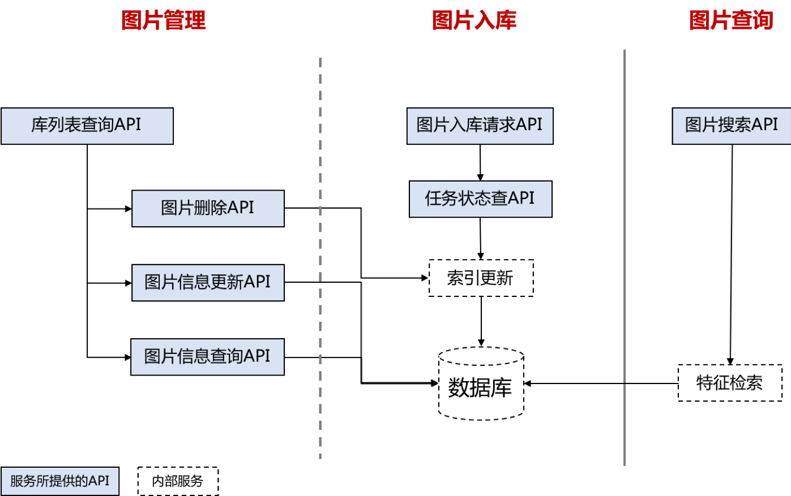

# 通用图片搜索

## 一、接口描述

### 1. 功能描述
> 提供图片入库、入库图片搜索、图片及信息管理等功能。

### 2. 接口使用

> 在获得使用权限后，您可使用已经封装好的SDK进行相应开发，整体流程详见[调用方法](../Operation-Guide/call-methods.md)  。

### 3. 能力说明

> 基于检测、分类和特征表示能力，支持用户上传图片及相关信息后自动提取图片特征并构建索引，支持索引构建完成后进行图片搜索，图片及相关信息的管理。

### 4.整体流程介绍

## 二、请求说明
### [图片入库请求](insert_data.md)
### [任务状态查询请求](fetch_task_status.md)
### [图片搜索请求](search.md)
### [库列表查询请求](list_collection.md)
### [图片删除请求](delete_image.md)
### [图片信息更新请求](update_infos.md)
### [图片信息查询请求](fetch_infos.md)

## 三、接口数据要求
> 1. 图片格式：Base64 或 url
> 2. 图片像素：最小 201 \* 201，最大 4096 \* 4096  
> 3. 图片大小：单张图片小于 3.75M
> 4. 图片类型：jpg, jpeg, png
> 5. 批量接口单次最大处理量为200

## 四、注意事项
   1. 通用图片搜索服务的接口调用次数及QPS是所有接口共享的，即所有接口调动次数总数不能超过限额。
   2. 目前不支持jfs图片服务器以外的图片url作为入参。当有大规模数据入库时，为了防止带宽打满，可将图片上传至京东OSS，获得OSS链接后再批量传入。
   3. 网关对传输大小有限制，不可传输超过5M的内容；
   4. 目前每个用户仅支持建立3个库，每个库目前最多存放30000张图片。

## 五、错误码

### 1.业务错误码

业务错误码（status）|对应message|说明
------|------|------
1004 | "TASK_NOT_EXIST" | 任务不存在
1030 | "NO_RELATIVE_COLLECTION" | 无相关的collection
1031 | "NO_RELATIVE_IMAGE" | 无相关的图片
1032 | "REPEAT_IMAGE_NAME_IN_DB" | 图片名与库中图片名重复
1033 | "REPEAT_IMAGE_NAME_IN_PARAM" | 参数列表中存在重复的图片名
2001 | "INVALID_PARAM_TOP_K" | 无效的top_k
2005 | "IMAGE_TOO_SMALL" | 图片大小超出最小限制
2006 | "BROKEN_BASE64_OR_URL" | 无效的base64或url
2007 | "IMAGE_TOO_LARGE" | 图片大小超出最大限制
2008 | "INVALID_DOCS" | 无效的入库数据
2010 | "INVALID_COLLECTION_NAME" | 无效的库名
2011 | "INVALID_IMAGE_INFO" | 无效的图片信息
2012 | "INVALID_IMAGE_NAME" | 无效的图片名
2013 | "COLLECTION_COUNT_EXCEEDS_LIMIT" | 超出允许创建的图片库数
2014 | "PARAMS_LENGTH_EXCEEDS_LIMIT" | 超过允许的参数长度 
2015 | "COLLECTION_DOES_NOT_EXIST" | 该库不存在  
5000 | "INTERNAL_SERVER_ERROR" | 内部服务错误