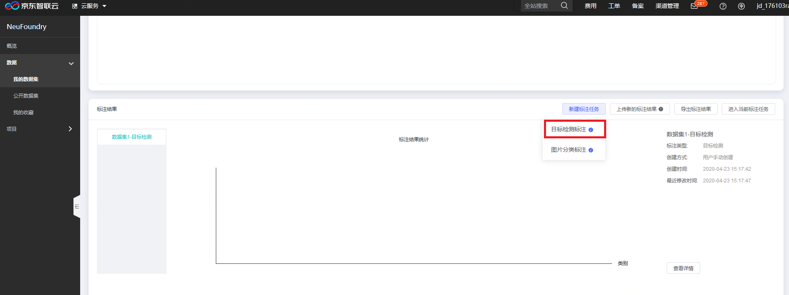
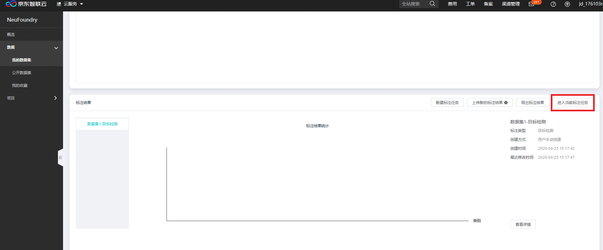
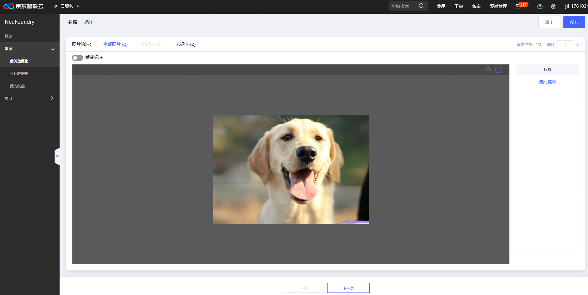
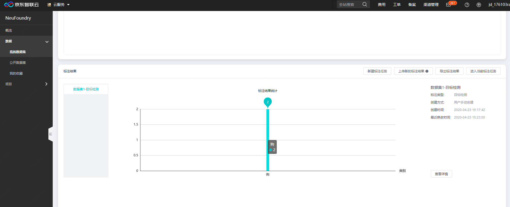

# 目标检测标注

用户在创建数据集，上传完图像数据之后，可通过项目详情页查看数据，同时可进行图片框图数据标注。具体入口如下：

**第一步，创建或进入框图标注任务**  
如果是第一次使用图像框图标注，通过点击"新建标注任务"->"图像框图标注"，进入标注页面

如果需要基于之前的框图结果进行标注，则可以点击"进入当前标注任务"，如下图：

**第二步，进入标注页面**  
进入标注页面后，可以看到操作区是待标注的图片，右边是标签管理，如下图

首先需要添加我们需要框选目标的标签，然后在左侧操作区域进行标注操作，每画完一个框图，选择右侧对应的标签

**第三步，查看标注统计结果**  
如果所有数据都标注完成，则点击退出，返回数据详情页面，可以查看针对之前标注任务的标注结果统计

---

如果您对产品有使用或者其他方面任何问题，欢迎联系我们

---