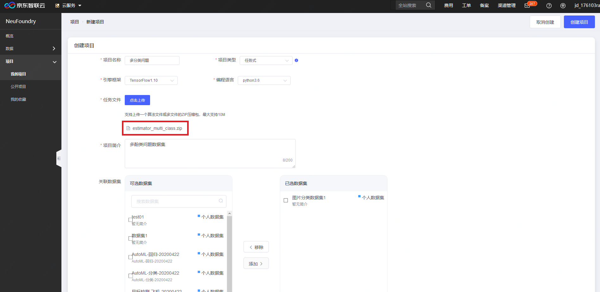
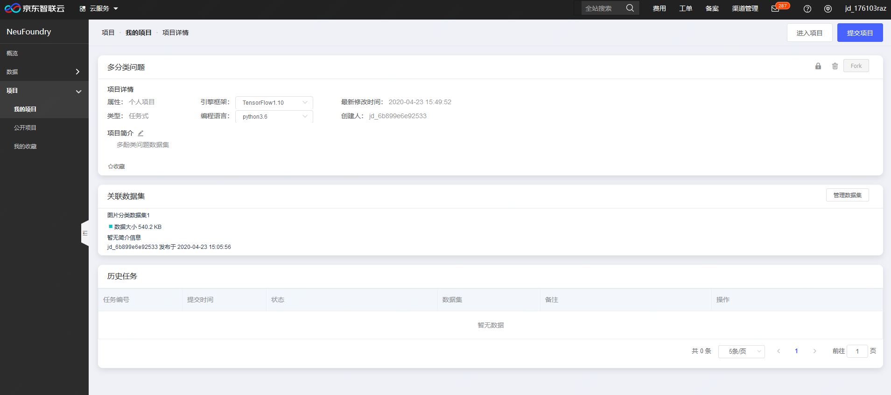
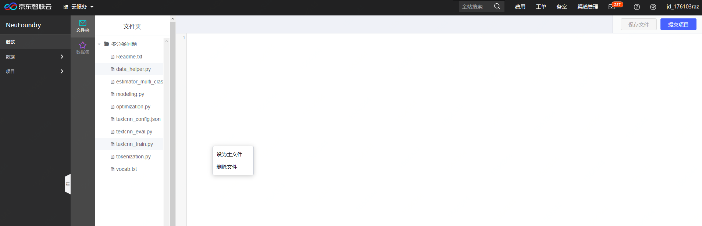

# 算法任务式

**第一步，创建项目**  
在点击创建项目的页面中，填写必要的信息，如项目名称、项目简介等内容，同时在项目类型中选择“任务式”，和实际相对应的引擎框架，选择编程语言版本，如下图
  

点击任务文件后面的“点击上传”按钮，弹出如下对话框：

选择需要上传的算法任务文件，之后，显示如下：

创建完成后，在我的项目列表中会出现相应的内容，如下图：

**第二步，查看项目详情**  
点击"项目详情"，可进入到项目详情页面，如下：
  

在该项目详情页，可对引擎框架、编程语言、以及关联的数据集进行编辑。点击"管理数据集"，弹出管理关联数据集如下图
  
  
  
  **第三步，进入项目进行编辑**  
在项目详情页，点击右上角的“进入项目”，即可进入任务式的项目编辑页面。

  
  
进入编辑页面后显示如下图：
   
  
  
在该页面中左侧文件夹显示的是代码的列表，在右侧操作区可以对代码进行修改。
  
  
  
 
  

---

如果您对产品有使用或者其他方面任何问题，欢迎联系我们

---