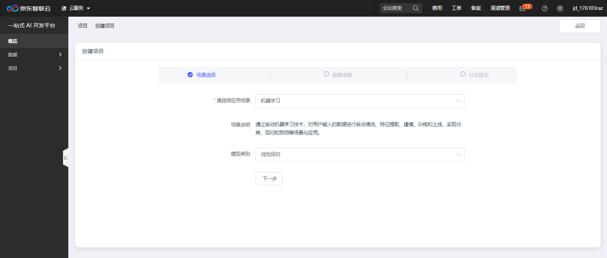

# 自动化模型训练经典案例及操作步骤

欢迎您来到京东智联云NeuFoundry一站式AI开发平台，为了您的快捷使用，请先登录注册京东智联云账号并开通使用权限。

## 1. 案例

## 2. 选项说明  

一、项目类型4种：

    1、任务式：使用者将算法程序以一个文件或者一个zip文件压缩包的方式，通过浏览器上传到平台，以此来进行模型训练。  
    2、NoteBook：Jupyter Notebook是一个交互式笔记本，支持运行多种编程语言。 本系统中特指使用Jupyter NoteBook的方式进行算法代码编写，模型训练任务提交，以及结果查看等操作。  
    3、图形化拖拽：系统将常用的算法、流程控制等程序代码封装成组件，使用者通过拖拽和链接组件构建模型训练流程。  
    4、自动化：使用者不用写任何代码，通过选择相应的使用场景，以及对应的数据集，系统自动进行训练。  
    注意：
        1、图形化拖拽和自动化内置的算法及场景有限，具体支持类型可见产品文档 
        2、如有算法文件或可编写算法代码，建议使用任务式和NoteBook  
二、项目简介  

    项目简介最大长度支持200文字描述！
三、应用场景

    图像分类：根据业务需求，自定义图像分类服务，如为家电客户提供冰箱、电视等图像分类，为服装客户提供外套、裤子等分类。
    目标检测：可定制化识别一张图中的多个目标，提供目标物体的所在位置、对应名称等要素，如汽车识别中将图片中所有汽车框出。
    文本分类：根据业务场景需求，目前提供自定义短文本分类服务，如将用户投诉自动归类、用户评论自动归类等。
    机器学习：通过自动机器学习技术，对用户输入的数据进行自动清洗、特征提取、建模、训练和上线，实现分类、回归和预测等场景化应用。
四、评估指标

    平均绝对误差（MAE）：是预测值与实际值的绝对差值的平均值。
    均方误差（MSE）：是预测值与实际值之差平方的期望值。
    决定系数（R2）：是预测值和实际值的符合程度。
## 3. 操作步骤

**步骤1**  
登录完成后，点击左侧菜单“项目”-“我的项目”，右上角点击“新建项目”，如下图：  
  
**步骤2**  
进入新建项目页，输入各项目信息，标记*号项为必填项，输入项目名称，选择对应项目类型，
本示例项目类型选择为“自动化”，输入项目简介。信息填写完成后点击“创建项目”。如下图：  
  
**步骤3**  
项目创建完成后进入自动化模型项目信息页，或返回项目列表可根据项目类型和项目状态及项目名称进行检索查询，如下图：
  
点击“查看详情”可进入项目详细信息页，如下图：  
  
选择对应的应用场景，机器学习应用场景需要选择模型类别。如下图：
  
在选择应用场景后，点击“下一步”，根据应用场景，填写其它项目信息，如下图：（机器学习场景）  
  
选择样本数据集，或点击创建数据集，创建一个新的数据集。选择对应股评指标，
需要预测的变量（分类模型可以选择任意字段类型的列，回归分析模型只能选择字段类型为数字的列。）
排除列为复选框（需要从训练数据中去掉的列，通常为ID等）。填写完成后点击“下一步”进入任务提交页，如下图：  
  
如应用场景选择图像分类、目标检测、文本分类，只需要选择对应的样本数据集即可，如下图：  
  
点击提交训练，提交机器学习任务。  

---

如果您对产品有使用或者其他方面任何问题，欢迎联系我们

---
