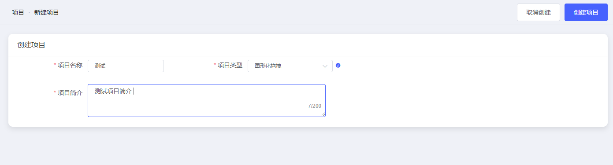
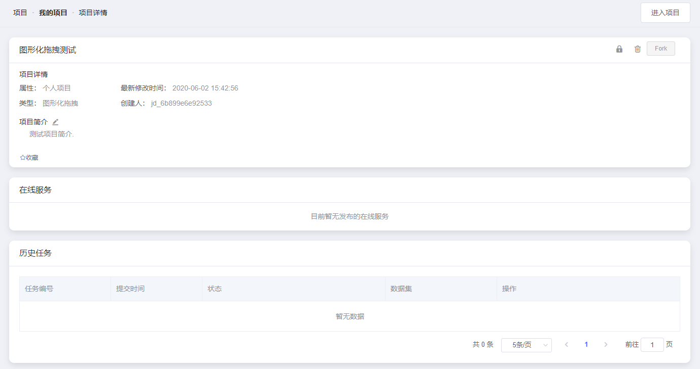
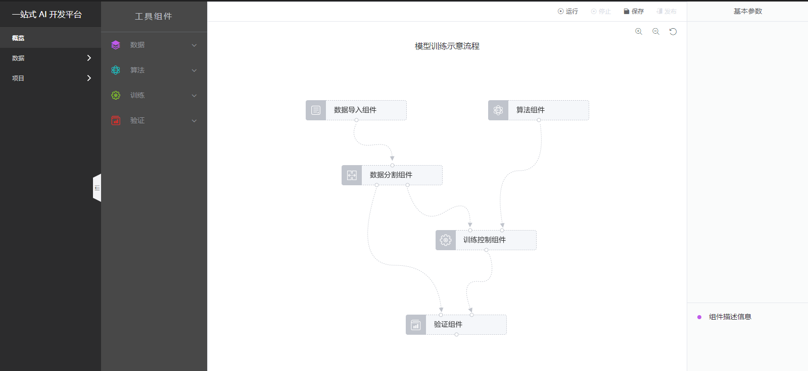
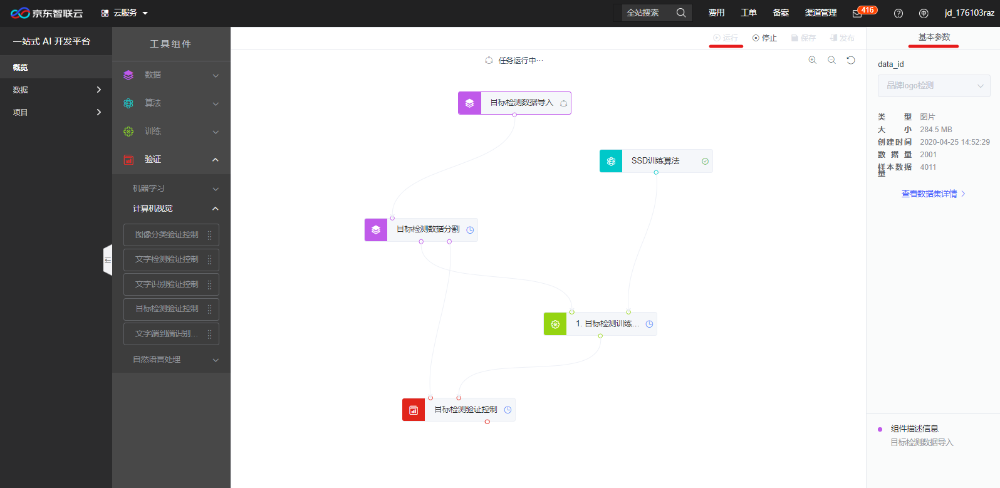

# 拖拽式模型训练经典案例及操作步骤

欢迎您来到京东智联云NeuFoundry一站式AI开发平台，为了您的快捷使用，请先登录注册京东智联云账号并开通使用权限。

## 1. 案例

## 2. 选项说明  

一、项目类型4种：

    1、任务式：使用者将算法程序以一个文件或者一个zip文件压缩包的方式，通过浏览器上传到平台，以此来进行模型训练。  
    2、NoteBook：Jupyter Notebook是一个交互式笔记本，支持运行多种编程语言。 本系统中特指使用Jupyter NoteBook的方式进行算法代码编写，模型训练任务提交，以及结果查看等操作。  
    3、图形化拖拽：系统将常用的算法、流程控制等程序代码封装成组件，使用者通过拖拽和链接组件构建模型训练流程。  
    4、自动化：使用者不用写任何代码，通过选择相应的使用场景，以及对应的数据集，系统自动进行训练。  
    注意：
        1、图形化拖拽和自动化内置的算法及场景有限，具体支持类型可见产品文档 
        2、如有算法文件或可编写算法代码，建议使用任务式和NoteBook  
二、项目简介  

    项目简介最大长度支持200文字描述！
## 3. 操作步骤

**步骤1**  
登录完成后，点击左侧菜单“项目”-“我的项目”，右上角点击“新建项目”，如下图：  
  
**步骤2**  
进入新建项目页，输入各项目信息，标记*号项为必填项，输入项目名称，选择对应项目类型，
本示例项目类型选择为“图形化拖拽”，输入项目简介。信息填写完成后点击“创建项目”。如下图：  
  
**步骤3**  
项目创建完成后进入图形化拖拽项目信息页，或返回项目列表可根据项目类型和项目状态及项目名称进行检索查询，如下图：
  
点击“查看详情”可进入项目详细信息页，如下图：  
  
**步骤4**  
项目详情页中，右上角点击“进入项目”，进入图形化拖拽项目操作页，如下图：  
  
图形化拖拽操作页中，点击中部工具组件菜单，依次择数据、算法、训练、验证组件，相应组件拖拽至模型训练示意模型处，
部分组件需要组件基本参数处填写相应信息，并将组件进行拖拽连接，操作接入后点击运行即可。如下图：  
  

---

如果您对产品有使用或者其他方面任何问题，欢迎联系我们

---

import { Component } from '@angular/core';

@Component({
  selector: 'demo-flex-basic',
  template: `
  `,
  styles: [
    `
    `
  ]
})
export class DemoFlexBasicComponent {}
