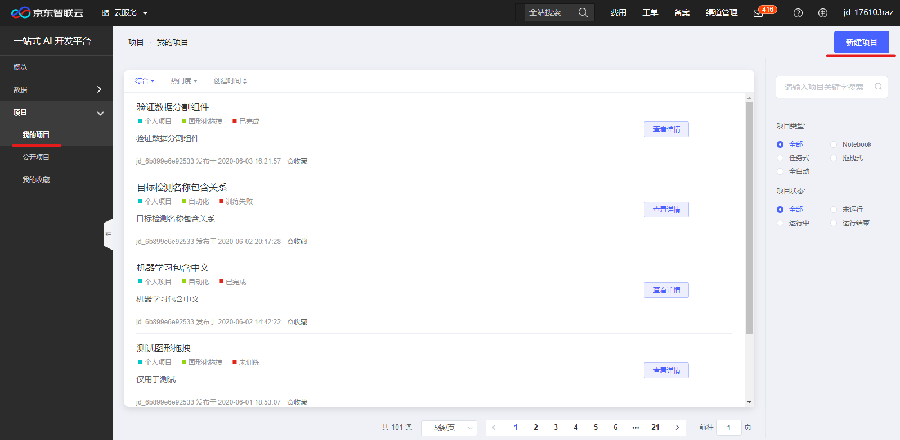
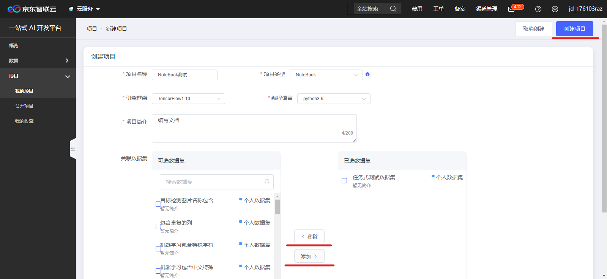
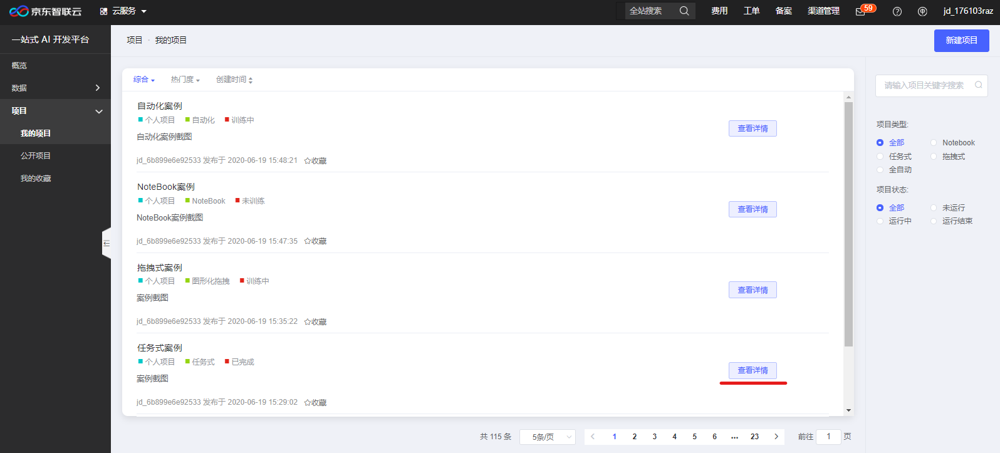
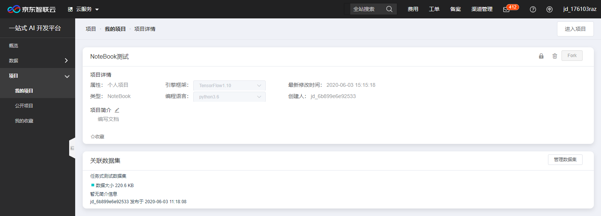
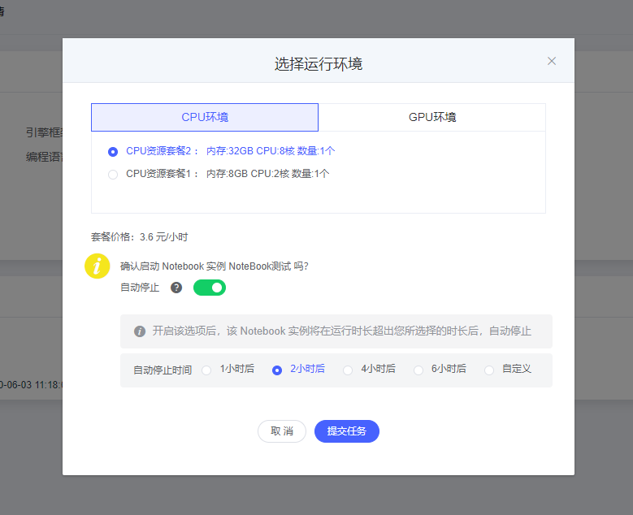

# Notebook案例及操作步骤

欢迎您来到京东智联云NeuFoundry一站式AI开发平台，为了您的快捷使用，请先登录注册京东智联云账号并开通使用权限。

## 1. 案例

## 2. 选项说明  

一、项目类型4种：

    1、任务式：使用者将算法程序以一个文件或者一个zip文件压缩包的方式，通过浏览器上传到平台，以此来进行模型训练。  
    2、NoteBook：Jupyter Notebook是一个交互式笔记本，支持运行多种编程语言。 本系统中特指使用Jupyter NoteBook的方式进行算法代码编写，模型训练任务提交，以及结果查看等操作。  
    3、图形化拖拽：系统将常用的算法、流程控制等程序代码封装成组件，使用者通过拖拽和链接组件构建模型训练流程。  
    4、自动化：使用者不用写任何代码，通过选择相应的使用场景，以及对应的数据集，系统自动进行训练。  
    注意：
        1、图形化拖拽和自动化内置的算法及场景有限，具体支持类型可见产品文档 
        2、如有算法文件或可编写算法代码，建议使用任务式和NoteBook  
二、引擎框架  

    系统共支持7种引擎框架  
三、项目简介  

    项目简介最大长度支持200文字描述！
四、运行环境及资费

    系统提供3种运行环境供您选择
        1、CPU资源套餐1：内存8GB CPU：2核 数量：1个 价格：1.6元/小时
        2、CPU资源套餐2：内存32GB CPU：8核 数量：1个 价格：3.6元/小时
        3、GPU资源套餐1：CPU：12核 GPU：1卡 内存：32GB 数量：1个 价格：6元/小时
## 3. 操作步骤

**步骤1**  
登录完成后，点击左侧菜单“项目”-“我的项目”，右上角点击“新建项目”，如下图：  
  
**步骤2**  
进入新建项目页，输入各项目信息，标记*号项为必填项，部分选择框为联动式，如您需要先选择对应的引擎框架后才可选择编程语言，
本例项目类型选择为NoteBook，项目简介最多支持200文字长度，关联数据集处勾选相应数据集，点击“添加”按钮将选择的对应数据集添加到
“已选数据集中”，点击“移除按钮”取消已选数据集到可选数据集，信息填写完成后点击“创建项目”。如下图：  
  
**步骤3**  
项目创建完成后进入NoteBook项目信息页，或进入项目列表，项目列表可根据项目类型和项目状态及项目名称进行检索查询，如下图：
  
点击“查看详情”可进入项目详细信息页，如下图：  
  
项目详情页中，右上角点击“进入项目”，弹出运行环境选择框，如下图：  
  
根据需求选择相应运行环境后点击“提交任务”，即可。

---

如果您对产品有使用或者其他方面任何问题，欢迎联系我们

---
