# 自动化

欢迎您来到京东智联云NeuFoundry一站式AI开发平台，为了您的快捷使用，请先登录注册京东智联云账号并开通使用权限。

## 一、自动化简介

## 二、自动化操作描述  

登录系统后,左侧菜单依次点击"项目"-"我的项目"进入项目列表页,如下图:  
  
创建项目点击右上角"新建项目"按钮,进入项目新建页:如下图  
  
项目创建页各选项说明:  

    项目名称: 支持中文、英文字母、数字及下划线
    项目类型:  
        1.任务式：使用者将算法程序以一个文件或者一个zip文件压缩包的方式，通过浏览器上传到平台，以此来进行模型训练。
        2.NoteBook：Jupyter Notebook是一个交互式笔记本，支持运行多种编程语言。 本系统中特指使用Jupyter NoteBook
          的方式进行算法代码编写，模型训练任务提交，以及结果查看等操作。
        3.图形化拖拽：系统将常用的算法、流程控制等程序代码封装成组件，使用者通过拖拽和链接组件构建模型训练流程。
        4.自动化：使用者不用写任何代码，通过选择相应的使用场景，以及对应的数据集，系统自动进行训练。
        注意：
            1.图形化拖拽和自动化内置的算法及场景有限，具体支持类型可见产品文档
            2.如有算法文件或可编写算法代码，建议使用任务式和NoteBook
    引擎框架:共12种引擎框架
    编程语言:2种编程语言
    项目简介:自由填写项目相关信息
    关联数据集:
        1.可选数据集:可查看公开数据集以及个人上传数据集
        2.已选数据集:项目关联进行开发训练的相关数据集
        3.添加/移除：勾选"可选数据集"点击添加，将勾选数据集选入到"已选数据集"，
          勾选"已选数据集"点击移除，将勾选数据集取消到"可选数据集"。
    注:创建项目页中部分选项框为联动式，如任务式选项不同，会展现不同选项。选择引擎框架后，才可选择编程语音选项。
本示例为创建自动化项目，需填写项目名称，选择项目类型为自动化，填写项目简介，自动化新建项目信息如下图： 
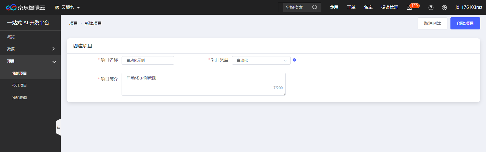  
相关信息填写完成后，点击右上角"创建项目"，项目创建成功后跳转到项目各项信息编辑页，如下图：  
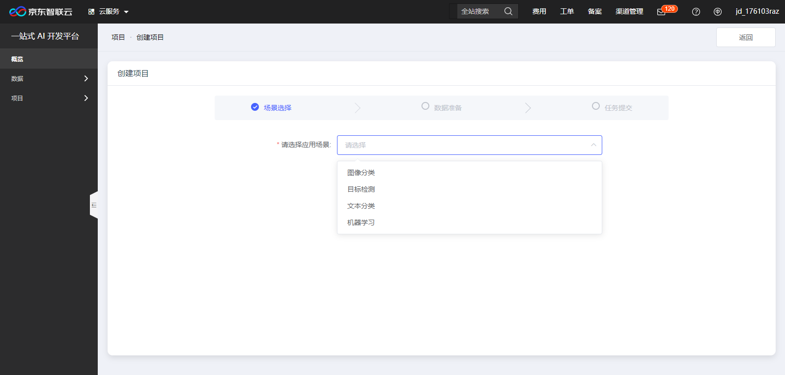  
首先选择应用场景，应用场景分为以下四种，各场景选项说明如下：  

    图像分类：根据业务需求，自定义图像分类服务，如为家电客户提供冰箱、电视等图像分类，为服装客户提供外套、裤子等分类。
    目标检测：可定制化识别一张图中的多个目标，提供目标物体的所在位置、对应名称等要素，如汽车识别中将图片中所有汽车框出。
    文本分类：根据业务场景需求，目前提供自定义短文本分类服务，如将用户投诉自动归类、用户评论自动归类等。
    机器学习：通过自动机器学习技术，对用户输入的数据进行自动清洗、特征提取、建模、训练和上线，实现分类、回归和预测等场景化应用。
             注意：机器学习场景，需选择一项模型类别，模型类别分以下两种：
                   线性回归：
                   分类：
应用场景选择后，跳转到数据准备页，填写数据集相关信息，各应用场景所需要编辑的数据集信息不同，分别如下：  
图像分类、目标检测、文本分类场景相关数据集编辑只支持通过系统标注或上传系统可解析标注结果的数据集，如下图：  
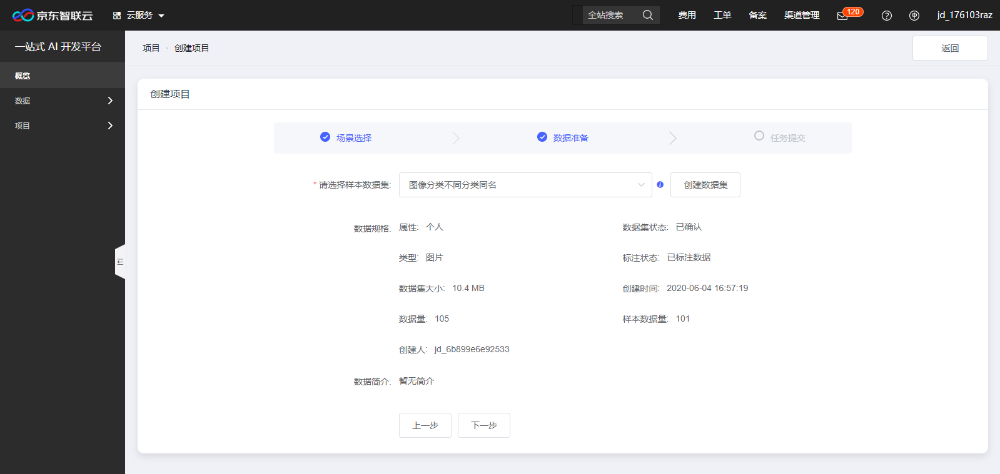  
机器学习场景相关数据集需要选择评估指标，评估指标分为以下三项：  

    平均绝对误差（MAE）：是预测值与实际值的绝对差值的平均值。
    均方误差（MSE）：是预测值与实际值之差平方的期望值。
    决定系数（R2）：是预测值和实际值的符合程度。
需要预测的变量：选择数据集中需要预测的变量，其中在应用场景选择机器学习时，模型类别选择为"分类"可以选择任意字段类型的列，模型类别为"线性回归"只能选择字段类型为数字的列。
排除列：选择数据集中需要排除的列（需要从训练数据中去掉的列，通常为ID等），该项可不作选择
机器学习场景相关数据集编辑如下图：  
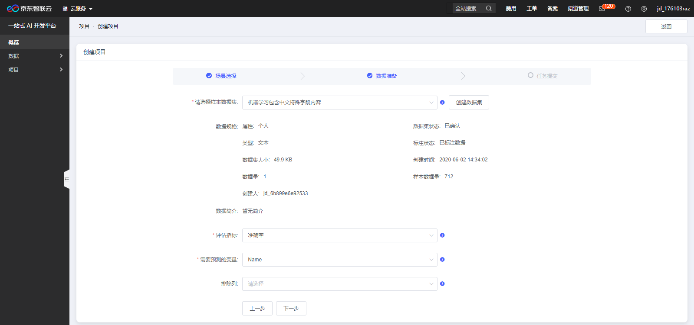  
数据准备完成后，点击"下一步"，进入数据集确认页，当前页面会列出项目数据相关信息，如下：  
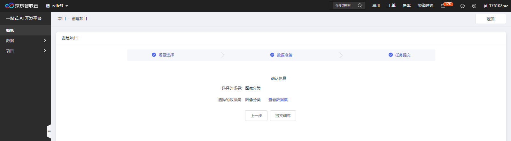  
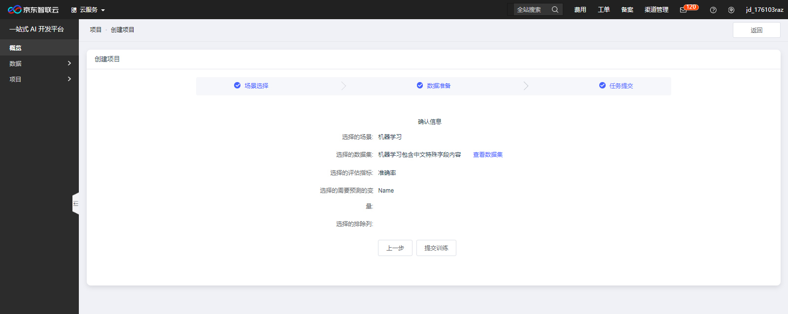  
确认信息无误点击"提交训练"按钮，弹出任务提交成功提示，如下图：  
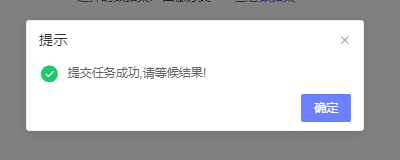  
可随时进入项目详情页历史任务区域查看运行状态，如下图：  
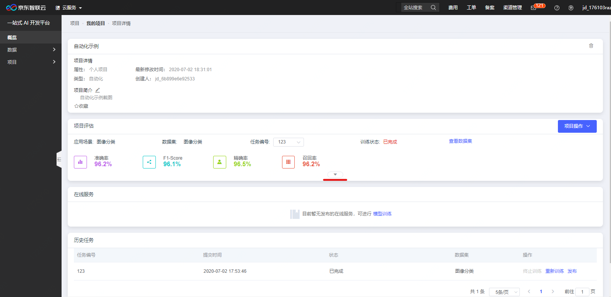  
上图项目详情页项目评估区域,点击下拉箭头可查看项目结果详细信息,如下图:  
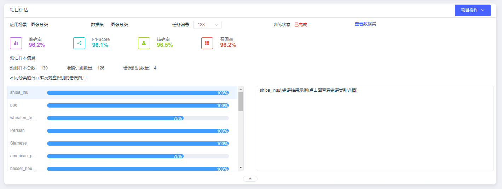  
项目评估区域右上角点击"项目操作"按钮,选择"发布"可将其发布为外部服务供其调用,如下图:  
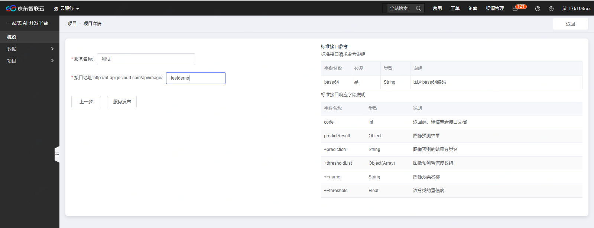  
信息填写完成后点击"服务发布"按钮,服务将进入审核阶段,待审核结束后可正常提供服务调用,可在项目详情页在线服务区域查看服务当前状态,如下图:  
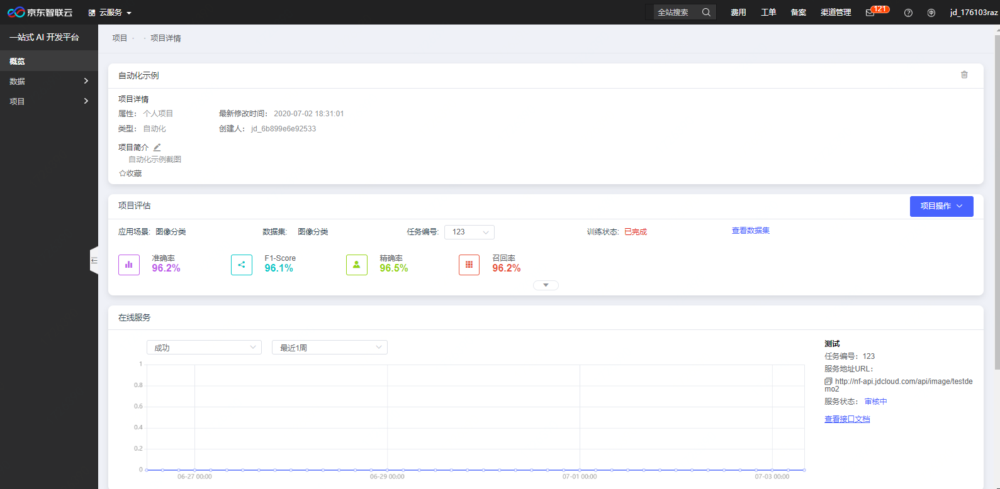  

---

如果您对产品有使用或者其他方面任何问题，欢迎联系我们

---
