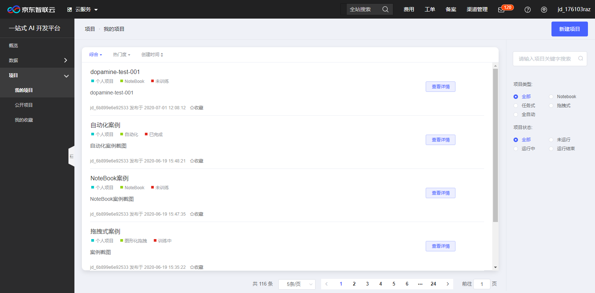

# 拖拽式

欢迎您来到京东智联云NeuFoundry一站式AI开发平台，为了您的快捷使用，请先登录注册京东智联云账号并开通使用权限。

## 一、拖拽式简介  

## 二、拖拽式操作描述  

登录系统后,左侧菜单依次点击"项目"-"我的项目"进入项目列表页,如下图:  
  
创建项目点击右上角"新建项目"按钮,进入项目新建页:如下图  
  
项目创建页各选项说明:  

    项目名称: 支持中文、英文字母、数字及下划线
    项目类型:  
        1.任务式：使用者将算法程序以一个文件或者一个zip文件压缩包的方式，通过浏览器上传到平台，以此来进行模型训练。
        2.NoteBook：Jupyter Notebook是一个交互式笔记本，支持运行多种编程语言。 本系统中特指使用Jupyter NoteBook
          的方式进行算法代码编写，模型训练任务提交，以及结果查看等操作。
        3.图形化拖拽：系统将常用的算法、流程控制等程序代码封装成组件，使用者通过拖拽和链接组件构建模型训练流程。
        4.自动化：使用者不用写任何代码，通过选择相应的使用场景，以及对应的数据集，系统自动进行训练。
        注意：
            1.图形化拖拽和自动化内置的算法及场景有限，具体支持类型可见产品文档
            2.如有算法文件或可编写算法代码，建议使用任务式和NoteBook
    引擎框架:共12种引擎框架
    编程语言:2种编程语言
    项目简介:自由填写项目相关信息
    关联数据集:
        1.可选数据集:可查看公开数据集以及个人上传数据集
        2.已选数据集:项目关联进行开发训练的相关数据集
        3.添加/移除：勾选"可选数据集"点击添加，将勾选数据集选入到"已选数据集"，
          勾选"已选数据集"点击移除，将勾选数据集取消到"可选数据集"。
    注:创建项目页中部分选项框为联动式，如任务式选项不同，会展现不同选项。选择引擎框架后，才可选择编程语音选项。
本示例为创建拖拽式项目，需要填写项目名称，选择项目类型为图形化拖拽，填写项目简介，拖拽式新建项目信息如下图： 
  
相关信息填写完成后，点击右上角"创建项目"，项目创建成功后跳转到项目详情页，如下图：  
  
项目详情页中存在可操作项，如：  

    拖拽式示例区域：点击项目简介图标，可编辑项目简介信息.任务示例区域右上角图标分别为项目公开（项目权限公开，方便平台交流）、
                   项目删除、项目克隆，注意：项目公开和项目删除为不可逆操作！
    在线服务区域：显示项目服务发布后,相关服务信息.
    历史任务区域：显示任务的历史操作记录，以及可对历史项目进行进一步的操作。
        终止任务：停止正在运行的任务
        发布：任务正常运行结束后,在此发布为服务,供外部调用.
项目详情页右上角点击"进入项目"，进入拖拽式项目流程编辑页。如下图：
  
拖拽式项目可对数据、算法、训练、验证组件自由选择组合，各组件说明如下：  

    数据组件：指定运算所需要的数据集,包括数据导入及数据分割部分,选中数据导入组件,在窗口右侧基本参数区域选择对应数据集
    算法组件：选择合适的编程算法
    训练组件：选择对应运行环境
    验证组件：查看、导出运行结果
一个完整的拖拽式项目需要对以上4各组件进行合理的配置、关联，如下图示例： 
  
以上示例中,点击"保存"按钮可对当前模板进行保存.点击"停止"按钮,可停止正在运行的运算模板.
点击"运行"按钮运行当前运算模板. 运行中各组件通过右键单击,可查看日志或下载运行日志.如下图:  
  
  
服务正常运行结束后,在项目详情页历史任务区域可将其发布为服务,供外部调用.如下图:  
  
点击"发布"按钮,弹出服务信息编写框,如下图:  
  
服务发布后,在项目详情页在线服务区域可查看发布服务的相关信息,如下图:  
  
待服务审核通过后便可供外部正常调用.

---

如果您对产品有使用或者其他方面任何问题，欢迎联系我们

---
