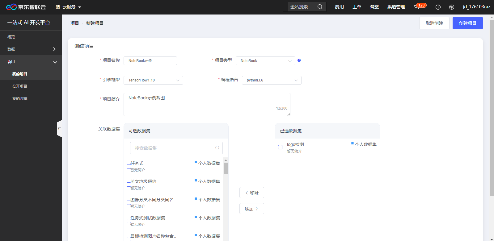
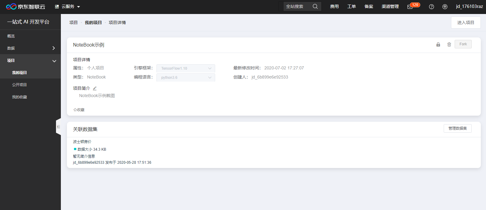
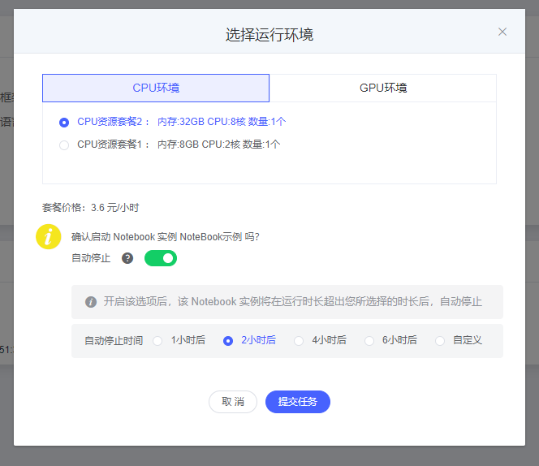
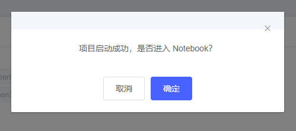
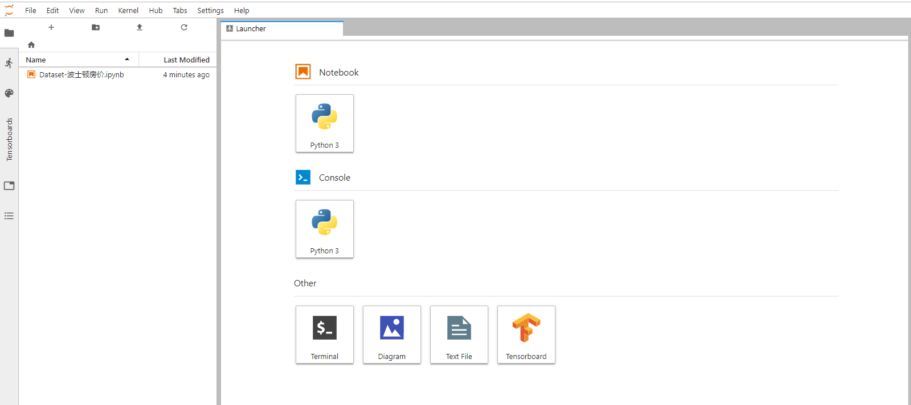

# NoteBook

欢迎您来到京东智联云NeuFoundry一站式AI开发平台，为了您的快捷使用，请先登录注册京东智联云账号并开通使用权限。

## 一、NoteBook简介  

## 二、NoteBook操作描述  

登录系统后,左侧菜单依次点击"项目"-"我的项目"进入项目列表页,如下图:  
  
创建项目点击右上角"新建项目"按钮,进入项目新建页:如下图  
  
项目创建页各选项说明:  

    项目名称: 支持中文、英文字母、数字及下划线
    项目类型:  
        1.任务式：使用者将算法程序以一个文件或者一个zip文件压缩包的方式，通过浏览器上传到平台，以此来进行模型训练。
        2.NoteBook：Jupyter Notebook是一个交互式笔记本，支持运行多种编程语言。 本系统中特指使用Jupyter NoteBook
          的方式进行算法代码编写，模型训练任务提交，以及结果查看等操作。
        3.图形化拖拽：系统将常用的算法、流程控制等程序代码封装成组件，使用者通过拖拽和链接组件构建模型训练流程。
        4.自动化：使用者不用写任何代码，通过选择相应的使用场景，以及对应的数据集，系统自动进行训练。
        注意：
            1.图形化拖拽和自动化内置的算法及场景有限，具体支持类型可见产品文档
            2.如有算法文件或可编写算法代码，建议使用任务式和NoteBook
    引擎框架:共12种引擎框架
    编程语言:2种编程语言
    项目简介:自由填写项目相关信息
    关联数据集:
        1.可选数据集:可查看公开数据集以及个人上传数据集
        2.已选数据集:项目关联进行开发训练的相关数据集
        3.添加/移除：勾选"可选数据集"点击添加，将勾选数据集选入到"已选数据集"，
          勾选"已选数据集"点击移除，将勾选数据集取消到"可选数据集"。
    注:创建项目页中部分选项框为联动式，如任务式选项不同，会展现不同选项。选择引擎框架后，才可选择编程语音选项。
本示例为创建NoteBook项目，填写项目名称，项目类型为NoteBook，填写项目简介，选择引擎框架、编程语言和关联数据集；
NoteBook新建项目信息如下图：  
  
相关信息填写完成后，点击右上角"创建项目"，项目创建成功后跳转到项目详情页，如下图：  
  
项目详情页中存在可操作项，如：  

    Notebook示例区域：显示项目相关信息，点击项目简介图标，可编辑项目简介信息,NoteBook示例区域右上角图标
                     分别为项目公开（项目权限公开，方便平台交流）、项目删除、项目克隆，注意：项目公开和项目删除为不可逆操作！
    关联数据集区域：显示项目关联数据集相关信息，点击"管理数据集"按钮，可重新选择任务关联数据集。
项目详情页右上角点击"进入项目"，弹出任务环境选择框。如下图：  
  
选择对应运行环境后点击"提交任务"，会弹出NoteBook项目启动成功的提示框，如下图：  
  
选择是否进入NoteBook平台，进入NoteBook平台操作页，如下图：  
  

---

如果您对产品有使用或者其他方面任何问题，欢迎联系我们

---
