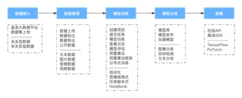

# AI开发基本流程

　　开发流程：

- **流程说明**：
- A）	数据接入：本平台为了更好的支持各种数据的接入方式，包括了直连大数据平台的数据、多种数据源的接入配置和关系型、非关系型数据的上传等。
- B）	数据管理：数据的管理主要包括了数据的标注、标注结果的导出和公开数据集，在数据标注过程中，可以上传原始数据集，也支持已经具备标注结果的数据集，如果要用以进行模型训练，必须先对所上传的数据集根据使用目的，进行相应的数据标注，如文本分类、图像分类、目标检测等类型的数据标注。在标注过程中，可以查看多人协同标注的标注任务管理、分配标注任务、审核和跟踪标注过程。
- C）	模型训练：主要目的是为特定场景，基于一些常用框架，选择或者编写特定的算法，包含深度学习中最为关键的算法代码，构建模型的核心。本系统为专业算法工程师提供任务式、NoteBook交互方式，为非专业算法人员提供图形化拖拽、自动化交互方式；将上述方式得到的样本数据集，以及算法模型，通过在CPU或者GPU上进行多次反复迭代训练，最终得到特定的参数结果；对训练完成的模型，通过一定已知结果数据集的进行预测，或者模型的准确率、召回率等相应指标项，用户可通过模型评估结果，来判断模型是否符合预期。
- D）	模型仓库：除了一站式的模型训练的功能和特性，还支持了基于模型的生态管理，提供了模型仓库的概念，对模型进行发布、转换、下载等功能。同时也提供了用户自建模型的上传和推理服务，将用户指定的模型框架、网络结构、模型文件、模型配置等信息上传到本平台后，平台即可发布成在线服务的形式，提供给其他用户进行调用。
- E）	模型部署：模型训练出来后，部署工作也是至关重要的一环，通过模型评估结果，可选择将符合业务预期的模型，通过服务发布功能，将模型发布成在线API服务或者离线SDK，其中API服务以RestFul API的方式为业务系统提供服务支撑。

---

如果您对产品有使用或者其他方面任何问题，欢迎联系我们

---
