****

**Ku+ MLOps**

**用户使用手册**

目录

[1. 基础知识](#基础知识)

[1.1. 名词解释](#_Toc83566265)

[1.2. AI开发基本流程](#_Toc83566266)

[2. Ku+ MLOps产品介绍](#_Toc83566267)

[2.1. 产品概述](#_Toc83566268)

[2.2. 产品架构](#_Toc83566269)

[2.3. 产品优势](#_Toc83566270)

[3. 快速入门](#快速入门)

[3.1. 使用自动化构建模型](#使用自动化构建模型)

[3.2. 使用拖拽式构建模型](#使用拖拽式构建模型)

[4. Ku+ MLOps使用指南](#_Toc83566274)

[4.1. 概览](#_Toc83566275)

[4.2. 数据集管理](#_Toc83566276)

[4.2.1. 平台预置数据集](#_Toc83566277)

[4.2.2. 原始数据集上传](#_Toc83566278)

[4.2.3. 已标注数据集上传](#已标注数据集上传)

[4.2.4. 数据集公开](#数据集公开)

[4.2.5. 数据集收藏](#数据集收藏)

[4.3. 数据标注](#_Toc83566282)

[4.3.1. 个人标注](#个人标注)

[4.3.2. 团队标注](#团队标注)

[4.3.3. 标注任务管理](#标注任务管理)

[4.4. 模型训练](#_Toc83566286)

[4.4.1. 自动化建模](#自动化建模)

[4.4.2. 拖拽式建模](#拖拽式建模)

[4.4.3. NoteBook(jili功能不可用)](#notebookjili功能不可用)

[4.4.4. 任务式建模(jili功能不可用)](#任务式建模jili功能不可用)

[4.4.5. 项目共享](#_Toc83566291)

[4.4.6. 项目收藏](#_Toc83566292)

[4.5.
模型仓库](#模型仓库模型仓库为模型的存储仓库模型仓库中可导入所有训练任务生成的模型并进行统一管理模型仓库支持模型管理和各模型版本管理各模型的版本具备评估报告校验模型部署下载等功能具体操作如下)

[4.6. 服务部署](#服务部署)

[4.7. 服务调用](#服务调用)

[5. FAQ](#faq)

# 基础知识

## 名词解释

- 任务式建模：算法工程师将算法程序以一个文件或者一个zip压缩包的方式，通过浏览器上传到平台，以此来进行模型训练。
  
  - NoteBook：
    Notebook是一个交互式笔记本，支持运行多种编程语言。本系统中特指使用NoteBook的方式进行算法代码编写、模型训练任务的提交，以及结果查看等操作。
    
    - 算法组件：将算法通过封装，屏蔽内部复杂的逻辑，对外通过简单的链接和调用即可使用的功能模块。
    
    - 数据标注：将原始数据通过某种工具或者方法，进行分类、框图等多种形态的标注。
    
    - 样本数据集：原始数据内容加上标注后的标注结果，可用以进行模型训练的数据集。
    
    - 文本分类：根据业务场景需求，目前提供自定义短文本分类服务，如将用户投诉自动归类、用户评论自动归类等。
    
    - 图片分类：根据业务需求，自定义图片分类服务，如为家电客户提供冰箱、电视等图片分类，为服装客户提供外套、裤子等分类。
    
    - 目标检测：可定制化识别一张图中的多个目标，提供目标物体的所在位置、对应名称等要素，如汽车识别中将图片中所有汽车框出。

## AI开发基本流程

开发流程：数据标注—\>模型开发—\>模型训练—\>模型评估—\>服务部署

流程说明：

1. 数据标注：使用者上传的是原始数据集，如果要用以进行模型训练，必须先对所上传的数据集根据使用目的，进行相应的数据标注，如文本分类、图片分类、目标检测等类型的数据标注。

2. 模型开发：主要目的是为特定场景，基于一些常用框架，选择或者编写特定的算法，包含深度学习中最为关键的算法代码，构建模型的核心。本系统为专业算法工程师提供任务式、NoteBook交互方式，为非专业算法人员提供图形化拖拽、自动化交互方式。

3. 模型训练：将上述方式得到的样本数据集，以及算法模型，通过在CPU或者GPU上进行多次反复迭代训练，最终得到特定的参数结果

4. 模型评估：对训练完成的模型，通过一定已知结果数据集的进行预测，或者模型的准确率、召回率等相应指标项，用户可通过模型评估结果，来判断模型是否符合预期。

5. 服务发布：通过模型评估结果，可选择将符合业务预期的模型，通过服务发布功能，将模型发布成API服务，以RestFul
   API的方式为业务系统提供服务支撑。

# Ku+ MLOps产品介绍

## 产品概述

Ku+
MLOps是一款源于京东丰富场景的最佳实践的产品，提供从**数据标注-模型开发-模型训练-模型评估-服务部署**的一站式人工智能开发平台，提升AI开发的效率、降低开发成本、加速企业AI人才建设。

## 产品架构

Ku+
MLOps基础设施层采用Docker容器进行算力资源的池化，通过Kubernetes进行整体资源的管理、资源分配、任务运行、状态监控等，平台集成了MySQL、Redis、MQ等多种中间件服务，通过数据标注、模型训练、模型发布，生成自定义的AI能力，为各行各业的业务服务提供有力的支撑。

## 产品优势

1. **快速构建企业智能中台，降本提效**：提供完整智能中台基础环境建设内容，加速企业智能化转型，实现降本提效

2. **一站式开发环境，提升开发效率**：提供从数据到模型所需AI开发环境，实现企业AI人才培养

3. **提供专家实训服务，帮助企业培养AI人才**：提供专业的AI人才实训服务，建立企业自己的AI人才体系

4. **预置模型与服务，赋能京东最佳实践**：通过平台将京东最佳实践的AI能力，以模型、服务等方式赋能企业，加速企业智能化转型。

# 快速入门

## 使用自动化构建模型

Ku+
MLOps提供了自动化建模方式，无需关注模型选型、参数调整等开发细节，仅需两步即可完成一个AI开发项目。以创建图像分类为例。

步骤1：准备数据

步骤2：创建项目，训练模型

步骤3：将模型部署上线

步骤4：服务调用

**步骤1：准备数据**

Ku+
MLOps在【数据】-【公开数据集】中提供了可直接用于训练的平台预置数据集，本文操作示例使用此数据集进行模型训练。如果您想使用自己的数据集，具体操作参考4.2、4.3。

**步骤2：创建项目，训练模型**

1. 在Ku+ MLOps平台，单击左侧导航栏【项目】-【我的项目】。

2. 单击“新建项目”，填写项目名称、项目类型和项目简介等信息。项目类型选择自动化。

****

1. 单击“创建项目”，跳转至【场景选择】页面，选择“图像分类”应用场景、“通用图像分类”子应用场景。

1. 单击“下一步”，跳转至【数据准备】页面，选择平台的公开数据集“图像分类”

1. 单击“下一步”，跳转至【任务提交】页面，确认信息后，单击“提交训练”，完成图像分类项目创建。

1. 训练时间相对较长，请耐心等待。训练完成后，可以在【项目详情】页面查看“项目评估”，如“准确率”、“F1-score”、“精确率”、“召回率”。

**步骤3：将模型部署上线**

1. 当项目详情的历史任务区域，状态为“已完成”时，单击“发布”。

1. 在【发布】信息填写页面，填写服务名称和接口地址信息，单击“服务发布”，将模型发布上线。

**步骤4：服务调用**

1. 发布通过审核后，即可在【概览】-【在线服务】中进行服务调用操作。

1. 单击“服务调用测试”，填写参数；若为图片类参数，可单击“Base64转换工具”进行格式转换，将转换后的内容填入框内。

1. 单击“测试”，可在【调试信息】区域看到测试结果。

## 使用拖拽式构建模型

Ku+
MLOps提供了适用于机器学习、计算机视觉、自然语言处理和推荐系统等场景的算法组件、训练组件及验证组件，根据模型训练示意流程进行组件的拖拽与连接，即可完成模型构建。

步骤1：准备数据

步骤2：创建项目

步骤3：训练模型

步骤:4：将模型部署上线

步骤5：服务调用

**步骤1：准备数据**

Ku+
MLOps在【数据】-【公开数据集】中提供了可直接用于训练的平台预置数据集，本文操作示例使用此数据集进行模型训练。如果您想使用自己的数据集，具体操作参考4.2、4.3。

**步骤2：创建项目**

1. 在Ku+ MLOps平台，单击左侧导航栏【项目】-【我的项目】。

2. 单击“新建项目”，填写项目名称、项目类型和项目简介等信息。项目类型选择图形化拖拽。

1. 单击“创建项目”，进入【项目详情】页面。

**步骤3：训练模型**

1. 单击“进入项目”，进入拖拽式建模的控制页面，**根据模型训练示意流程进行组件的拖拽与连接。**

1. 完成连接后，单击“图像分类数据导入”组件，在右侧【基本参数】区域，选择数据集。

1. 单击“vgg_16训练算法”，在右侧【基本参数】区域，根据需求修改batch_size等参数信息，若无具体需求，可使用默认值。

1. 单击“运行”，完成模型构建，开始训练。

**步骤4：将模型部署上线**

1. 当项目详情的历史任务区域，状态为“已完成”时，单击“发布”。

1. 在【发布】信息填写页面，填写服务名称和接口地址信息，单击“服务发布”，将模型发布上线。

**步骤5：服务调用**

1. 发布通过审核后，即可在【概览】-【在线服务】中进行服务调用操作。

1. 单击“服务调用测试”，填写参数；若为图片类参数，可单击“Base64转换工具”进行格式转换，将转换后的内容填入框内。

1. 单击“测试”，可在【调试信息】区域看到测试结果。

# Ku+ MLOps使用指南

## 概览

登录系统之后，默认进来显示个人概览页面，显示如下图：

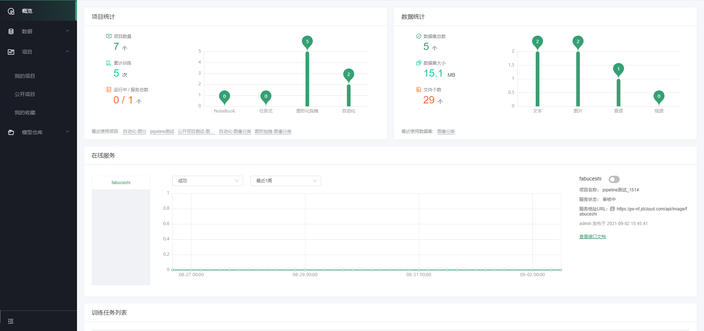

概览可以查看用户的项目统计信息、数据集统计信息，如可具体查看项目的数量、累计训练次数、以及已部署的服务数量，同时会以柱状图形式对各类型项目、各类型数据集数量进行分类统计。

同时概览页可查看在线服务的统计，包含统计的服务名称、服务运行状态、服务URL等内容，支持对服务进行启用/停止操作。通过提供的训练任务列表，对个人的训练任务和历史进行查看，并对训练任务进行相应的操作。

## 数据集管理

标注好的数据集是模型训练所需的重要资源，Ku+
MLOps提供数据集管理、数据集上传及数据标注等功能。Ku+
MLOps已预置了一部分行业典型数据集及部分京东业务特色的公开数据集便于用户直接使用，用户也可以直接上传自己使用的数据集。

### 平台预置数据集

平台预置数据集为已公开的数据集，在“数据-\>公开数据集”中，其含有完整的标注信息，可直接用于训练。如下图：

可根据数据集类型（图片、文本、视频、音频）及标注情况（原始数据）进行相应筛选。

### 原始数据集上传

原始数据集是指没有标注信息的数据，需用户在“数据-\>个人数据集”中上传，完成标注后才可用于训练。在数据菜单的右上角点击“新建数据集”，进入新建数据集页面

标注状态选择原始数据，根据页面要求填写基本信息即可，点击“提交”。

如下图所示，点击“数据集要求及上传样例”(a),
可获取详细数据集要求及样例；根据要求制作数据集文件，点击b处上传需要标注的数据集。

如上传文件不符合要求弹出相应提示框，根据提示可查看原因，进行下一步操作。

完成数据集上传后，如下图：

#### 数据文件格式要求

1. 图片数据格式说明：  
   1)支持最多上传1个 ZIP压缩包
   ，单个压缩包小于2GB，压缩包中的子文件总数在5万个以内，非压缩包文件小于100MB；
   
   2)文件名称仅支持：英文大小写字母、数字、下划线、中划线和英文点；  
   3)压缩包中的文件格式支持：png、jpg、jpeg、bmp、gif、tiff。

2. 文本数据格式说明：  
   1)支持最多上传1个 文件或者ZIP压缩包
   ，单个压缩包小于2GB，压缩包中的子文件总数在5万个以内，非压缩包文件小于100MB；
   
   2)文件名称仅支持：英文大小写字母、数字、下划线、中划线和英文点；  
   3)支持扩展名：txt、json、csv、xls、xlsx、zip。其中csv仅支持UTF-8编码格式。

3. 音频数据格式说明：  
   1)支持最多上传1个
   ZIP压缩包，单个压缩包小于2GB，压缩包中的子文件总数在5万个以内，非压缩包文件小于100MB；
   
   2)文件名称仅支持：英文大小写字母、数字、下划线、中划线和英文点；  
   3)压缩包中的文件格式支持：ogg、pcm、wav、mp3、flac、weba、webm。

4. 视频数据格式说明：  
   1)支持最多上传1个
   ZIP压缩包，单个压缩包小于2GB，压缩包中的子文件总数在5万个以内，非压缩包文件小于100MB；
   
   2)文件名称仅支持：英文大小写字母、数字、下划线、中划线和英文点；  
   3)压缩包中的文件格式支持：mp4、avi、3gp、wmv、mpg、flv。

根据数据集类型的不同，支持原始数据标注的场景也有所不同，原始数据文本类文件格式说明如下(其中图片、音频、视频满足文件类型格式要求即可)：

1. 文本分类(csv、xlsx)：

xlsx格式示例如下(csv格式可通过xlsx转换得到)：

B．短文本相似度(txt、xlsx、csv)：

txt示例如下(将需要判断是否相似的数据用\#\#\#\#\#分隔进行区分)：

xlsx示例如下：

### 已标注数据集上传

在数据菜单的右上角点击“新建数据集”，进入新建数据集页面

标注状态选择“已标注数据”，并根据数据集类型及标注类型进行相应选择。

**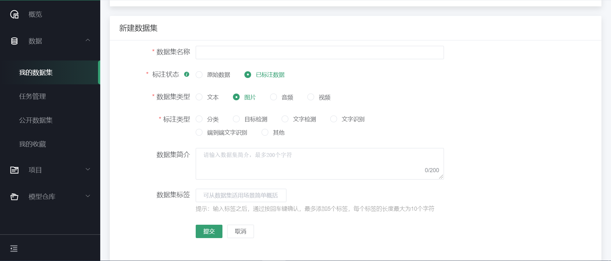**

如下图所示，点击“数据集要求及上传样例”(a),
可获取详细数据集要求及样例；根据要求制作数据集文件，点击b处上传需要标注的数据集。

其中标注类型中“其他”设置的目的是支持用户上传除平台所提供的的标注类型之外的类型，如图片类型中的实例分割。当上传标注类型无对应类型时，选择“其他”即可。如下图：

根据数据集类型的不同，支持已标注的场景也有所不同，标注文件的格式说明如下：

A．图片

1. 图片分类：图片分类的标注格式文件支持json、xml格式(以json为主)，标注文件的文件名称必须按照txfl-result.json来命名，文件内容遵循的层级关系主要包括如下：

{

"categories":

[

{

"images":

[

{

"url":"wheaten_terrier/wheaten_terrier_1.jpg"

},

{

"url":"wheaten_terrier/wheaten_terrier_2.jpg"

},

...

],

"name":"wheaten_terrier"

},

{

"images":

[

{

"url":"great_pyrenees/great_pyrenees_1.jpg"

},

{

"url":"great_pyrenees/great_pyrenees_2.jpg"

},

...

],

"name":"great_pyrenees"

},

...

]

}

1. 目标检测：目标检测的标注格式文件支持json、xml格式(以json为主)，标注文件的文件名称必须按照txkt-result.json来命名，文件内容遵循的层级关系主要包括如下：

[

{

"data":[

{

"bbox":{

"height":38,

"width":108,

"x":368,

"y":215

},

"label":"aeroplane",

"shape":"rect"

},

{

"bbox":{

"height":166,

"width":424,

"x":1,

"y":99

},

"label":"aeroplane",

"shape":"rect"

}

],

"image":"new/2008_000756.jpg"

},

...

]

1. 文字检测：文字检测的标注格式文件支持json、xml格式(以json为主)，标注文件的文件名称必须按照wzjc-result.json来命名，文件内容遵循的层级关系主要包括如下：

[

{

"data":[

{

"label":"LIM SENG THO HARDWARE TRADING",

"points":[

{

"x":121,

"y":220

},

{

"x":810,

"y":220

},

...

]

},

...

]

}

]

1. 文字识别：文字识别的标注格式文件支持json、xml格式(以json为主)，标注文件的文件名称必须按照wzsb-result.json来命名，文件内容遵循的层级关系主要包括如下：

[

{

"image":"word_1.png,",

"label":"Genaxis"

},

{

"image":"word_2.png,",

"label":"[06]"

},

{

"image":"word_3.png,",

"label":"62-03"

},

{

"image":"word_4.png,",

"label":"Carpark"

},

{

"image":"word_5.png,",

"label":"EXIT"

},

{

"image":"word_6.png,",

"label":"I2R"

},

{

"image":"word_7.png,",

"label":"fusionopolis"

},

{

"image":"word_8.png,",

"label":"fusionopolis"

}

]

1. 端到端文字识别：端到端文字识别的标注格式文件支持json、xml格式(以json为主)，标注文件的文件名称必须按照dddwzsb-result.json来命名，文件内容遵循的层级关系主要包括如下：

[

{

"data":[

{

"label":"LIM SENG THO HARDWARE TRADING",

"points":[

{

"x":121,

"y":220

},

{

"x":810,

"y":220

},

{

"x":810,

"y":258

},

{

"x":121,

"y":258

}

]

},

...

]

}

]

1. 文本

2. 文本分类(csv、xlsx)：文件内容需包含文本列和标签列。示例如下：

1. 短文本相似度：txt格式文本文件，其中每一行是一对句子及其对应标签（0、1）。格式为"句子1,句子2,标签"，分隔符为英文逗号，标签为0：不相似，1：相似。示例如下：

1. 划词标注，json格式文本文件，json层次结构如下：

****

1. CRF命名实体：txt格式文本文件，其中每一行是一个字及其所对应的标签（O,B-TIM,I-TIM,B-PER,I-PER,B-ORG,I-ORG,B-LOC,I-LOC），词语和标签之间由空格"
   "分隔。句子与句子用空行分隔。

1. 机器学习和推荐系统：标准的结构化数据即可。

2. 词频统计和词向量：txt格式文本文件，对整个文本进行训练，没有具体的标注格式。

C．音频

1. 语音转文本：语音转文本的标注格式文件是以json格式为主，标注文件的文件名称必须按照yyzwb-result.json来命名，文件内容遵循的层级关系主要包括如下：

[

{

"audio":"8kHz-20181227104853-5f3e8dfc41604bae.wav",

"data":[

{

"beginTime":0.5336176066024759,

"endTime":0.8789958734525447,

"text":"这问题"

},

{

"beginTime":0.9583837689133425,

"endTime":1.1089752407152682,

"text":"我们"

}

]

},

{

"audio":"8kHz-20181227105219-782789b09d8e4f74.wav",

"data":[

{

"beginTime":0.0016368638239339752,

"endTime":1.1793603851444292,

"text":"你投诉的这个问题，我们"

}

]

}

]

1. 语音分类：语音分类的标注格式文件是以json格式为主，标注文件的文件名称必须按照yyfl-result.json来命名，文件内容遵循的层级关系主要包括如下：

{

"categories":[

{

"audio":[

{

"index":9,

"url":"8kHz-20181227134406-18ad3c3ebbd146b0.wav"

},

...

],

"name":"a"

},

...

]

}

D． 视频

1. 视频分类：视频分类的标注格式文件是以json格式为主，标注文件的文件名称必须按照spfl-result.json来命名，文件内容遵循的层级关系主要包括如下：

{

"categories":[

{

"name":"a",

"videos":[

{

"index":3,

"url":"12.mp4"

},

...

]

},

...

]

}

1. 视频分段：语音分类的标注格式文件是以json格式为主，标注文件的文件名称必须按照spfd-result.json来命名，文件内容遵循的层级关系主要包括如下：

[  
{  
"annotations":[  
{  
"annotation":"2",  
"segs":[  
{  
"beginTime":0,  
"endTime":1  
}  
]  
}  
],  
"subjects":[  
{  
"bbox":{  
"x1":209,  
"y1":53,  
"x2":426,  
"y2":146,  
"flag":false,  
"targetMarkValue":"",  
"wid":217,  
"hei":93,  
"left":0,  
"width":0,  
"label":"2",  
"finalX1":0,  
"finalX2":0  
},  
"label":"2",  
"shape":"rect",  
"time":0  
}  
],  
"video":"1.mp4"  
},  
{  
"annotations":[  

],  
"subjects":[  

],  
"video":"1_1.mp4"  
},  
{  
"annotations":[  
{  
"annotation":"2",  
"segs":[  
{  
"beginTime":0,  
"endTime":7  
},  
{  
"beginTime":1,  
"endTime":3  
}  
]  
}  
],  
"subjects":[  

],  
"video":"2.mp4"  
}  
]

### 数据集公开

Ku+ MLOps提供了开放共享的生态与平台，便于大家更好地交流与使用。除Ku+
MLOps已预置的数据集外，平台也支持用户将自己的数据集进行公开，便于其他有类似需求的用户快速地使用。

在“我的数据集”列表找到相应的数据集，在数据集详情页，点击右上角的“设置为公开”即可。

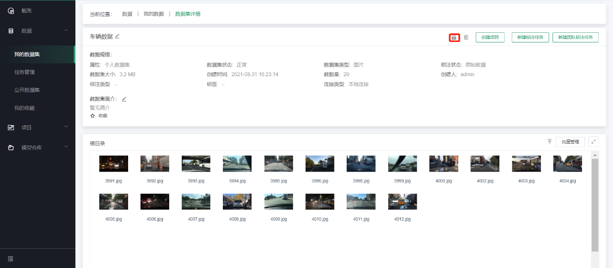

**注意事项**

- 个人上传的数据集才可进行公开，如果是已公开的数据集不需重复公开；

- 数据集一旦申请公开且审核通过，原则上不允许取消公开权限；

- 公开的数据集会进行审核，审核确认后才会公开，请注意数据集的敏感性及合规性；

- 审核失败的数据集根据审核意见进行调整后可重新提交，如已公开的数据集增加了新的数据或者标注，也可以作为新的数据集版本重新申请审核。

### 数据集收藏

数据集收藏功能是便于用户管理常用的数据集，目前个人数据集及公开数据集均支持收藏。在数据集列表及数据集详情页点击“收藏”按钮即可，后续可以在“数据-\>我的收藏”中快速查看。

## 数据标注

平台提供个人标注和团队标注两种数据标注方式。个人标注是指用户上传数据集并独立完成数据标注任务；团队标注是指用户上传数据集，然后分配到所在团队各成员进行标注。数据标注支持四种类型数据集的标注，分别为：文本、图片、音频和视频。

### 个人标注

个人标注可通过“数据-\>我的数据集”或“数据-\>任务管理”进入到标注操作页面。支持标注的数据集类型包括文本、图片、音频、视频四种类型，具体操作如下所示。

#### 图片标注

用户在创建数据集并完成上传图片数据后，可通过数据集详情页进行查看数据，同时可进行图片分类/目标检测/文字检测/文字识别/端到端文字识别的数据标注。具体入口如下：

##### 图片分类标注

第一步，新建数据集并完成原始数据的上传，可参考4.2.2；若在当前数据集下新建图片分类标注任务，可直接从第二步开始。

第二步，点击“新建标注任务”，选择“新建标注类型-\>图片分类标注”，如下图：

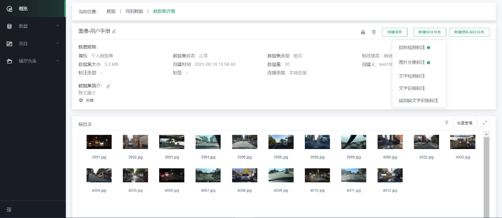

第三步，进入标注操作页面

在图片分类标注页面，操作区域上方会显示所有待分类的图片，页面下方可以通过单击“+”图标，新增分类标签。如下图：

通过拖拽上方图片到下方具体类别中，完成图片的分类。如下图：

第四步，查看标注结果和相关信息统计

在数据集详情页面，可以看到当前数据集每个类型对应的数量；右侧为相关信息统计，其中包括任务类型、标注类型、创建方式、创建时间和最近修改时间，如下图：

点击“查看详情”，进入图片分类的详细信息页面。如下图：

##### 目标检测标注

第一步，新建数据集并完成原始数据的上传，可参考[4.2.2](#原始数据集上传)

第二步，点击“新建标注任务”，选择“新建标注类型-\>目标检测标注”，如下图：

第三步，进入标注操作页面

在目标检测标注页面，可以看到操作区左侧是待标注的图片，右侧是标签管理；默认从第一张图片开始标注，在左侧标出目标后，选择选择对应的目标标签，即可完成当前单个目标的标注。如下图：

对该张图片标注完成之后，通过点击“下一页”，进行下一张图片的标注，系统会自动保存标注的内容。若已进行了标注工作，退出前，需点击“保存”后才可退出。如下图：

若在标注过程中出现了错标，可单击标注页面右上角的“操作”按钮，删除错标的目标框，重新标注。如下图：

第四步，查看标注结果和相关信息统计

在数据集详情页面，可以看到当前数据集每个标签类型对应的已标注数量；右侧为相关信息统计，其中包括任务类型、标注类型、创建方式、创建时间和最近修改时间。如下图：

点击“查看详情”，即可查看标注的详细信息，通过上方Tab可以切换查看不同标注状态的图片。如下图：

##### 文字检测标注

第一步，新建数据集并完成原始数据的上传，可参考[4.2.2](#原始数据集上传)

第二步，点击“新建标注任务”，选择“新建标注类型-\>文字检测标注”，如下图：

第三步，进入标注操作页面

在文字检测标注页面，操作区域左侧显示待标注图片。用户可选择矩形框或任意四边形进行在左侧图片上框定需要标注的区域，然后在右侧对标签中填写对应的文字内容。如下图：

若在标注过程中出现了错标，可单击标注页面右上角的“操作”按钮，删除错标的标注框，重新标注。如下图：

第四步，查看标注结果和相关信息统计

在数据集详情页面，可以看到文字检测的标注结果样例；右侧为相关信息统计，其中包括任务类型、标注类型、创建方式、创建时间和最近修改时间，如下图：

点击“查看详情”，进入文字检测标注的详细信息页面。通过上方Tab可以切换查看不同标注状态的图片。如下图：

##### 文字识别标注

第一步，新建数据集并完成原始数据的上传，可参考[4.2.2](#原始数据集上传)；若在当前数据集下新建图片分类标注任务，可直接从第二步开始

第二步，点击“新建标注任务”，选择“新建标注类型-\>文字识别标注”，如下图：****

第三步，进入标注操作页面

在文字识别标注页面，操作区域左侧显示待标注图片，在右侧对应图片，填写正确的文字内容。如下图：

第四步，查看标注结果和相关信息统计

在数据集详情页面，可以看到文字识别的标注结果样例；右侧为相关信息统计，其中包括任务类型、标注类型、创建方式、创建时间和最近修改时间，如下图所示。

点击“查看详情”，进入文字识别标注的详细信息页面。通过上方Tab可以切换查看不同标注状态的图片。如下图：

##### 端到端文字识别标注

第一步，新建数据集并完成原始数据的上传，可参考4.2.2

第二步，点击“新建标注任务”，选择“新建标注类型-\>端到端文字识别标注”，如下图：

****

第三步，进入标注操作页面

在端到端文字识别标注页面，操作区域左侧显示待标注图片。用户可选择矩形框或任意四边形进行在左侧图片上框定需要标注的区域，然后在右侧对标签中填写对应的文字内容。如下图：

若在标注过程中出现了错标，可单击标注页面右上角的“操作”按钮，删除错标的标注框，重新标注。如下图：

****

第四步，查看标注结果和相关信息统计

在数据集详情页面，可以看到端到端文字识别的标注结果样例；右侧为相关信息统计，其中包括任务类型、标注类型、创建方式、创建时间和最近修改时间，如下图所示。

****

点击“查看详情”，进入文字识别标注的详细信息页面。通过上方Tab可以切换查看不同标注状态的图片。如下图：

****

#### 文本标注

用户在创建数据集，上传完文本数据之后，可通过数据集详情页进行查看数据，同时可进行文本分类/划词/短文本相似度/CRF命名实体/词向量/词频统计/机器学习/推荐系统数据标注。具体入口如下：

##### 文本分类标注

第一步，新建数据集并完成原始数据的上传，可参考[4.2.2](#原始数据集上传)

第二步，点击“新建标注任务”，选择“新建标注类型-\>文本分类标注”，如下图：

****

系统会提示该场景支持的文件类型，下拉选择需要标注的文件，点击“确定”，如下图：

****

第三步，进入标注操作页面

在标注页面中，会将所有标注的内容显示在文本内容中，右侧显示文本标签，可以添加标签，可以通过点击某个标签，完成对整个文本内容进行分类。如下图：

对该条文本数据完成之后，通过点击“下一页”，进行下一条数据标注，系统会自动保存刚才的标注内容；若已进行了标注工作，退出前，需点击“保存”后才可退出。

第四步，查看标注结果和相关信息统计

在数据集详情页面，可以看到当前数据集每个标签对应的已标注的数量；右侧为相关信息统计，其中包括任务类型、标注类型、创建方式、创建时间和最近修改时间，如下图：

点击“查看详情”，即可查看标注的详细信息，同时支持修改已标注的信息。如下图：

##### 划词标注

第一步，新建数据集并完成原始数据的上传，可参考3.2.2

第二步，点击“新建标注任务”，选择“新建标注类型-\>划词标注”，如下图：

系统会提示该场景支持的文件类型，下拉选择需要标注的文件，点击“确定”，如下图：

第三步，进入标注操作页面

在标注页面中，会将所有标注的内容显示在文本内容中，右侧显示文本标签和标注结果，可以添加标签，可以通过双击标注结果进行删除操作，完成对整个文本内容划词标注，如下图：

对该条文本数据划词标注完成之后，通过点击下一页，进行下一条数据标注，系统会自动保存刚才的标注内容；若已进行了标注工作，退出前，需点击“保存”后才可退出。

第四步，查看标注结果和相关信息统计

在数据集详情页面，可以看到当前数据集每个标签对应的已标注的数量；右侧为相关信息统计，其中包括任务类型、标注类型、创建方式、创建时间和最近修改时间，如下图：

点击“查看详情”，即可查看标注的详细信息，同时支持修改已标注的信息。如下图：

##### 短文本相似度标注

第一步，新建数据集并完成原始数据的上传，可参考[4.2.2](#原始数据集上传)

第二步，点击“新建标注任务”，选择“新建标注类型-\>短文本相似度标注”，如下图：

****

系统会提示该场景支持的文件类型，下拉选择需要标注的文件，点击“确定”，如下图：

****

第三步，进入标注操作页面

在标注页面中，会将文本中对应内容分别进行标注，左侧显示标注内容，右侧显示文本标签，根据文本一和文本二的内容判断是否相似，选择后完成当前文本内容标注；若已进行了标注工作，退出前，需点击“保存”后才可退出。

第四步，查看标注结果和相关信息统计

在数据集详情页面，可以看到当前数据集相似与不相似的标注结果统计；右侧为相关信息统计，其中包括任务类型、标注类型、创建方式、创建时间和最近修改时间。

点击“查看详情”，即可查看标注的详细信息，同时支持修改已标注的信息。如下图：

****

##### CRF命名实体标注

第一步，新建数据集并完成原始数据的上传，可参考4.2.2

第二步，点击“新建标注任务”，选择“新建标注类型-\>CRF命名实体标注”，如下图：

系统会提示该场景支持的文件类型，下拉选择需要标注的文件，点击“确定”，如下图：

第三步，进入标注操作页面

在标注页面中，会将文本中对应内容分别进行标注，左侧显示标注内容，右侧显示文本标签；若已进行了标注工作，退出前，需点击“保存”后才可退出。

第四步，查看标注结果和相关信息统计

在数据集详情页面，可以看到当前数据集相似与不相似的标注结果统计；右侧为相关信息统计，其中包括任务类型、标注类型、创建方式、创建时间和最近修改时间。

点击“查看详情”，即可查看标注的详细信息，同时支持修改已标注的信息。如下图：

##### 机器学习/推荐系统标注(因标注方式相同，此处以机器学习为例)

第一步，新建数据集并完成原始数据的上传，可参考4.2.2

第二步，点击“新建标注任务”，选择“新建标注类型-\>机器学习标注”，如下图：

****

系统会提示该场景支持的文件类型，下拉选择需要标注的文件，点击“确定”，如下图：

****

第三步，进入标注操作页面

在标注页面中，系统会通过文本类型自动预判每个标签对应的个体类别，若预判存在问题，支持用户修改类别，若已进行了标注工作，退出前，需点击“保存”后才可退出。

第四步，查看标注结果和相关信息统计

在数据集详情页面，可以看到标注结果样例，其中包括任务类型、标注类型、创建方式、创建时间和最近修改时间。

点击“查看详情”，即可查看标注的详细信息，同时支持修改已标注的信息。如下图：

****

##### 词向量/词频统计标注

因为词向量和词频统计是对整个文本进行训练，故无需进行标注，只需上传数据集，选择数据集标注的场景即可。

#### 音频标注

用户在创建数据集，上传完音频数据之后，可通过数据集详情页进行查看数据，同时可进行语音转文本/语音分类数据标注。具体入口如下：

##### 语音转文本标注

第一步，新建数据集并完成原始数据的上传，可参考4.2.2

第二步，点击“新建标注任务”，选择“新建标注类型-\>语音转文本标注”，如下图：

****第三步，进入操作页面

在语音转文本的操作页面，上方会显示需要标注的音频文件，如下图：

通过从左向右拖动音频段的操作，可快速截取需要标注的内容。如下图：

在标注内容中填写对应的内容，如下图：

在a板块可查看标注音频段落的起止时间；b操作板块单击“播放”听取截取段落的音频，单击“移动”可删除已标注的音频段落，重新标注。c板块支持“暂停”、“快进”、“后退”操作；d板块支持音频在时间维度的“放大”、“缩小”。对该张音频标注完成之后，通过点击“下一页”，进行下一段音频的标注，系统会自动保存标注的内容。若已进行了标注工作，退出前，需点击“保存”后才可退出。如下图：

第四步，查看标注结果和相关信息统计

在数据集详情页面，可以看到音频转文本结果示例；右侧为相关信息统计，其中包括任务类型、标注类型、创建方式、创建时间和最近修改时间，如下图：

点击“查看详情”，即可查看标注的详细信息，同时支持修改已标注的信息。如下图：

##### 语音分类标注

第一步，新建数据集并完成原始数据的上传，可参考4.2.2

第二步，点击“新建标注任务”，选择“新建标注类型-\>语音分类标注”，如下图：

第三步，进入语音分类操作页面

在语音分类标注页面，操作区域上方会显示所有待分类的音频，页面下方可以通过单击“+”图标，新增分类标签。如下图：

单击操作区域上方的音频，可播放音频内容，判断音频所属分类。

当出现错分类时(music分组为例)，可点击操作区域下方“music”分组，点击弹窗中“-”按钮，移除错分类“yinpin”文件。

第四步，查看标注结果和相关信息统计

在数据集详情页面，可以看到每个音频类别对应的数量；右侧为相关信息统计，其中包括任务类型、标注类型、创建方式、创建时间和最近修改时间，如下图：

单击“查看详情”，可进入语音分类标注的详细信息页面，如下图：

#### 视频标注

用户在创建数据集，上传完视频数据之后，可通过数据集详情页进行查看数据，同时可进行视频分类/视频分段数据标注。具体入口如下：

##### 视频分类标注

第一步，新建数据集并完成原始数据的上传，可参考4.2.2

第二步，点击“新建标注任务”，选择“新建标注类型-\>视频分类标注”，如下图：

第三步，进入视频分类操作页面

在视频分类标注页面，操作区域上方会显示所有待分类的视频，页面下方可以通过单击“+”图标，新增分类标签。

单击操作区域上方的视频，可播放视频内容，判断视频所属分类。如下图：

当出现错分类时(day组为例)，可点击操作区域下方“day”分组，点击弹窗中“-”按钮，移除错分类文件。如下图：

第四步，查看标注结果和相关信息统计

在数据集详情页面，可以看到每个视频类别对应的数量；右侧为相关信息统计；其中包括任务类型、标注类型、创建方式、创建时间和最近修改时间，如下图所示。

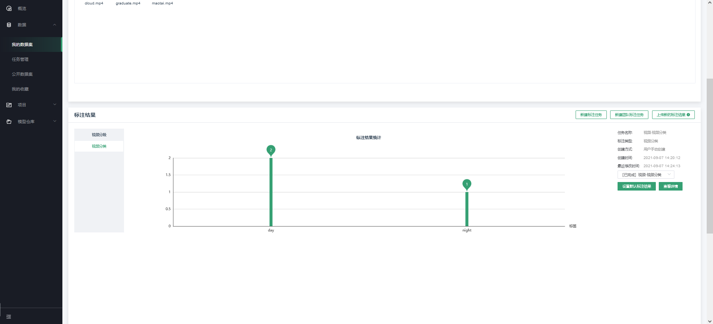

点击“查看详情”，可进入视频分类标注的详细信息页面。如下图：

##### 视频分段标注

第一步，新建数据集并完成原始数据的上传，可参考4.2.2

第二步，点击“新建标注任务”，选择“新建标注类型-\>视频分段标注”，如下图：****

第三步，进入标注操作页面

在视频分段标注页面，可以看到操作区左侧是待标注的视频，右侧是标签管理，默认从第一个视频开始标注
。如下图：

****

点击下拉框选择标签，添加该标签的视频片段，以“people”为例。如下图：

在下方操作区域，选择该视频需要截取的片段，拖拽圆点，可确定截取的起止时间，截取片段的最小单位为1s。如下图：

点击“播放/暂停”按钮，可在视频播放区域查看此片段的内容；点击“×”，可删除people标签片段；点击“＋”，可添加people标签片段。如下图：

点击左上角“键盘”按钮，可查看快捷操作。如下图：

第四步，查看标注结果统计

在数据集详情页面，可以看到每个标签对应已标注的数量；右侧为相关信息统计，其中包括任务类型、标注类型、创建方式、创建时间和最近修改时间，如下图：

点击“查看详情”，可进入视频分段标注的详细信息页面。如下图：

### 团队标注

团队标注可通过“数据-\>任务管理”页面进行操作管理。团队标注主要分为以下步骤：1)上传需要标注的数据集;2)创建团队添加团队成员;3)创建标注任务;4)任务分配;5)标注者标注;6)标注审核;7)完成标注。数据集类型包括文本、图片、音频、视频四种标注类型，具体操作如下所示。

#### 创建团队

第一步，添加团队，团队管理-\>添加团队

填写团队名称和团队描述，点击“确定”完成团队添加。

注：用户最多可以创建20个团队，每个团队最多可添加40个成员，我加入的团队是不可编辑的，包括添加成员和编辑、删除成员

第二步，添加成员，点击“添加成员”

团队成员中主要包括了标注人员和审核人员两种角色，分配标注任务时，标注人员只能看到自己的标注样本数据，任意审核人员可以看到审核要求的样本集中的所有审核任务，同时支持数据集的创建人员、标注人员和审核人员都是同一个人。

第三步，查看团队成员

点击“修改”可修改该成员的角色；点击“删除”，可删除该成员重新分配团队，如下图所示。当需要删除的用户还有标注任务未完成时，不支持删除，点击“删除”，提示“当前组关联标注任务，不可进行当前操作”。

点击“加入的团队”可查看目前已加入的团队详情；当前板块仅支持查看，不支持操作。

#### 创建团队标注任务

首先任务分配者在数据-\>个人数据集中完成创建数据集及数据上传操作，进入数据集详情页面，可参考3.2.2。然后点击“新建团队标注任务”，如下图：

填写任务类型、任务名称、任务描述、标注团队、是否需要审核等信息，点击“提交”。其中是否需要审核选择“是”，需依次填写审核比例和审核通过率
。若选择“否”，则无需填写审核比例和审核通过率信息并且无标注审核阶段。以选择“是”为例，如下图：

#### 任务分配

完成创建团队标注任务后，需要在数据-\>任务管理中进行任务分配操作，如下图：

任务列表下方显示支持操作的功能，根据标注的状态会相应变化，如下图：

点击“任务分配”，进入任务分配页面，支持平均分配和数量分配两种分配类型，其中平均分配按标注数据数量和人员数量进行均分，数量分配支持分配人员自定义标注人员的标注数量。确定分配方式后，点击“提交”。如下图：

#### 标注者标注

标注者在任务管理中，可以看到被分配的任务，按时完成标注任务即可，各标注类型标注说明参考个人标注4.3.1。

#### 标注审核

当团队中所有人标注完成后，由数据集的创建者提交标注完成，进入到标注审核阶段，审核的界面如下：

点击“审核通过”和“审核不通过”选项，即可保存审核状态，并自动跳转到下一页，如果此次任务的标注质量普遍都很差，审核人员可以直接点击“驳回重标”按钮，表示此任务需要重新标注，状态变为驳回重标状态，标注人员在保存的标注结果之上继续标注。

审核过程中，随时都可以查看到审核数据的统计信息，如下图：

### 标注任务管理

标注任务的管理分为三种角色：数据集创建用户、标注人员和审核用户，整体流程如下：

各角色在不同任务状态的操作及说明：

| 状态/操作  | 我创建         | 我标注                                                    | 我审核                                  | 备注                                   |                                                                                       |
| ------ | ----------- | ------------------------------------------------------ | ------------------------------------ | ------------------------------------ | ------------------------------------------------------------------------------------- |
| 数据同步状态 | 已创建         | 数据集详情 查看任务详情                                           |                                      |                                      | 用户创建协同标注任务 已创建状态                                                                      |
|        | 同步中         | 数据集详情 查看任务详情                                           |                                      |                                      | 系统根据任务类型抽取数据 已创建-\>同步中                                                                |
|        | 同步失败        | 数据集详情 查看任务详情 删除任务                                      |                                      |                                      | 系统内部错误 同步中-\>同步失败                                                                     |
|        | 已同步(待分配)    | 数据集详情 查看任务详情 分配任务 修改任务（不可改类型） 删除任务                     |                                      |                                      | 同步完成 同步中-\>同步完成                                                                       |
| 标注状态   | 待标注         | 数据集详情 查看任务详情 修改任务（不可改类型） 删除任务                          | 查看任务详情 标注                            |                                      | 分配任务 待分配-\>待标注                                                                        |
|        | 驳回重标 (审核驳回) | 数据集详情 查看任务详情 查看审核详情 重新标注                               | 查看任务详情 查看审核详情                        | 查看任务详情 查看审核详情                        | 审核驳回 审核中-\>驳回重标                                                                       |
|        | 标注中         | 数据集详情 查看任务详情 查看标注进度（统计） 提交完成（均标注完成） 查看标注详情             | 查看任务详情 标注 查看标注进度（统计）                 |                                      | 开始标注 待标注-\>标注中 -------------------------------------- 审核驳回后点击重新标注 审核驳回-\>标注中          |
|        | 已完成         | 数据集详情 查看任务详情 查看标注进度（统计） 查看标注详情 标注结果下载 创建项目 查看审核详情（有审核） | 查看任务详情 查看标注进度（统计） 查看标注详情 查看审核详情（有审核） | 数据集详情 查看任务详情 查看审核详情（有审核） 标注结果下载      | 提交标注完成 标注中-\>已完成（无审核） ------------------------------------------- 审核通过 审核中-\>已完成（有审核） |
| 审核状态   | 审核中         | 数据集详情 查看任务详情 查看标注进度（统计） 查看标注详情 标注结果下载 查看审核进度           | 查看任务详情 查看标注进度（统计） 查看标注详情 查看审核进度      | 审核（提交、驳回） 查看任务详情 查看审核进度 数据集详情 标注结果下载 | 提交审核 标注完成-\>审核中                                                                       |
|        | 审核 未通过      | 数据集详情 查看任务详情 查看标注进度（统计） 查看标注详情 标注结果下载 查看审核详情           | 查看任务详情 查看标注进度（统计） 查看标注详情 查看审核详情      | 数据集详情 查看任务详情 查看审核详情 标注结果下载           | 审核完成提交（审核任务提交，判断审核通过率\<设定阈值） 审核中-\>审核不通过                                              |

## 模型训练

平台以项目方式进行训练任务管理，可以通过创建自动化、拖拽式、Notebook、任务式四种类型的项目来进行不同方式的模型训练。

用户可通过Ku+ MLOps进行模型的开发和训练，面向不同的用户群体，Ku+
MLOps提供不同的交互方式，如面向业务开发人员，提供自动化和拖拽式训练的方式，面向专业算法工程师提供NoteBook和任务式方式进行模型的开发和训练。用户选择不同的项目类型对应不同的创建项目步骤，具体使用方式见以下说明：

### 自动化建模

#### 图像分类

第一步，创建项目

在点击“创建项目”的页面中，填写必要的信息，如项目名称、项目简介等内容，同时在项目类型中选择“自动化”，如下图：

在点击创建项目之后，进入实际的创建内容，选择应用场景

从下拉列表中选择“图像分类”，以及对应的子场景，如下图：

点击“下一步”选择数据，从下拉菜单中选择数据集，如果没有数据集，可点击选择框中的“创建数据集”，去新建数据集。，如下图：

此处我们选择“图像分类-样例”数据集，如下图：

点击下一步，对所要提交的信息进行确认，确认无误之后，点击提交训练提交自动化训练任务。如下图：

第二步，查看训练任务和评估结果

训练任务提交之后，在项目的详情页，会显示历史任务，以及任务的状态等信息，如下图：

点击训练中旁边的图标可查看训练进度

训练任务成功完成后，会在项目评估结果中展示模型评估指标，如下图：

点击评估详情区域的下拉箭头，可展示更详细的评估内容。

展开后如下图，列表中展示了每一个类别的准确率和错误图片等信息。

#### 文本分类

第一步，创建项目

在点击创建项目的页面中，填写必要的信息，如项目名称、项目简介等内容，同时在项目类型中选择“自动化”，如下图：

****

在点击创建项目之后，进入实际的创建内容，选择应用场景

****

选择文本分类，如下图：

****

点击“下一步”选择数据，从下拉菜单中选择数据集，如果没有数据集，可点击选择框中的“创建数据集”，去新建数据集。

****

点击下一步，对所要提交的信息进行确认，确认无误之后，点击提交训练提交自动化训练任务，如下图：

****

第二步，查看训练任务和评估结果

训练任务提交之后，在项目的详情页，会显示历史任务，以及任务的状态等信息，如下图：

****

点击训练中旁边的图标查看训练进度

**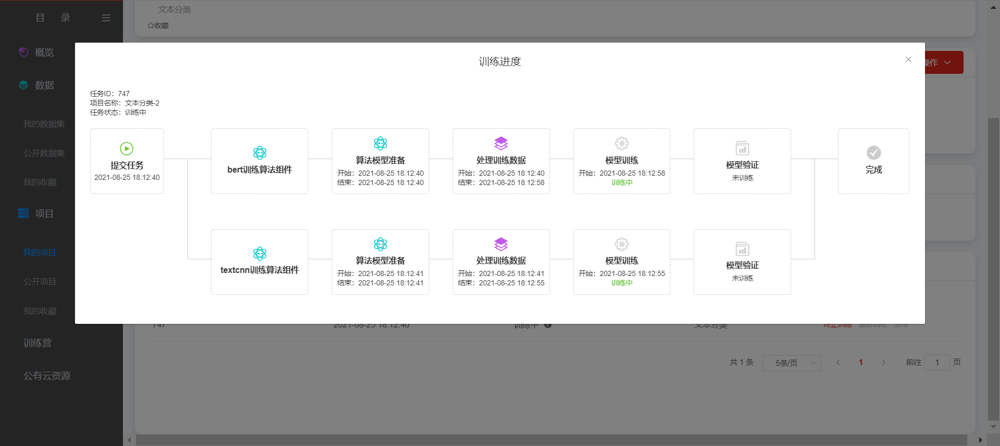**

训练任务成功完成后，会在项目评估结果中出现，如下图：

****

点击评估详情区域的下拉箭头，可展示更详细的评估内容。

****

展开后如下图，列表中展示了每一个类别的准确率和错误识别的案例信息。

#### 机器学习

机器学习主要分为线性回归和分类两种模型类别，下面以线性回归建模过程为例进行介绍。

第一步，创建项目

在点击创建项目的页面中，填写必要的信息，如项目名称、项目简介等内容，同时在项目类型中选择“自动化”，如下图：

****

在点击创建项目之后，进入实际的创建内容，应用场景选择机器学习，如下图：

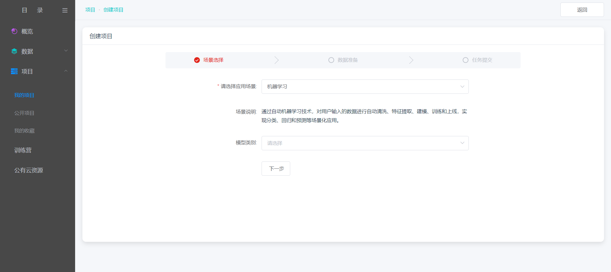

然后选择模型类别，选择线性回归，点击“下一步”，如下图：

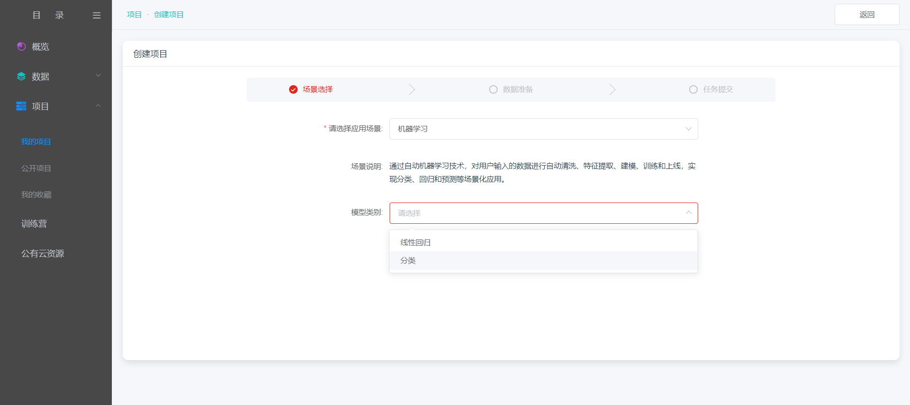

选择样本数据集、评估指标、需要预测的变量和排除列信息，如下图：

鼠标悬浮右侧提示图标，可查看每个指标的具体介绍，如下图：

根据需要选择填写信息，点击“下一步”，如下图：

进入信息确认页面，若确认无误，点击“提交训练”；若需要更改信息，支持点击“上一步”进行信息修改，如下图：

第二步，查看训练任务和评估结果

训练任务提交之后，在项目的详情页，会显示历史任务，以及任务的状态等信息，如下图：

点击训练中旁边的图标查看训练进度

训练任务成功完成后，会在项目评估结果中出现，如下图：

点击评估详情区域的下拉箭头，可展示更详细的评估内容。

展开如下图，列表中展示了训练结果的拟合曲线和特征重要度。

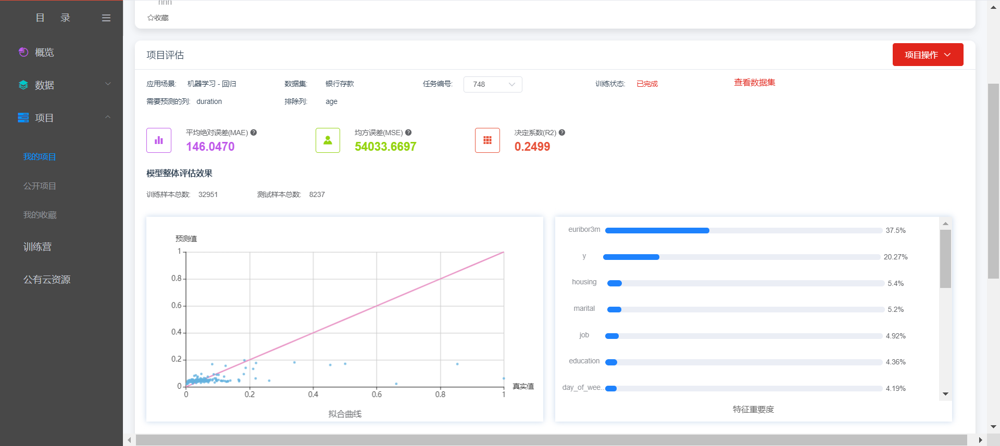

### 拖拽式建模

第一步，创建项目

在点击创建项目的页面中，填写必要的信息，如项目名称、项目简介等内容，同时在项目类型中选择“图形化拖拽”，点击“创建项目”完成创建。如下图：

第二步，查看项目详情

在新建完成项目之后，自动转到项目详情页。因为此时还没有任何训练任务，所以在详情页的历史任务和在线服务均为空，点击“进入项目”，如下图：

第三步，进入项目

项目整个区域分为左、中、右三部分，左侧为组件列表页，中间为操作区域，右侧为信息展示区域。如下图：

工具组件分为了4大类：数据组件、算法组件、训练组件以及验证组件，点开对应类别下拉列表，可以看到详细的组件列表。并且中间操作区域展示了模型训练示意流程，可根据示意流程组合需要的训练场景。如下图：

将训练需要的组件从各类别组件选取后拖拽至操作区域，然后把所有组件按照一定的逻辑链接起来之后，可组成类似如上图中中间部分的流程图。如下图所示，右侧部分为显示选中组件的基本参数信息，以及组件的描述信息，从基本参数信息中，可选择相应的内容，或者填写相应的内容。

如果在拖动拖动过程中，不想使用哪一个组件，则可在该组件处，点击右键，选中弹出框的删除，即可将该组件从该流程图中删除。

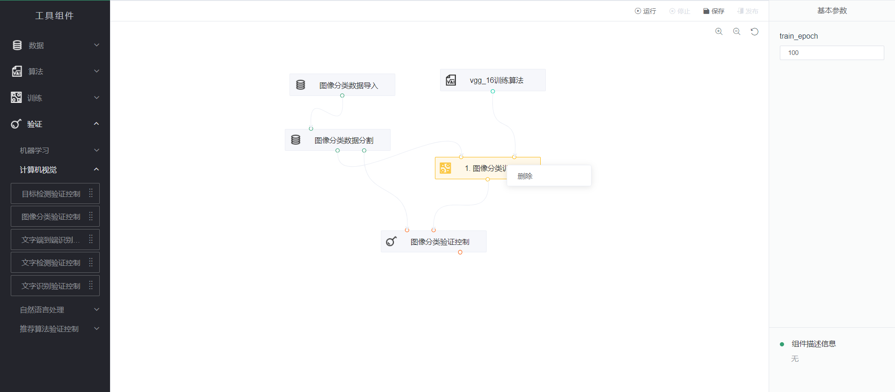

第四步，运行

在完成所有流程的设计，以及对应组件的参数配置之后，可点击操作区域的“运行”，对本次所拖拽的流程图内容进行模型训练，所有组件的状态变为“运行中”。

第五步，查看训练状态

训练成功后，操作区域上方显示“任务运行成功”。如下图：

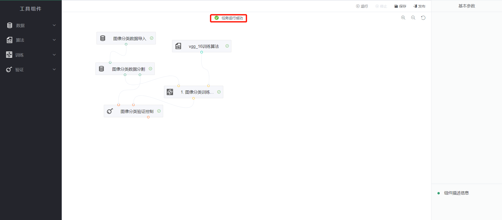

### NoteBook(jili功能不可用)

第一步，创建项目

在点击创建项目的页面中，填写必要的信息，如项目名称、项目简介等内容，同时在项目类型中选择“NoteBook”，以及选择和实际相对应的引擎框架，选择编程语言版本，选择需要训练的数据集，如下图：

第二步，查看项目详情

在新建完成项目之后，自动转到项目详情页

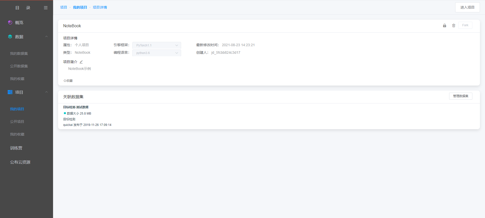

在项目详情页，也可设置关联数据集，如下图：

第三步，启动NoteBook，进入项目

在项目详情页，点击“进入项目”，启动Jupyter NoteBook

等待一段时间，系统后台启动相应NoteBook服务之后，点击“确定”，进到Jupyter
NoteBook中。

鼠标左键双击左侧目录栏文件，弹出交互框，通过此页面信息，用户可知数据集所在位置以及查看数据集的相关命令：

关于Jupyter NoteBook具体操作可参考官方文档：

### 任务式建模(jili功能不可用)

第一步，创建项目

在点击创建项目的页面中，填写必要的信息，如项目名称、项目简介等内容，同时在项目类型中选择“任务式”，以及选择和实际相对应的引擎框架，选择编程语言版本，如下图：

点击任务文件后面的“点击上传”按钮，弹出如下对话框：

选择需要上传的算法任务文件，之后，显示如下：

创建完成后，在我的项目列表中会出现相应的内容，如下图：

第二步，查看项目详情

点击项目详情，可进入到项目详情页面，如下：

在该项目详情页，可对引擎框架、编程语言、以及关联的数据集进行编辑，点击管理数据集，弹出管理关联数据集如下
图

第三步，进入项目进行编辑

在项目详情页，点击右上角的“进入项目”，即可进入任务式的项目编辑页面，

进入编辑页面后显示如下图：

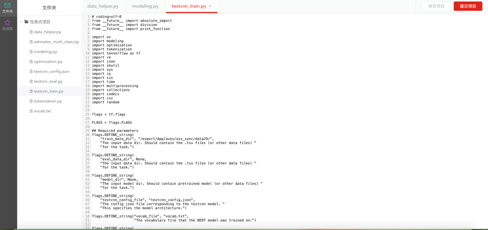

在该页面中左侧文件夹显示的是代码的列表，在右侧操作区可以对代码进行修改。

**关键步骤：选择主文件**

通过在文件夹区域，通过点击右键，在右键弹出框中，选择“设为主文件”，为我们的代码选择一个主文件，即入口文件内容：

同时，点击左侧的数据集，可看到所关联的数据集内容，通过数据集名称右侧的“复制”图标，快捷拷贝数据集目录，通过数据集目录在代码中直接使用数据集，如下图：

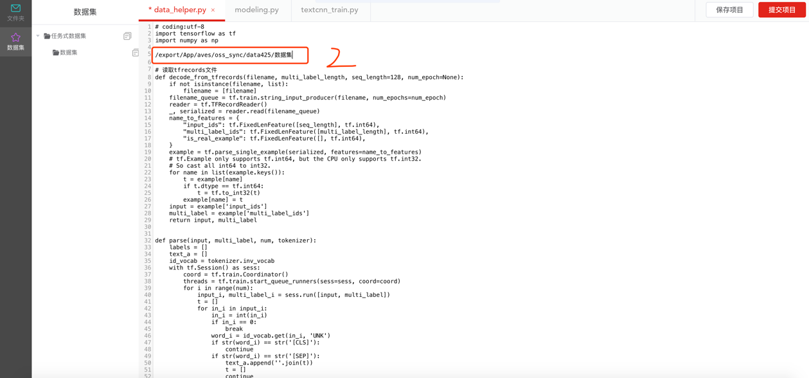

点击保存按钮，对所做的修改内容进行保存。

第四步，提交训练任务

方式1:
通过进入编辑区域，在对代码修改好之后，需要进行模型训练的时候，通过点击右侧的“提交项目”之后，在弹出的运行环境选择对应内容后，将该训练任务提交后台运行。

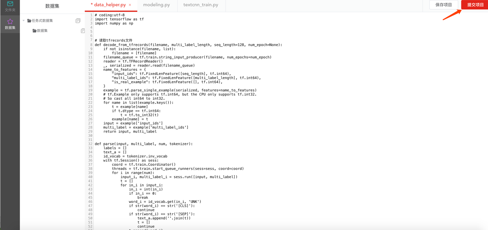

方式2:
在已经设置好主文件的前提下，可直接在项目详情页通过点击右上角的“提交项目”进行提交。

提交之后，可以在历史任务中看到刚才提交的任务处于运行中，如下图：

训练完成之后，可下载输出以及查看日志等相应操作。

### 项目共享

#### 公开项目

公开项目的设置旨在为用户提供交流与学习的平台，用户可以将自己训练的优秀项目分享至公开项目中与大家共同学习与进步。具体操作如下：

第一步，进入将要分享的项目详情页面

点击项目概要信息的右上角“设置为公开”，如下图

会弹出公开确认窗口

确认公开之后，会有专门的管理员进行审核，审核通过后，平台上所有人可以看到该项目

#### Fork项目

在公开项目列表中，选择想fork为自己的项目，点击查看详情，进入项目详情

在项目详情中，点击Fork，弹出Fork弹窗

填写弹窗后，项目就Fork为自己的项目，可进行编辑等正常使用

### 项目收藏

在公开项目列表中，点击收藏按钮

在已收藏的项目会出现在我的收藏（项目）中

说明：公开项目和我的项目中的所有项目都可以收藏，便于使用过程中查找

## 模型仓库模型仓库为模型的存储仓库，模型仓库中可导入所有训练任务生成的模型并进行统一管理。模型仓库支持模型管理和各模型版本管理，各模型的版本具备评估报告、校验模型、部署、下载等功能。具体操作如下：

第一步，进入模型列表

模型列表对所有训练任务进行管理，支持模型类别筛选和模型名称搜索，如下图：

第二步，进入模型发布

点击“发布方式”，发布页面，填写服务名称和接口地址，如下图：

第三步，查看服务详情

点击“服务详情”，跳转至模型的服务详情页面，可查看该模型服务的基本信息，如下图：

第四步，模型下载

点击“模型下载”，自动进入下载页面，如下图：

。

第五步，模型详情

通过查看模型详情，可看到项目的基本信息以及模型评估结果。如下图：

第六步：模型转换

点击模型转换，可进行模型的格式转换，如下图：

## 服务部署

用户可通过评估报告和校验模型的效果决定是否进行部署，若部署则点击“部署”，进入部署信息填写页面，如下图所示。填写服务名称以及自定义的接口地址之后，点击“确定”后已提交发布请求，需管理员进行审核，审核通过后可进行服务调用操作。

提交审核后，在项目详情中会新增在线服务板块，可查看审核的状态

通过审核后，服务状态会变成运行中，此时可通过接口调用来使用刚才训练完成的模型能力。

## 服务调用

用户完成部署后，平台支持用户对AI能力的调用。发布通过审核后，即可在【概览】-【在线服务】中进行服务调用操作。

单击“服务调用测试”，填写参数；若为图片类参数，可单击“Base64转换工具”进行格式转换，将转换后的内容填入框内。

单击“测试”，可在【调试信息】区域看到调用结果。

**  
**

# FAQ
