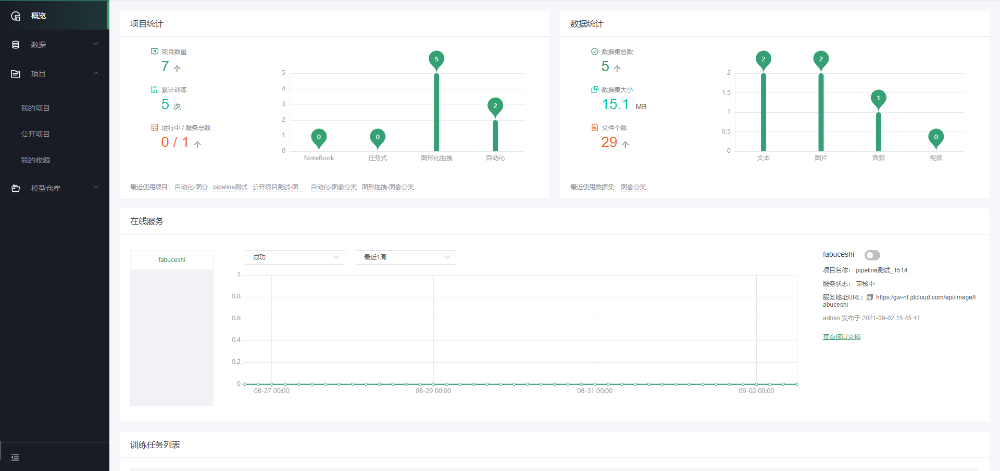

# 个人概览页

　　## 概览

登录系统之后，默认进来显示个人概览页面，显示如下图：

概览可以查看用户的项目统计信息、数据集统计信息，如可具体查看项目的数量、累计训练次数、以及已部署的服务数量，同时会以柱状图形式对各类型项目、各类型数据集数量进行分类统计。

同时概览页可查看在线服务的统计，包含统计的服务名称、服务运行状态、服务URL等内容，支持对服务进行启用/停止操作。通过提供的训练任务列表，对个人的训练任务和历史进行查看，并对训练任务进行相应的操作。

---

如果您对产品有使用或者其他方面任何问题，欢迎联系我们

---
