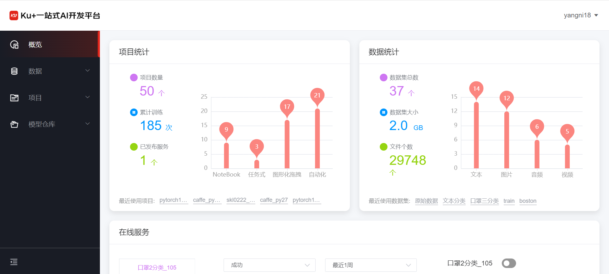

# 个人概览页

登录系统之后，默认进来显示的是个人概览页。

　　概览页可以看到用户的项目统计信息、数据统计信息，如可具体看到项目数量、累计训练次数、以及已发布的服务数量，同时会根据项目类型任务式、NoteBook、图形化拖拽和自动化分别统计该类型的项目数量。

　　同时，通过概览页可以查看在线服务的统计，包含统计的服务名称、服务URL、以及服务运行状态等内容。通过提供的训练任务列表，对个人的训练任务和历史进行查看，并对训练任务进行相应的操作。

---

如果您对产品有使用或者其他方面任何问题，欢迎联系我们

---
