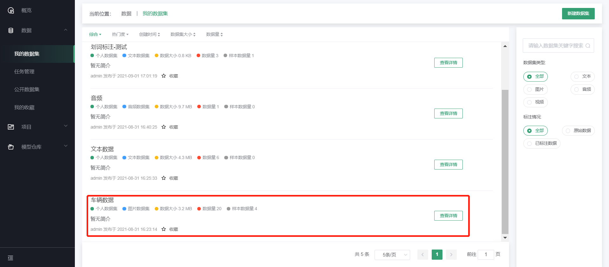
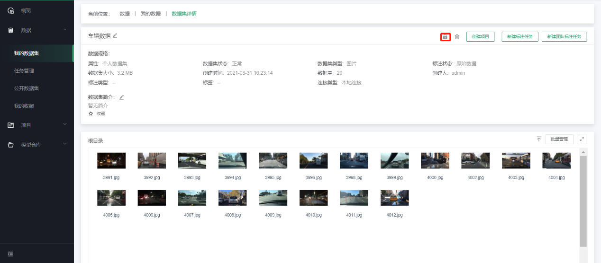

# 公开数据集

Ku+ MLOps提供了开放共享的生态与平台，便于大家更好地交流与使用。除Ku+
MLOps已预置的数据集外，平台也支持用户将自己的数据集进行公开，便于其他有类似需求的用户快速地使用。

在“我的数据集”列表找到相应的数据集，在数据集详情页，点击右上角的“设置为公开”即可。

**注意事项**

- 个人上传的数据集才可进行公开，如果是已公开的数据集不需重复公开；

- 数据集一旦申请公开且审核通过，原则上不允许取消公开权限；

- 公开的数据集会进行审核，审核确认后才会公开，请注意数据集的敏感性及合规性；

- 审核失败的数据集根据审核意见进行调整后可重新提交，如已公开的数据集增加了新的数据或者标注，也可以作为新的数据集版本重新申请审核。

---

如果您对产品有使用或者其他方面任何问题，欢迎联系我们

---
