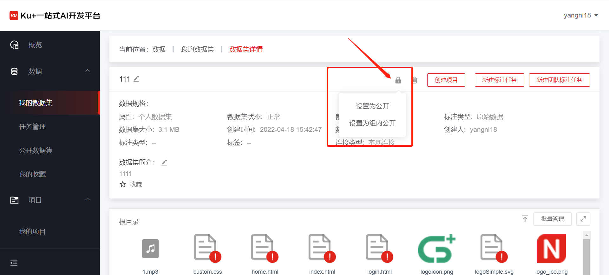

# 公开数据集

平台提供了开放共享的生态与平台，便于大家更好地交流与使用。除平台已预置的数据集外，我们也欢迎大家将自己的数据集进行公开，便于其他由类似需求的用户快速地使用。积极参与到数据集生态建设的用户，平台也会给予相应的支持与鼓励。

 

**1)	公开方式**

   1. 数据集的公开方式分为两种：全平台公开和组内公开，在数据集列表找到相应的数据集，在数据集详情页，点击右上角的“设置为公开”即可。
 
   2. 数据集设置为组内公开时，只能够在用户加入的组内进行共享和模型训练，和全平台公开的规则一致，不可修改数据集的内容和标注信息。

**2)	注意事项**

   1. 个人上传的数据集才可进行公开，如果是已公开的数据集不需重复公开；

   2. 数据集一旦申请公开且审核通过，原则上不允许取消公开权限；
   
   3. 公开的数据集会进行审核，审核确认后才会公开，请注意数据集的敏感性及合规性；

   4. 审核失败的数据集根据审核意见进行调整后可重新提交，如已公开的数据集增加了新的数据或者标注，也可以作为新的数据集版本重新申请审核。

---

如果您对产品有使用或者其他方面任何问题，欢迎联系我们

---
