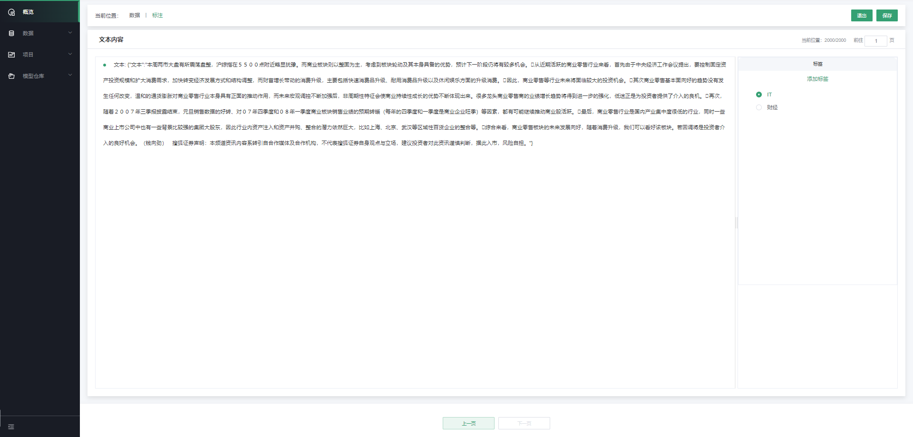
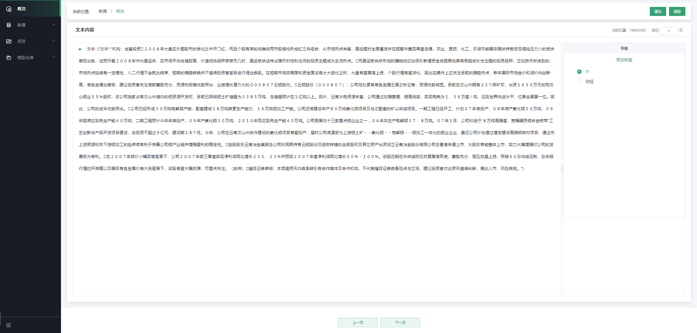
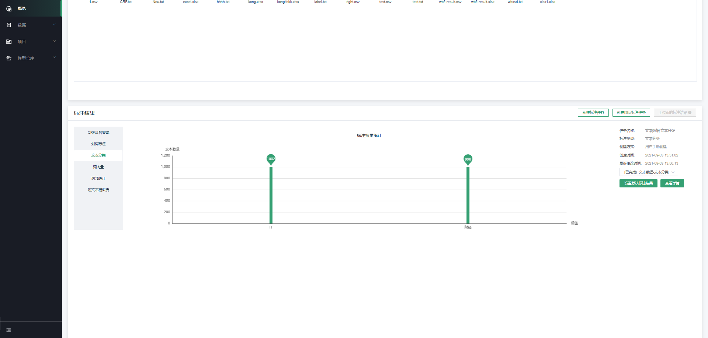

# 文本分类标注

第一步，新建数据集并完成原始数据的上传，可参考[4.2.2](#原始数据集上传)

第二步，点击“新建标注任务”，选择“新建标注类型-\>文本分类标注”，如下图：

****

系统会提示该场景支持的文件类型，下拉选择需要标注的文件，点击“确定”。

第三步，进入标注操作页面

在标注页面中，会将所有标注的内容显示在文本内容中，右侧显示文本标签，可以添加标签，可以通过点击某个标签，完成对整个文本内容进行分类。如下图：

对该条文本数据完成之后，通过点击“下一页”，进行下一条数据标注，系统会自动保存刚才的标注内容；若已进行了标注工作，退出前，需点击“保存”后才可退出。

第四步，查看标注结果和相关信息统计

在数据集详情页面，可以看到当前数据集每个标签对应的已标注的数量；右侧为相关信息统计，其中包括任务类型、标注类型、创建方式、创建时间和最近修改时间，如下图：

点击“查看详情”，即可查看标注的详细信息，同时支持修改已标注的信息。如下图：

---

如果您对产品有使用或者其他方面任何问题，欢迎联系我们

---
