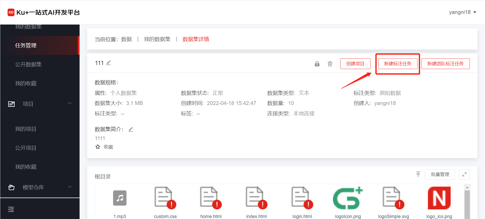
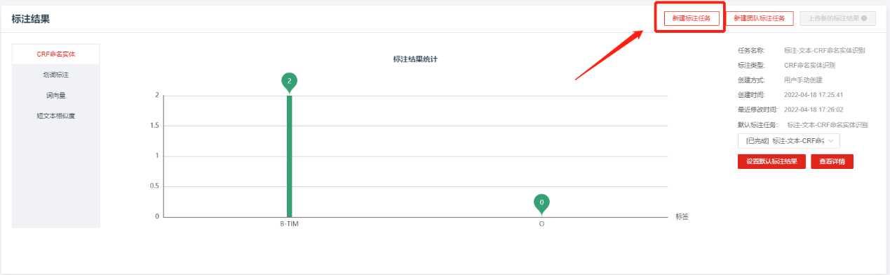
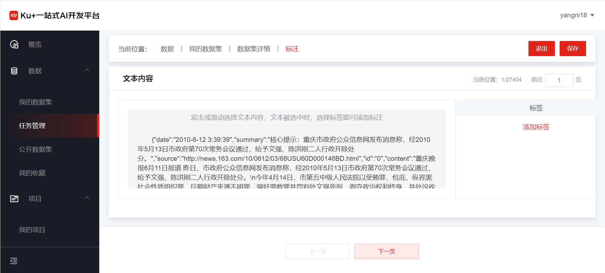
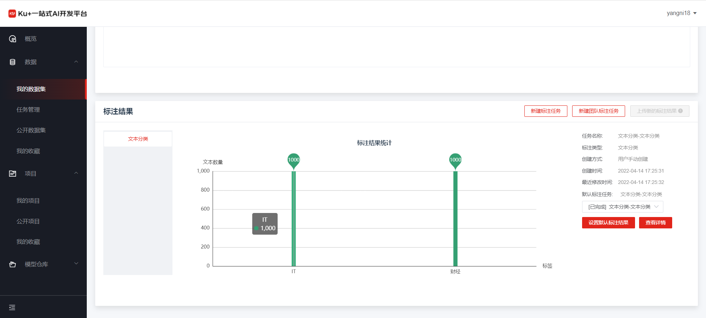

# 文本分类标注

用户在创建数据集，上传完文本数据之后，可通过项目详情页进行查看数据，同时可进行文本分类的数据标注。具体入口如下：

第一步，创建或进入标注

如果为第一次创建标注任务，点击“新建标注任务”

 
 
如果已经有标注任务，或者基于之前的标注结果进行标注，可点击“查看详情”，如下图：

 
 
如果有多次标注任务，可以对某一次成功的标注任务设置为“默认标注结果”。

第二步，进行标注

在标注页面中，会将所有标注的内容显示在文本内容中，右侧显示文本标签，可以添加标签，可以通过点击某个标签，完成对整个文本内容进行分类。

 
 
对该条文本数据分类完成之后，通过点击下一页，进行下一条数据标注，系统会自动保存刚才的标注内容。

 
第三步，查看标注统计结果

如果所有数据都标注完成，则点击退出，返回数据详情页面，可以看到对刚才的标注有了标注结果统计。
 
 

---

如果您对产品有使用或者其他方面任何问题，欢迎联系我们

---
