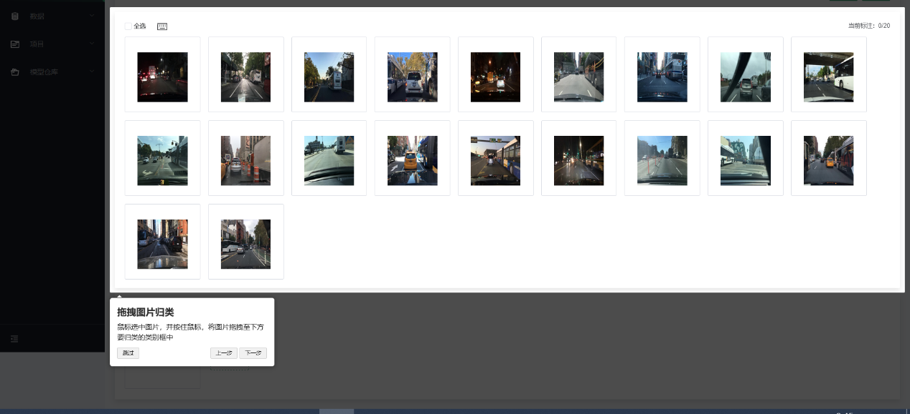
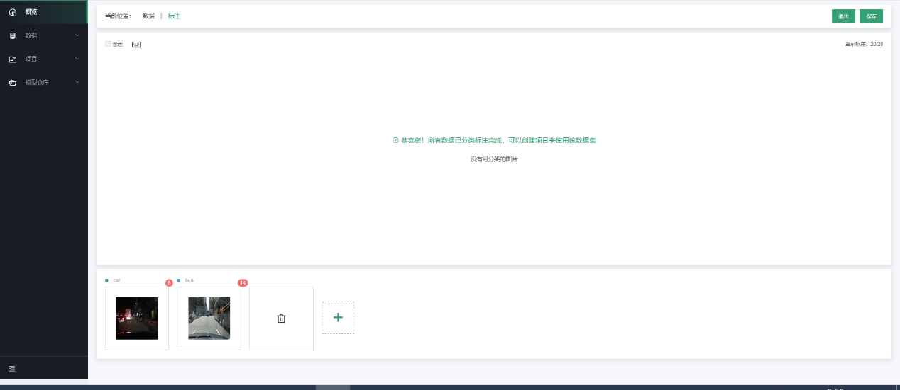

# 图像分类标注

第一步，新建数据集并完成原始数据的上传，可参考4.2.2；若在当前数据集下新建图片分类标注任务，可直接从第二步开始。

第二步，点击“新建标注任务”，选择“新建标注类型-\>图片分类标注”，如下图：

第三步，进入标注操作页面

在图片分类标注页面，操作区域上方会显示所有待分类的图片，页面下方可以通过单击“+”图标，新增分类标签。如下图：

通过拖拽上方图片到下方具体类别中，完成图片的分类。如下图：

第四步，查看标注结果和相关信息统计

在数据集详情页面，可以看到当前数据集每个类型对应的数量；右侧为相关信息统计，其中包括任务类型、标注类型、创建方式、创建时间和最近修改时间，如下图：

点击“查看详情”，进入图片分类的详细信息页面。如下图：

---

如果您对产品有使用或者其他方面任何问题，欢迎联系我们

---
