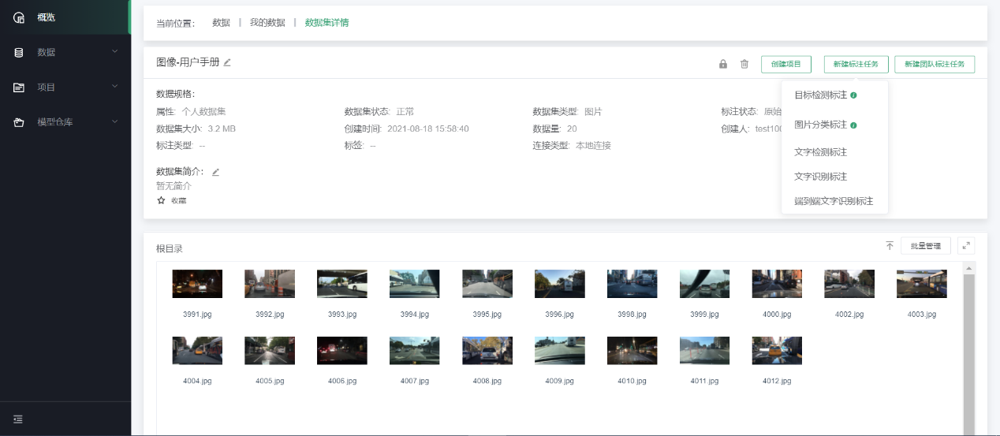
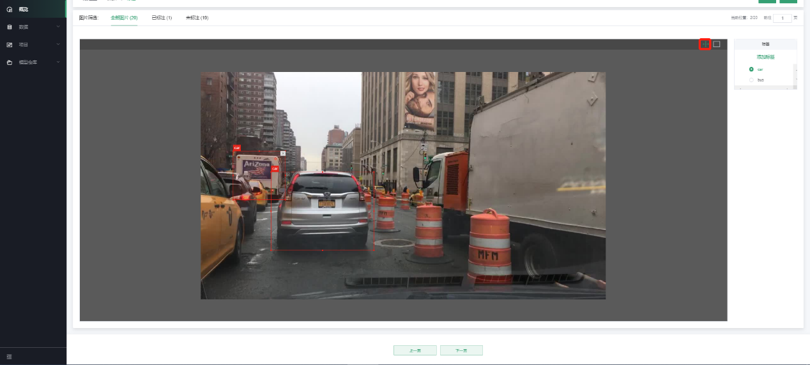
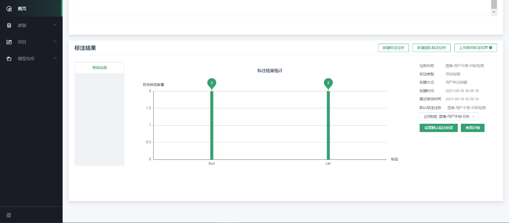
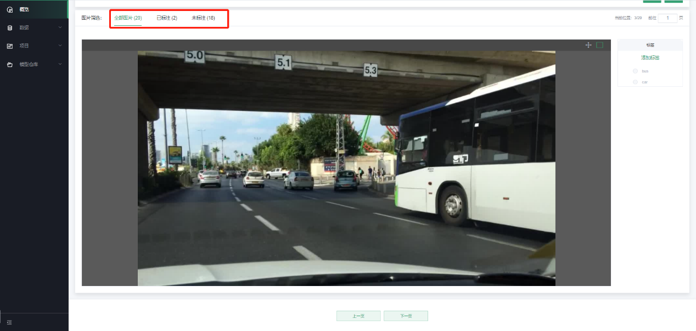

# 目标检测标注

第一步，新建数据集并完成原始数据的上传，可参考[4.2.2]
第二步，点击“新建标注任务”，选择“新建标注类型-\>目标检测标注”，如下图：

第三步，进入标注操作页面

在目标检测标注页面，可以看到操作区左侧是待标注的图片，右侧是标签管理；默认从第一张图片开始标注，在左侧标出目标后，选择选择对应的目标标签，即可完成当前单个目标的标注。
对该张图片标注完成之后，通过点击“下一页”，进行下一张图片的标注，系统会自动保存标注的内容。若已进行了标注工作，退出前，需点击“保存”后才可退出。如下图：

若在标注过程中出现了错标，可单击标注页面右上角的“操作”按钮，删除错标的目标框，重新标注。如下图：

第四步，查看标注结果和相关信息统计

在数据集详情页面，可以看到当前数据集每个标签类型对应的已标注数量；右侧为相关信息统计，其中包括任务类型、标注类型、创建方式、创建时间和最近修改时间。如下图：

点击“查看详情”，即可查看标注的详细信息，通过上方Tab可以切换查看不同标注状态的图片。如下图：

---

如果您对产品有使用或者其他方面任何问题，欢迎联系我们

---
