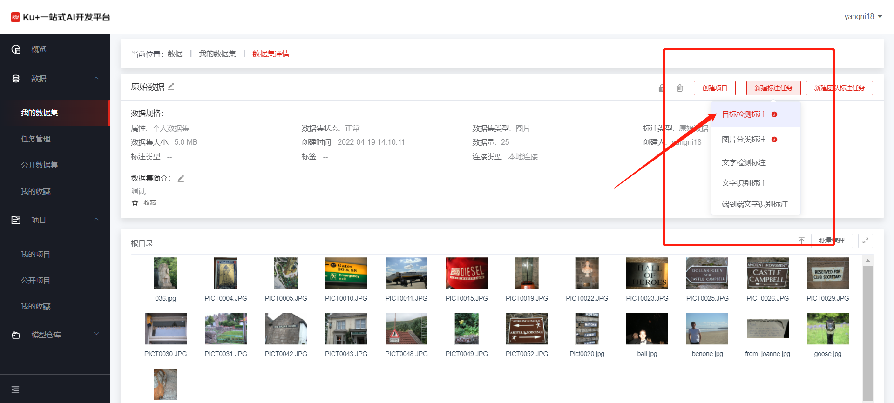
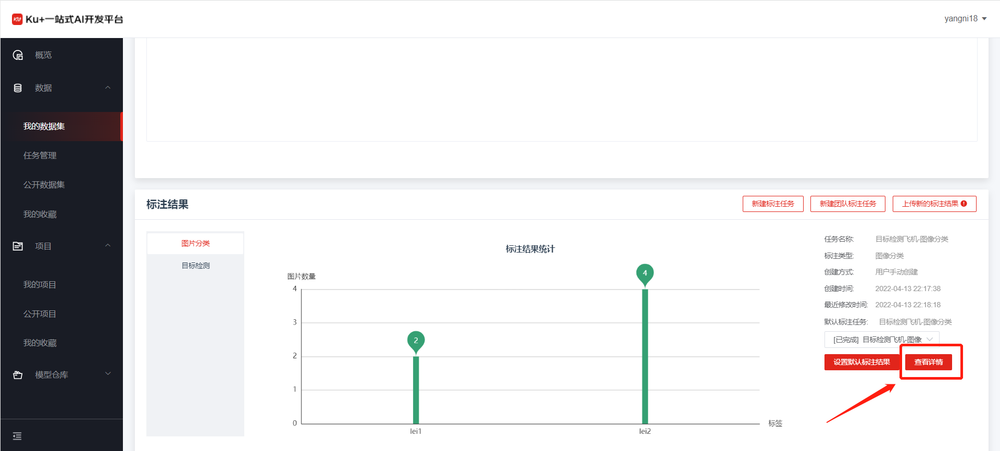
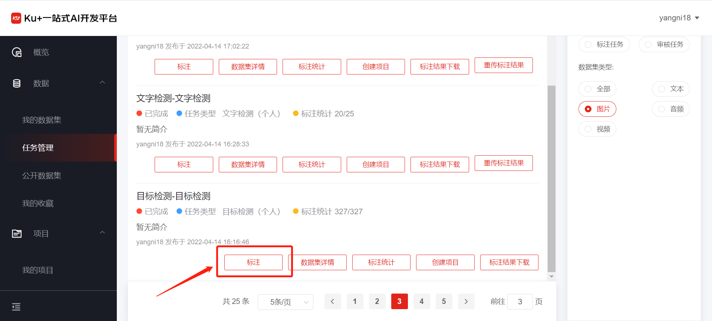
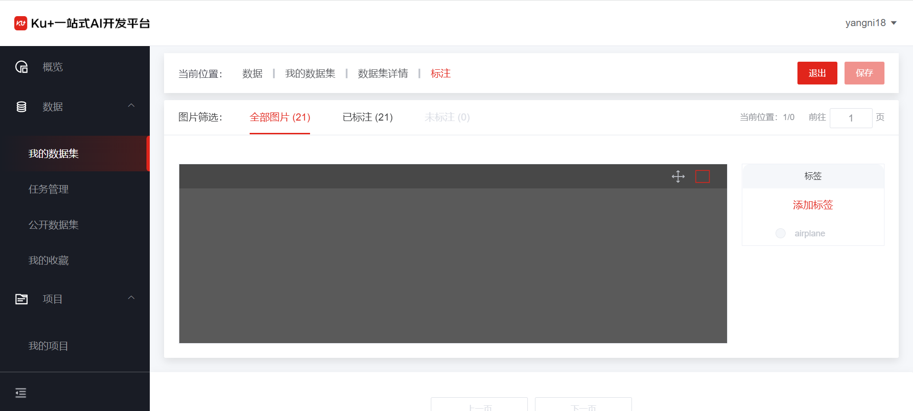
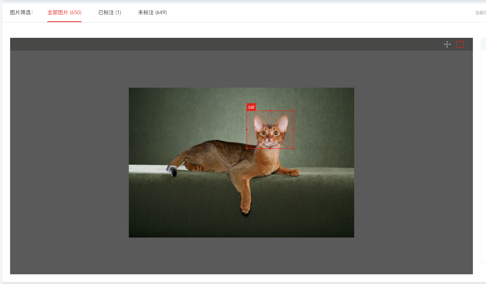

# 目标检测标注

用户在创建数据集，上传完图像数据之后，可通过项目详情页进行查看数据，同时可进行图片框图数据标注。具体入口如下：

第一步，创建或进入框图标注

如果是第一次使用图像框图标注，通过点击新建标注任务—》图像框图标注，进入标注页面。

 
 
如果需要基于之前到框图结果进行标注，则可以点击进入当前标注任务，如下图：

 
 
或者在任务管理中，点击“标注”按钮对当前的任务进行标注。如下图：
 
 

第二步，进入标注页面

进入标注页面后，可以看到操作区是待标注的图片，右边是标签管理，如下图：

 
 
首先需要添加我们需要框选目标的标签，然后在左侧操作区域进行标注操作，每画完一个框图，选择右侧对应的标签。

 
 
第三步，查看标注统计结果

如果所有数据都标注完成，则点击退出，返回数据详情页面，可以看到对刚才的标注有了标注结果统计。
 
 

---

如果您对产品有使用或者其他方面任何问题，欢迎联系我们

---
