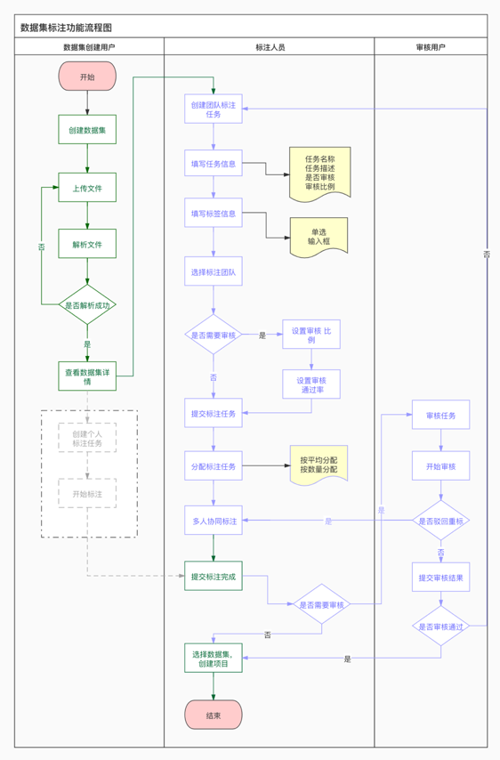
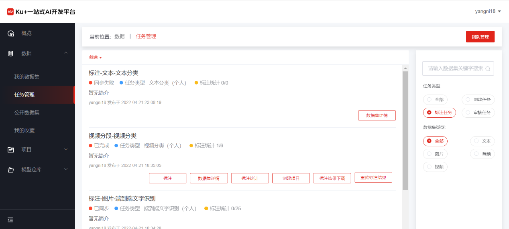
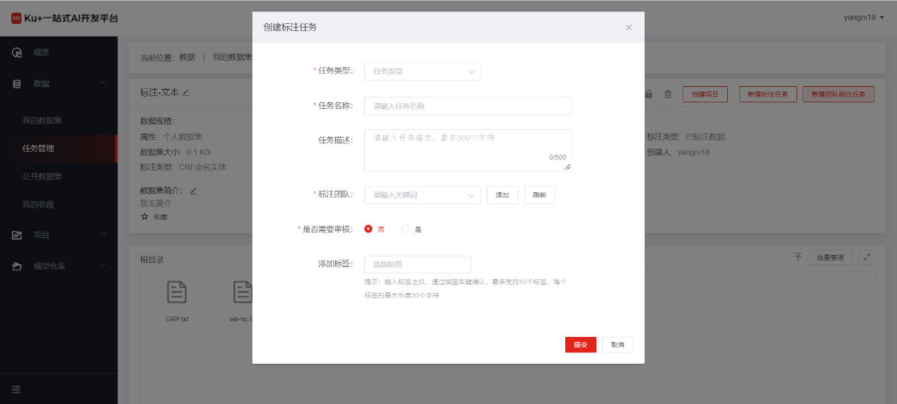
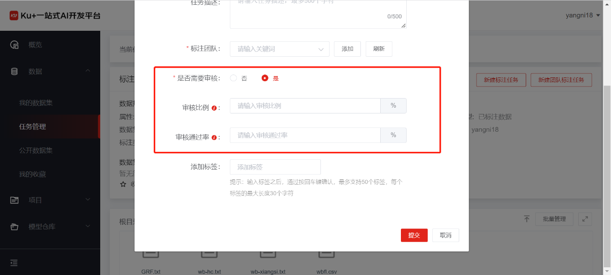
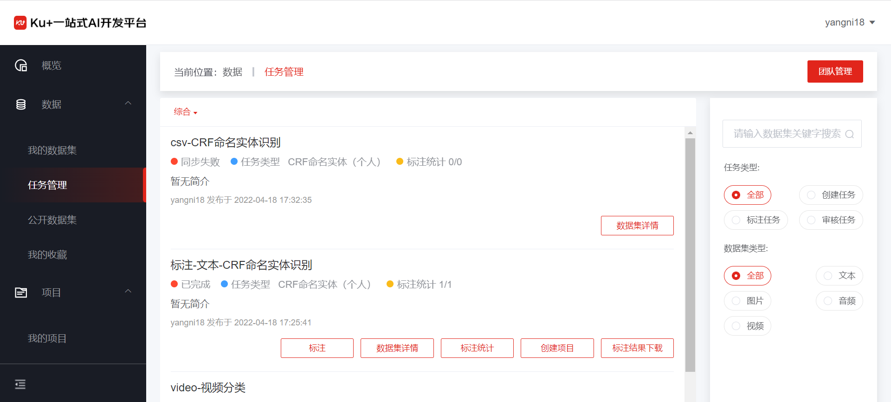
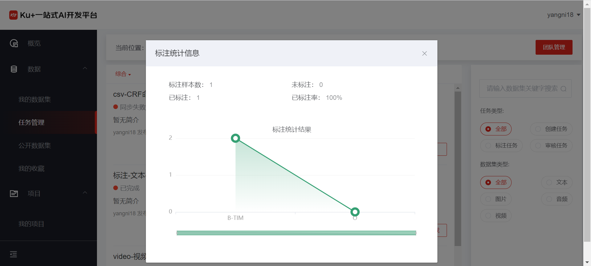
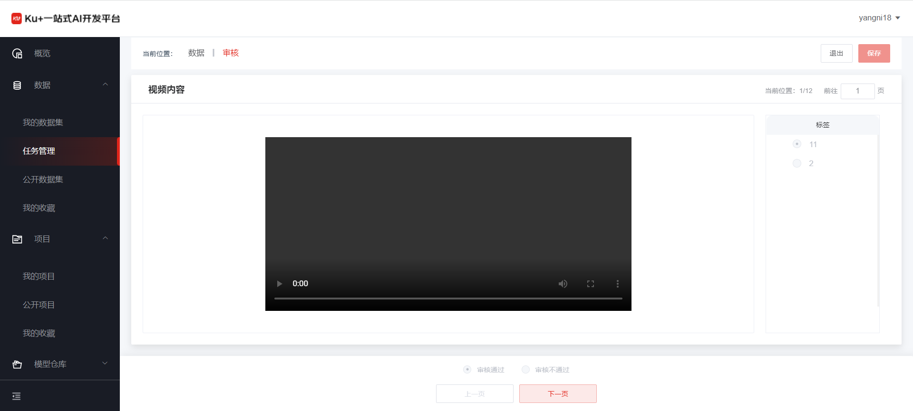
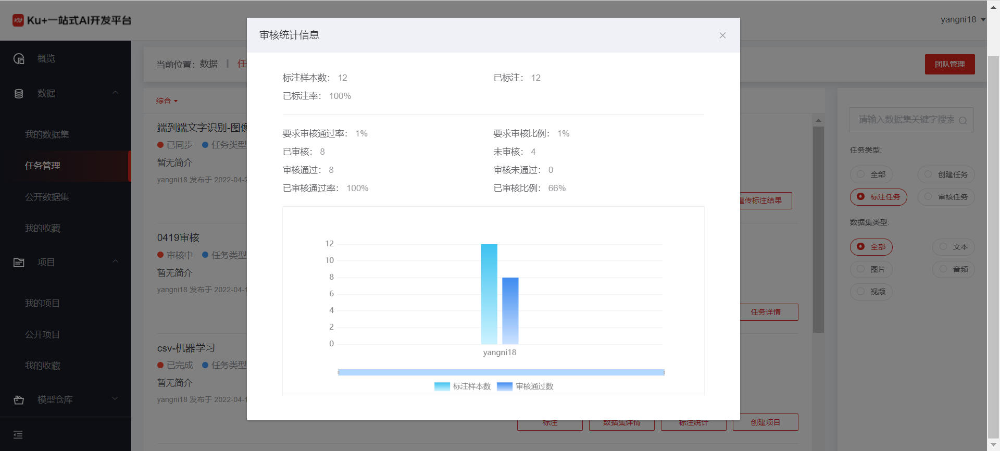

# 任务管理

标注管理分为个人标注和团队标注任务，对任务的管理分为三种角色：任务的创建者、标注人员和审核人员，整体流程如下：
 
 

点击左侧菜单的任务管理导航栏，即可进入到任务管理的列表页，标注任务包括了数据集的一个个人标注任务和多个多人团队标注任务，如下图：
 

在数据集的详情页面，点击“新建团队标注任务”，选择需要标注的类型。

 

填写相关信息后，可以选择标注的团队，并对本次标注是否需要进行审核提供可选项。如果团队不存在，即可点击"添加"按钮，进行[添加团队](teamManage.md)。

 
其中审核比例为：表示在标注样本总数的基础上需要审核的样本数，计算公式为：审核样本总数 = 标注样本总数 * 审核比例

审核通过率：表示提交到审核完成状态时，要求标注任务的已审核通过样本数占审核样本总数的百分比，计算公式为：审核通过率 = 已审核通过样本数 / 审核样本总数 * 100%

点击“提交”按钮，即可成功提交多人协同的团队标注任务。提交完成的任务首先的状态为“同步中”，同步中的状态表示同步数据集中可用于标注的样本集。同步完成之后，标注任务进入到“待分配”状态。

 
任务分配的方式包括标注人员平均分配和指定数量进行分配。任务分配完成后，即可进入到标注流程中。

点击左侧菜单的任务管理导航栏，即可进入到任务管理的列表页，标注任务包括了数据集的一个个人标注任务和多个多人团队标注任务，如下图：
 
 
 
点击标注按钮，即可进入到每一种场景的标注页面，标注完成后，即可查看标注统计信息，如图所示：

 
 
团队中所有人标注完成后，有数据集的创建者提交标注完成，如果此标注任务是需要进行审核的，此任务即可进入到标注审核阶段，审核的界面如下：

 
 
点击“审核通过”和“审核不通过”选项，即可保存审核状态，并自动跳转到下一页，如果此次任务的标注质量普遍都很差，审核人员可以直接点击“驳回重标”按钮，表示此任务需要重新标注，状态变为驳回重标状态，标注人员在保存的标注结果之上继续标注。
审核过程中，随时都可以查看到审核数据的统计信息，如下图：
 
 

---

如果您对产品有使用或者其他方面任何问题，欢迎联系我们

---
