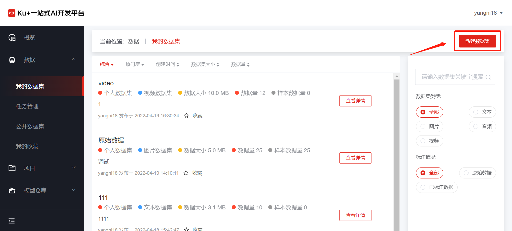
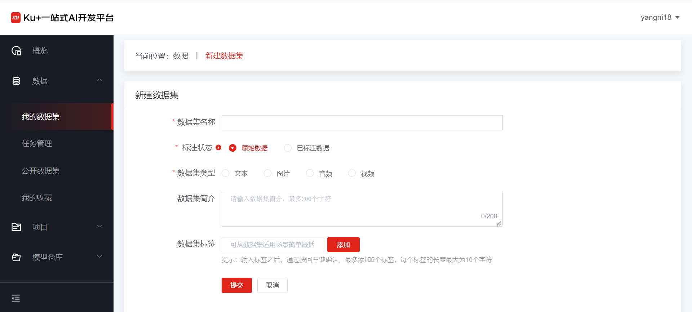
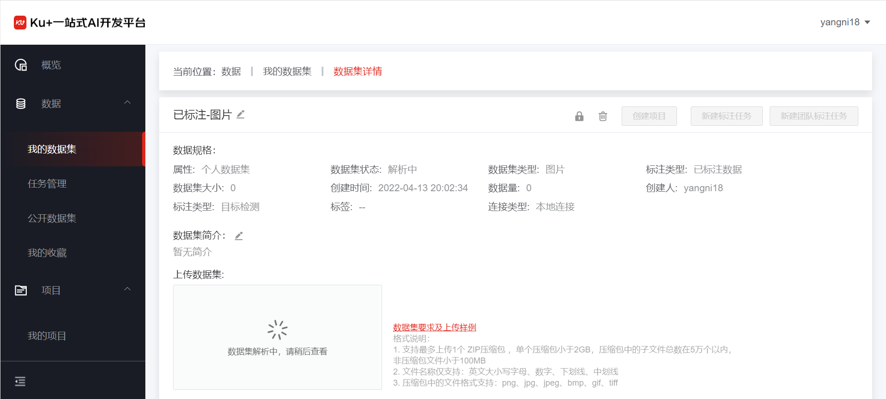

# 原始数据上传

在数据菜单的右上角点击“新建数据集”，进入新建数据集页面

 
标注状态选择原始数据，根据页面要求填写基本信息即可。

 
根据所选数据集类型，点击/将数据集压缩包拖动到指定位置即可上传数据集，详细数据集要求及样例可参见页面要求，如上传文件不符合要求会有相应提示，根据提示可进行下一步操作。

 

各种文件类型的格式要求如下：

- A.	图片格式说明：
   1. 支持最多上传1个 ZIP压缩包 ，单个压缩包小于2GB，压缩包中的子文件总数在5万个以内，非压缩包文件小于100MB
   2. 文件名称仅支持：英文大小写字母、数字、下划线、中划线
   3. 压缩包中的文件格式支持：png、jpg、jpeg、bmp、gif、tiff
   
- B.	文本格式说明：
   1. 支持最多上传1个 文件或者ZIP压缩包 ，单个压缩包小于2GB，压缩包中的子文件总数在5万个以内，非压缩包文件小于100MB
   2. 文件名称仅支持：英文大小写字母、数字、下划线、中划线
   3. 支持扩展名：txt、json、csv、xls、xlsx、zip
   
- C.	音频格式说明：
   1. 支持最多上传1个 ZIP压缩包 ，单个压缩包小于2GB，压缩包中的子文件总数在5万个以内，非压缩包文件小于100MB
   2. 文件名称仅支持：英文大小写字母、数字、下划线、中划线
   3. 压缩包中的文件格式支持：ogg、pcm、wav、mp3、flac、weba、webm
   
- D.	视频格式说明：
   1. 支持最多上传1个 ZIP压缩包 ，单个压缩包小于2GB，压缩包中的子文件总数在5万个以内，非压缩包文件小于100MB
   2. 文件名称仅支持：英文大小写字母、数字、下划线、中划线
   3. 压缩包中的文件格式支持：mp4、avi、3gp、wmv、mpg、flv

---

如果您对产品有使用或者其他方面任何问题，欢迎联系我们

---
