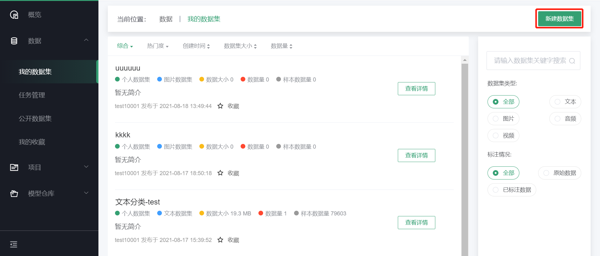
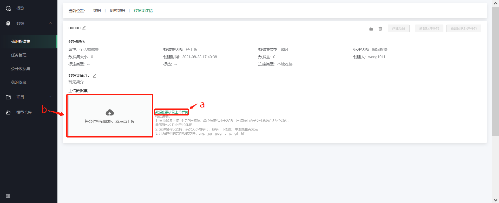
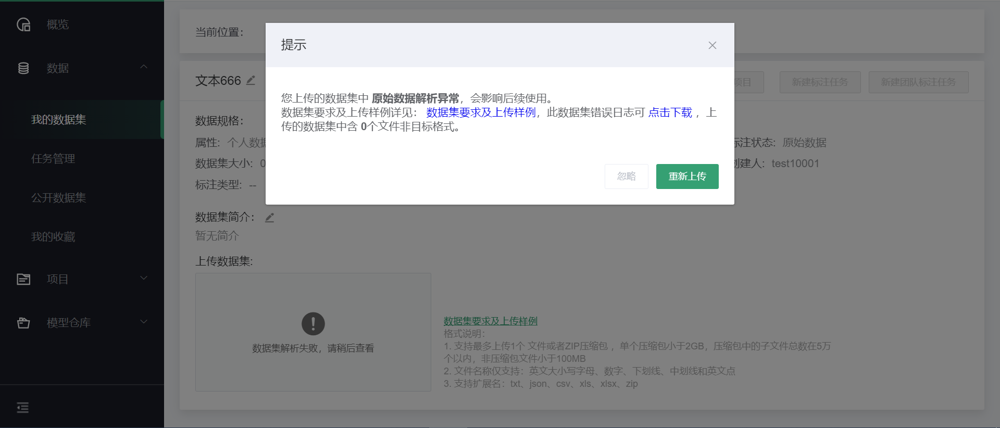
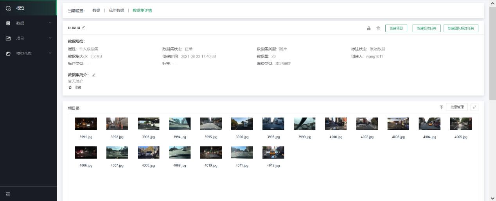

# 原始数据上传

原始数据集是指没有标注信息的数据，需用户在“数据-\>个人数据集”中上传，完成标注后才可用于训练。在数据菜单的右上角点击“新建数据集”，进入新建数据集页面

标注状态选择原始数据，根据页面要求填写基本信息即可，点击“提交”。

如下图所示，点击“数据集要求及上传样例”(a),
可获取详细数据集要求及样例；根据要求制作数据集文件，点击b处上传需要标注的数据集。

如上传文件不符合要求弹出相应提示框，根据提示可查看原因，进行下一步操作。

完成数据集上传后，如下图：

---

如果您对产品有使用或者其他方面任何问题，欢迎联系我们

---
