# 标注数据上传

在新建数据集页面，标注状态选择“已标注数据”，并根据数据集类型及标注类型进行相应选择。

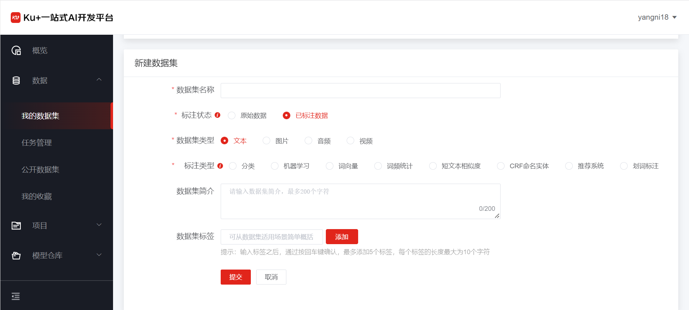 

根据数据集类型的不同，支持已标注的场景也有所不同，标注文件的格式说明如下：

- A.	文本

1)	文本分类：支持csv与xlsx格式文件，文件需包含文本列和标签列。

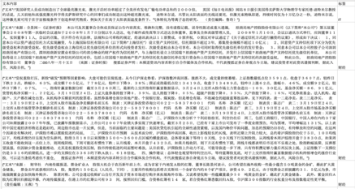 
 
2)	词频统计和词向量：txt格式文本文件，对整个文本进行训练，没有具体的标注格式。

3)	短文本相似度：txt格式文本文件，其中每一行是一对句子及其对应标签（0、1）。格式为"句子1#####句子2#####标签"，分隔符为5个#号，标签为0：不相似，1：相似。
 
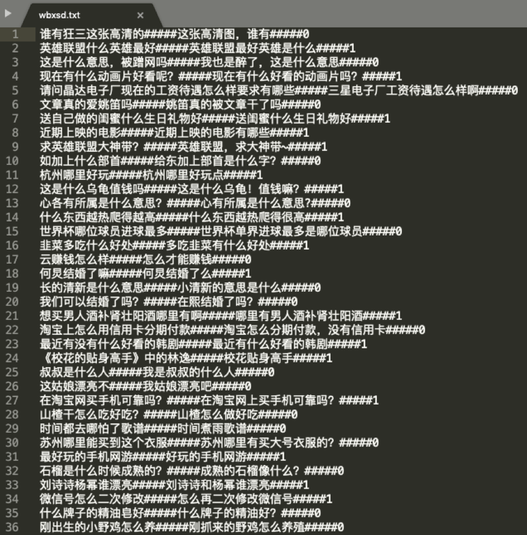 
 
4)	CRF命名实体：txt格式文本文件，其中每一行是一个字及其所对应的标签（O,B-TIM,I-TIM,B-PER,I-PER,B-ORG,I-ORG,B-LOC,I-LOC），词语和标签之间由空格" "分隔。句子与句子用空行分隔。
 
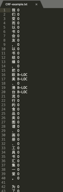 
 
5) 机器学习和推荐系统：标准的结构化数据即可。
 
- B.	图片

1)	图像分类：图像分类的标注格式文件是以json格式为主，标注文件的文件名称必须按照txfl-result.json来命名，文件内容遵循的层级关系主要包括如下：
```json
{
    "categories":
    [
        {
            "images":
            [
                {
                    "url":"wheaten_terrier/wheaten_terrier_1.jpg"
                },
                {
                    "url":"wheaten_terrier/wheaten_terrier_2.jpg"
                },
                ...
            ],
            "name":"wheaten_terrier"
        },
        {
            "images":
            [
                {
                    "url":"great_pyrenees/great_pyrenees_1.jpg"
                },
                {
                    "url":"great_pyrenees/great_pyrenees_2.jpg"
                },
                ...
            ],
            "name":"great_pyrenees"
        },
        ...
    ]
}
```
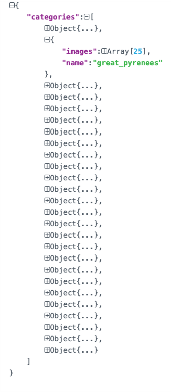 

2)	目标检测：目标检测的标注格式文件是以json格式为主，标注文件的文件名称必须按照txkt-result.json来命名，文件内容遵循的层级关系主要包括如下：
```json
[
    {
        "data":[
            {
                "bbox":{
                    "height":38,
                    "width":108,
                    "x":368,
                    "y":215
                },
                "label":"aeroplane",
                "shape":"rect"
            },
            {
                "bbox":{
                    "height":166,
                    "width":424,
                    "x":1,
                    "y":99
                },
                "label":"aeroplane",
                "shape":"rect"
            }
        ],
        "image":"new/2008_000756.jpg"
    },
    ...
]
```
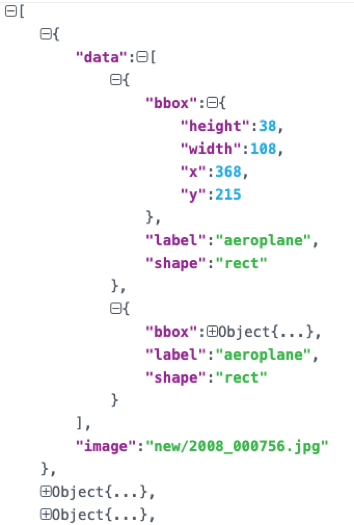 

3)	文字检测：文字检测的标注格式文件是以json格式为主，标注文件的文件名称必须按照wzjc-result.json来命名，文件内容遵循的层级关系主要包括如下：
```json
[
    {
        "data":[
            {
                "label":"LIM SENG THO HARDWARE TRADING",
                "points":[
                    {
                        "x":121,
                        "y":220
                    },
                    {
                        "x":810,
                        "y":220
                    },
                    ...
                ]
            },
            ...
        ]
    }
]
```
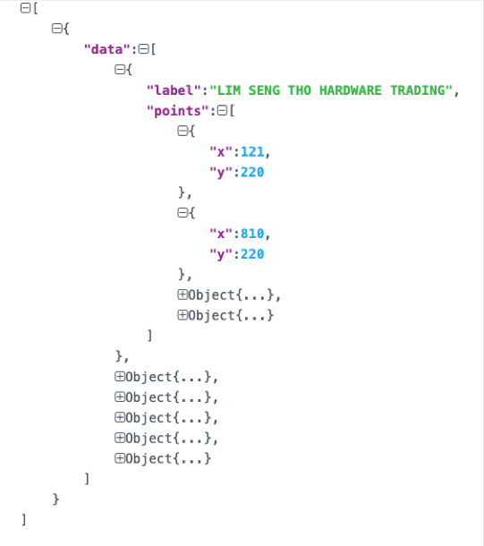 

4)	文字识别：文字识别的标注格式文件是以json格式为主，标注文件的文件名称必须按照wzsb-result.json来命名，文件内容遵循的层级关系主要包括如下：
```json
[
    {
        "image":"word_1.png,",
        "label":"Genaxis"
    },
    {
        "image":"word_2.png,",
        "label":"[06]"
    },
    {
        "image":"word_3.png,",
        "label":"62-03"
    },
    {
        "image":"word_4.png,",
        "label":"Carpark"
    },
    {
        "image":"word_5.png,",
        "label":"EXIT"
    },
    {
        "image":"word_6.png,",
        "label":"I2R"
    },
    {
        "image":"word_7.png,",
        "label":"fusionopolis"
    },
    {
        "image":"word_8.png,",
        "label":"fusionopolis"
    }
]
``` 
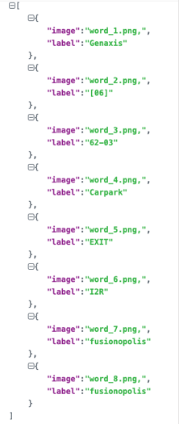 

5)	端到端文字识别：端到端文字识别的标注格式文件是以json格式为主，标注文件的文件名称必须按照dddwzsb-result.json来命名，文件内容遵循的层级关系主要包括如下：
```json
[
    {
        "data":[
            {
                "label":"LIM SENG THO HARDWARE TRADING",
                "points":[
                    {
                        "x":121,
                        "y":220
                    },
                    {
                        "x":810,
                        "y":220
                    },
                    {
                        "x":810,
                        "y":258
                    },
                    {
                        "x":121,
                        "y":258
                    }
                ]
            },
            ...
        ]
    }
]
```
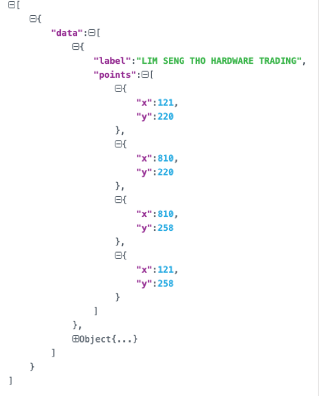 

- C.	音频

1)	语音转文本：语音转文本的标注格式文件是以json格式为主，标注文件的文件名称必须按照yyzwb-result.json来命名，文件内容遵循的层级关系主要包括如下：
```json
[
    {
        "audio":"8kHz-20181227104853-5f3e8dfc41604bae.wav",
        "data":[
            {
                "beginTime":0.5336176066024759,
                "endTime":0.8789958734525447,
                "text":"这问题"
            },
            {
                "beginTime":0.9583837689133425,
                "endTime":1.1089752407152682,
                "text":"我们"
            }
        ]
    },
    {
        "audio":"8kHz-20181227105219-782789b09d8e4f74.wav",
        "data":[
            {
                "beginTime":0.0016368638239339752,
                "endTime":1.1793603851444292,
                "text":"你投诉的这个问题，我们"
            }
        ]
    }
]
``` 
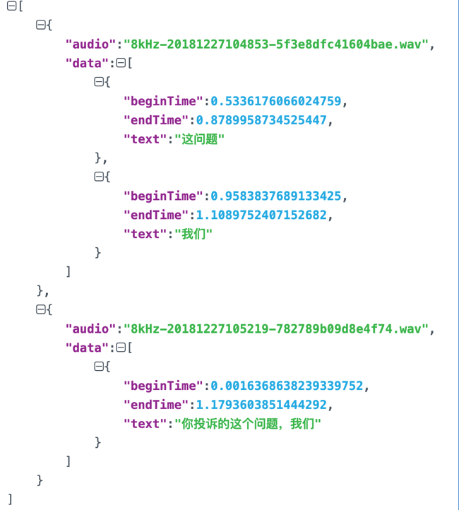 

2)	语音分类：语音分类的标注格式文件是以json格式为主，标注文件的文件名称必须按照yyfl-result.json来命名，文件内容遵循的层级关系主要包括如下：
```json
{
    "categories":[
        {
            "audio":[
                {
                    "index":9,
                    "url":"8kHz-20181227134406-18ad3c3ebbd146b0.wav"
                },
                ...
            ],
            "name":"a"
        },
        ...
    ]
}
```
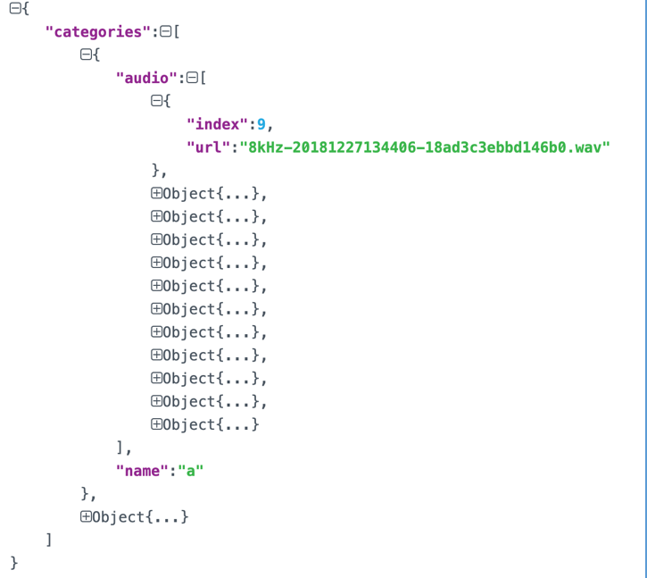 

- D.	视频

1)	视频分类：视频分类的标注格式文件是以json格式为主，标注文件的文件名称必须按照spfl-result.json来命名，文件内容遵循的层级关系主要包括如下：
```json
{
    "categories":[
        {
            "name":"a",
            "videos":[
                {
                    "index":3,
                    "url":"12.mp4"
                },
                ...
            ]
        },
        ...
    ]
}
``` 
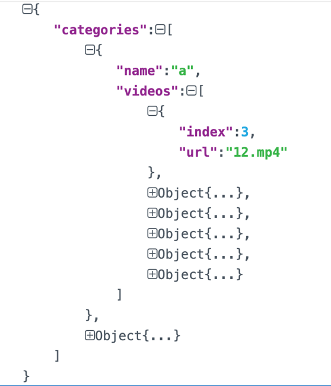 

2)	视频分段：语音分类的标注格式文件是以json格式为主，标注文件的文件名称必须按照spfd-result.json来命名，文件内容遵循的层级关系主要包括如下：
```json
[
    {
        "annotations":[
            {
                "annotation":"2",
                "segs":[
                    {
                        "beginTime":0,
                        "endTime":1
                    }
                ]
            }
        ],
        "subjects":[
            {
                "bbox":{
                    "x1":209,
                    "y1":53,
                    "x2":426,
                    "y2":146,
                    "flag":false,
                    "targetMarkValue":"",
                    "wid":217,
                    "hei":93,
                    "left":0,
                    "width":0,
                    "label":"2",
                    "finalX1":0,
                    "finalX2":0
                },
                "label":"2",
                "shape":"rect",
                "time":0
            }
        ],
        "video":"1.mp4"
    },
    {
        "annotations":[

        ],
        "subjects":[

        ],
        "video":"1_1.mp4"
    },
    {
        "annotations":[
            {
                "annotation":"2",
                "segs":[
                    {
                        "beginTime":0,
                        "endTime":7
                    },
                    {
                        "beginTime":1,
                        "endTime":3
                    }
                ]
            }
        ],
        "subjects":[

        ],
        "video":"2.mp4"
    }
]
``` 
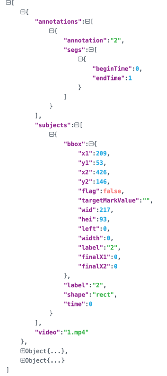 


根据所选数据集类型，点击/将数据集压缩包拖动到指定位置即可上传数据集，详细数据集要求及样例可参见页面要求，如上传文件不符合要求会有相应提示，根据提示可进行下一步操作。


---

如果您对产品有使用或者其他方面任何问题，欢迎联系我们

---
