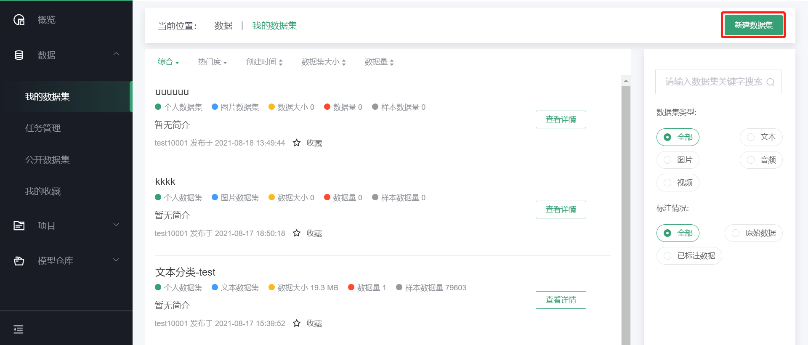
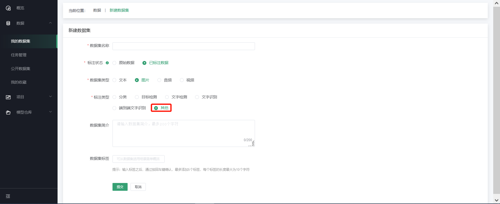
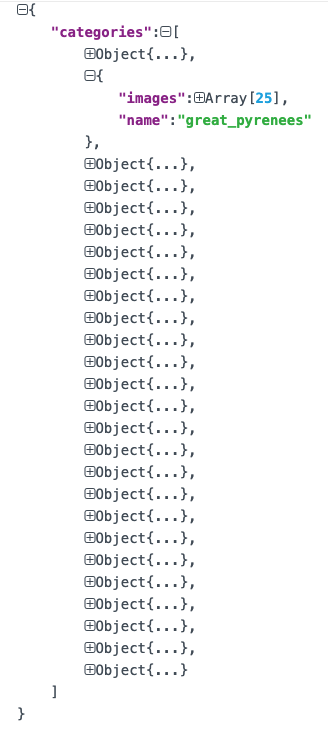
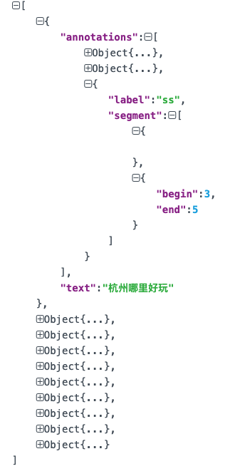
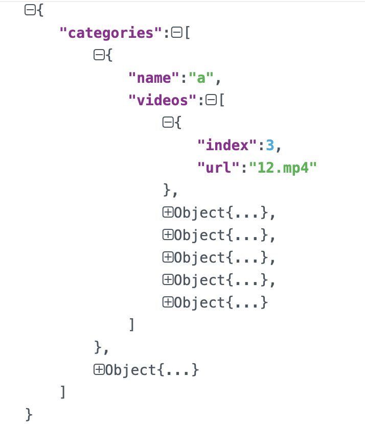

# 已标注数据上传

在数据菜单的右上角点击“新建数据集”，进入新建数据集页面

标注状态选择“已标注数据”，并根据数据集类型及标注类型进行相应选择。

****

如下图所示，点击“数据集要求及上传样例”(a),
可获取详细数据集要求及样例；根据要求制作数据集文件，点击b处上传需要标注的数据集。

其中标注类型中“其他”设置的目的是支持用户上传除平台所提供的的标注类型之外的类型，如图片类型中的实例分割。当上传标注类型无对应类型时，选择“其他”即可。如下图：

根据数据集类型的不同，支持已标注的场景也有所不同，标注文件的格式说明如下：

A．图片

1. 图片分类：图片分类的标注格式文件支持json、xml格式(以json为主)，标注文件的文件名称必须按照txfl-result.json来命名，文件内容遵循的层级关系主要包括如下：

{

"categories":

[

{

"images":

[

{

"url":"wheaten_terrier/wheaten_terrier_1.jpg"

},

{

"url":"wheaten_terrier/wheaten_terrier_2.jpg"

},

...

],

"name":"wheaten_terrier"

},

{

"images":

[

{

"url":"great_pyrenees/great_pyrenees_1.jpg"

},

{

"url":"great_pyrenees/great_pyrenees_2.jpg"

},

...

],

"name":"great_pyrenees"

},

...

]

}

1. 目标检测：目标检测的标注格式文件支持json、xml格式(以json为主)，标注文件的文件名称必须按照txkt-result.json来命名，文件内容遵循的层级关系主要包括如下：

[

{

"data":[

{

"bbox":{

"height":38,

"width":108,

"x":368,

"y":215

},

"label":"aeroplane",

"shape":"rect"

},

{

"bbox":{

"height":166,

"width":424,

"x":1,

"y":99

},

"label":"aeroplane",

"shape":"rect"

}

],

"image":"new/2008_000756.jpg"

},

...

]

1. 文字检测：文字检测的标注格式文件支持json、xml格式(以json为主)，标注文件的文件名称必须按照wzjc-result.json来命名，文件内容遵循的层级关系主要包括如下：

[

{

"data":[

{

"label":"LIM SENG THO HARDWARE TRADING",

"points":[

{

"x":121,

"y":220

},

{

"x":810,

"y":220

},

...

]

},

...

]

}

]

1. 文字识别：文字识别的标注格式文件支持json、xml格式(以json为主)，标注文件的文件名称必须按照wzsb-result.json来命名，文件内容遵循的层级关系主要包括如下：

[

{

"image":"word_1.png,",

"label":"Genaxis"

},

{

"image":"word_2.png,",

"label":"[06]"

},

{

"image":"word_3.png,",

"label":"62-03"

},

{

"image":"word_4.png,",

"label":"Carpark"

},

{

"image":"word_5.png,",

"label":"EXIT"

},

{

"image":"word_6.png,",

"label":"I2R"

},

{

"image":"word_7.png,",

"label":"fusionopolis"

},

{

"image":"word_8.png,",

"label":"fusionopolis"

}

]

1. 端到端文字识别：端到端文字识别的标注格式文件支持json、xml格式(以json为主)，标注文件的文件名称必须按照dddwzsb-result.json来命名，文件内容遵循的层级关系主要包括如下：

[

{

"data":[

{

"label":"LIM SENG THO HARDWARE TRADING",

"points":[

{

"x":121,

"y":220

},

{

"x":810,

"y":220

},

{

"x":810,

"y":258

},

{

"x":121,

"y":258

}

]

},

...

]

}

]

1. 文本

2. 文本分类(csv、xlsx)：文件内容需包含文本列和标签列。示例如下：

1. 短文本相似度：txt格式文本文件，其中每一行是一对句子及其对应标签（0、1）。格式为"句子1,句子2,标签"，分隔符为英文逗号，标签为0：不相似，1：相似。示例如下：

1. 划词标注，json格式文本文件，json层次结构如下：

****

1. CRF命名实体：txt格式文本文件，其中每一行是一个字及其所对应的标签（O,B-TIM,I-TIM,B-PER,I-PER,B-ORG,I-ORG,B-LOC,I-LOC），词语和标签之间由空格"
   "分隔。句子与句子用空行分隔。

1. 机器学习和推荐系统：标准的结构化数据即可。

2. 词频统计和词向量：txt格式文本文件，对整个文本进行训练，没有具体的标注格式。

C．音频

1. 语音转文本：语音转文本的标注格式文件是以json格式为主，标注文件的文件名称必须按照yyzwb-result.json来命名，文件内容遵循的层级关系主要包括如下：

[

{

"audio":"8kHz-20181227104853-5f3e8dfc41604bae.wav",

"data":[

{

"beginTime":0.5336176066024759,

"endTime":0.8789958734525447,

"text":"这问题"

},

{

"beginTime":0.9583837689133425,

"endTime":1.1089752407152682,

"text":"我们"

}

]

},

{

"audio":"8kHz-20181227105219-782789b09d8e4f74.wav",

"data":[

{

"beginTime":0.0016368638239339752,

"endTime":1.1793603851444292,

"text":"你投诉的这个问题，我们"

}

]

}

]

1. 语音分类：语音分类的标注格式文件是以json格式为主，标注文件的文件名称必须按照yyfl-result.json来命名，文件内容遵循的层级关系主要包括如下：

{

"categories":[

{

"audio":[

{

"index":9,

"url":"8kHz-20181227134406-18ad3c3ebbd146b0.wav"

},

...

],

"name":"a"

},

...

]

}

D． 视频

1. 视频分类：视频分类的标注格式文件是以json格式为主，标注文件的文件名称必须按照spfl-result.json来命名，文件内容遵循的层级关系主要包括如下：

{

"categories":[

{

"name":"a",

"videos":[

{

"index":3,

"url":"12.mp4"

},

...

]

},

...

]

}

1. 视频分段：语音分类的标注格式文件是以json格式为主，标注文件的文件名称必须按照spfd-result.json来命名，文件内容遵循的层级关系主要包括如下：

[  
{  
"annotations":[  
{  
"annotation":"2",  
"segs":[  
{  
"beginTime":0,  
"endTime":1  
}  
]  
}  
],  
"subjects":[  
{  
"bbox":{  
"x1":209,  
"y1":53,  
"x2":426,  
"y2":146,  
"flag":false,  
"targetMarkValue":"",  
"wid":217,  
"hei":93,  
"left":0,  
"width":0,  
"label":"2",  
"finalX1":0,  
"finalX2":0  
},  
"label":"2",  
"shape":"rect",  
"time":0  
}  
],  
"video":"1.mp4"  
},  
{  
"annotations":[  

],  
"subjects":[  

],  
"video":"1_1.mp4"  
},  
{  
"annotations":[  
{  
"annotation":"2",  
"segs":[  
{  
"beginTime":0,  
"endTime":7  
},  
{  
"beginTime":1,  
"endTime":3  
}  
]  
}  
],  
"subjects":[  

],  
"video":"2.mp4"  
}  
]

---

如果您对产品有使用或者其他方面任何问题，欢迎联系我们

---
