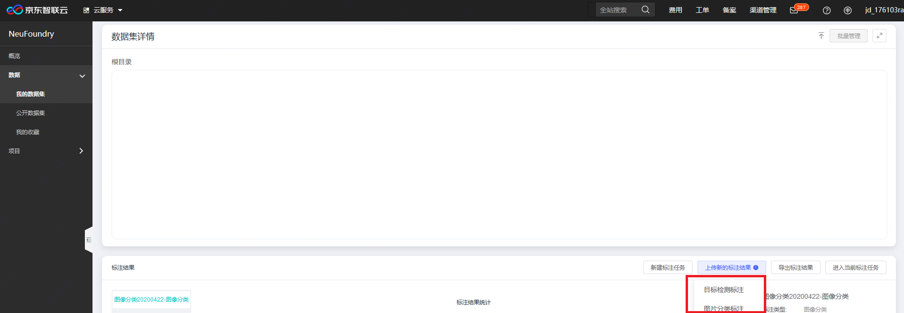
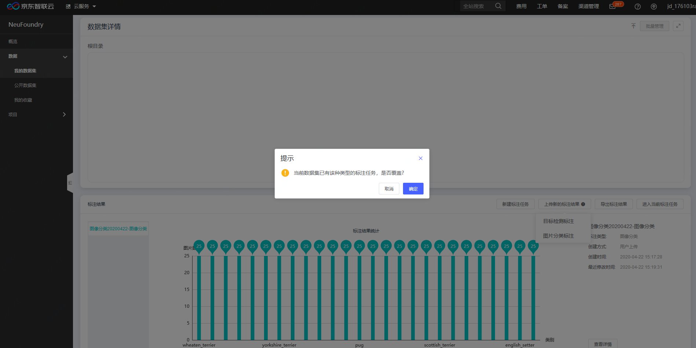
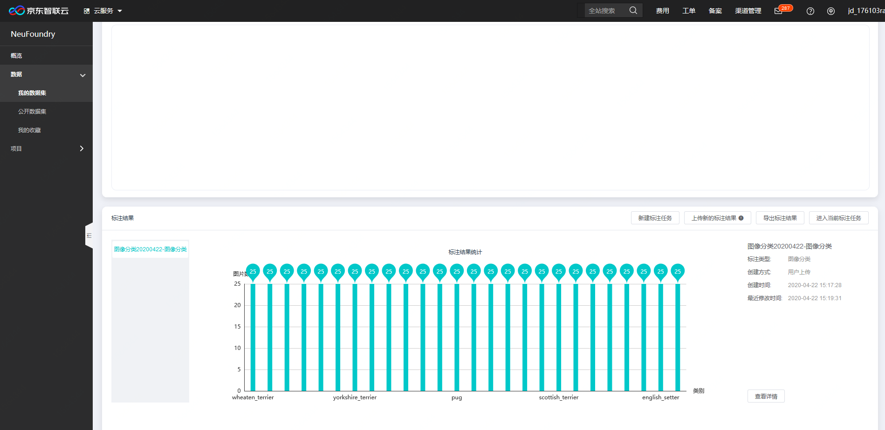

# 标注文件上传

用户上传完原始数据之后，如果未上传标注文件，可通过后续上传标注文件，来进行文本、图像、音频、视频的样本数据集准备。

**第一步，上传标注结果文件**

在数据集详情页下方，标注结果一栏点击“上传新的标注结果”

选择需要上传的标注类型

选择上传标注文件，通过拖拽或者点击上传方式

**第二步，解析标注文件**

解析标注结果完成后，在标注结果一栏中显示统计结果

---

如果您对产品有使用或者其他方面任何问题，欢迎联系我们

---