# 自动化

**第一步，创建项目**

在点击创建项目的页面中，填写必要的信息，如项目名称、项目简介等内容，同时在项目类型中选择“自动化”，如下图：

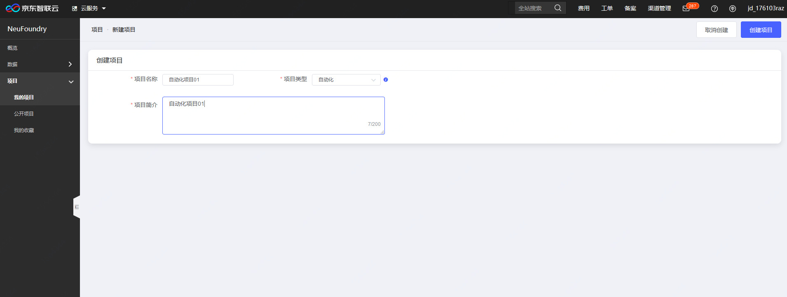

在点击创建项目之后，进入实际的创建内容，首先，选择应用场景

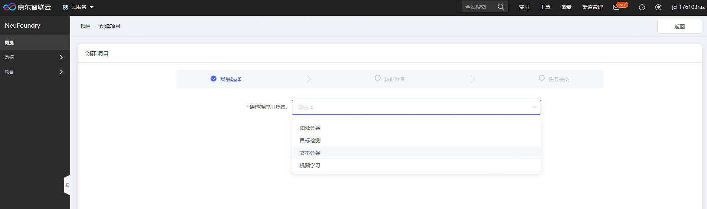

如选择图像分类，如下图：

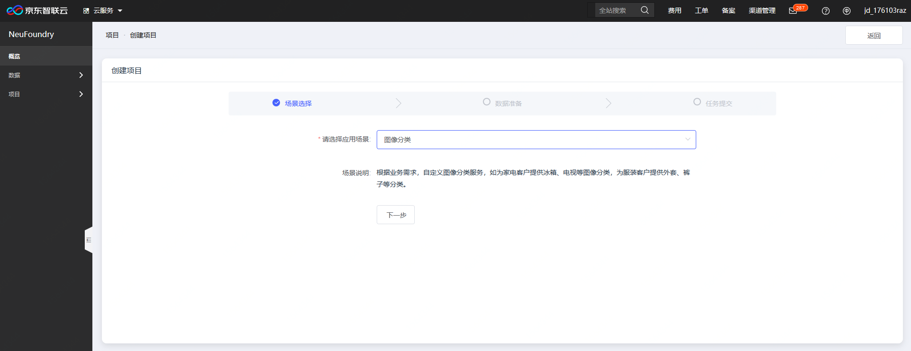

之后，选择数据，从下拉菜单中选择数据集，如果没有数据集，可点击选择框中的“创建数据集”，去新建数据集

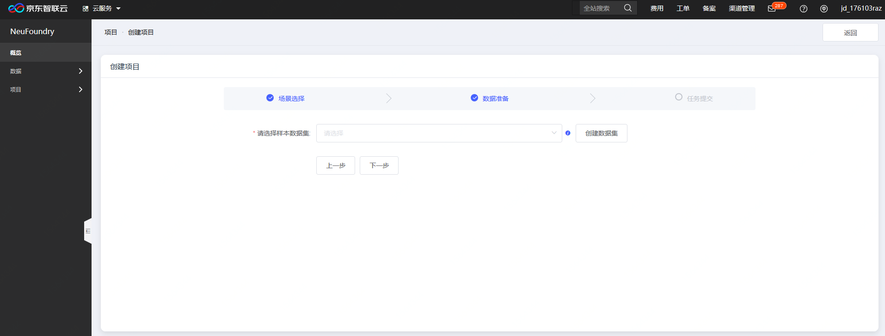

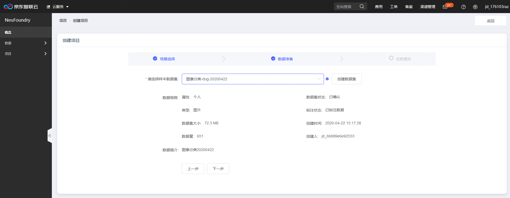

点击下一步，对所要提交的信息进行确认，如下图：

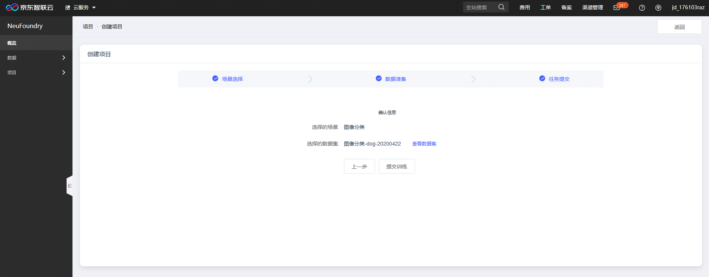

确认无误之后，点击"提交训练"即可提交自动化训练任务。

**第二步，查看训练任务和评估结果**

训练任务提交之后，可以在项目的详情页，查看历史任务，以及任务的状态等信息，如下图：

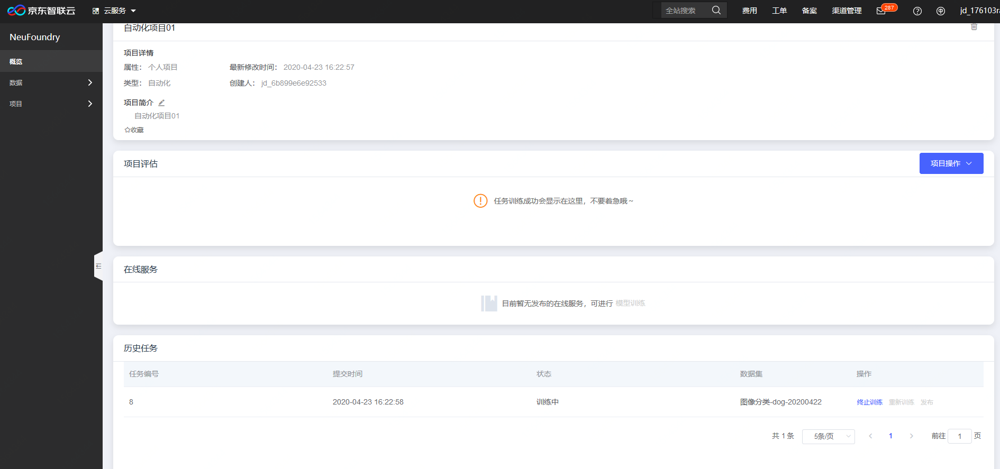

如果训练任务有成功的结果的话，会在项目评估结果中出现，如下图：

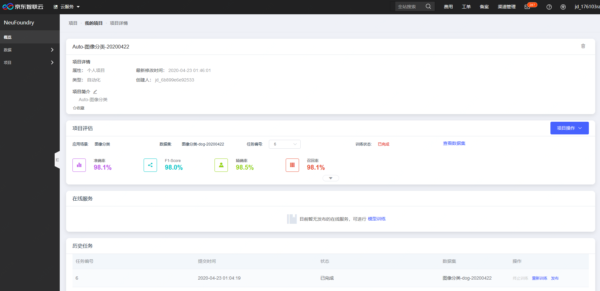

点击评估详情区域的下拉箭头，可展示更详细的评估内容，如列表每一个类别的准确率和错误图片等信息：

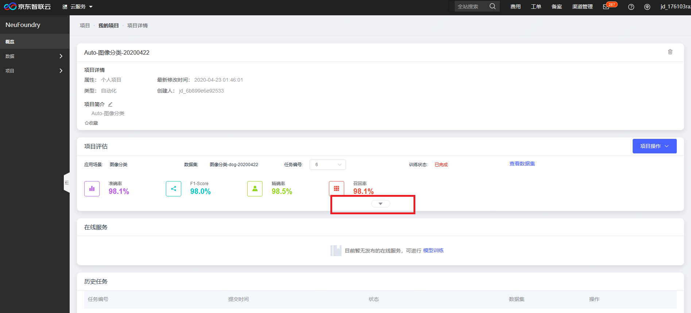

展开后下图：

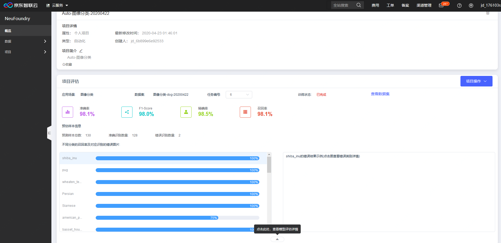

**第三步，服务发布**

通过项目详情页，点击项目评估的项目操作"发布"，或者在历史任务中已完成任务后面发布，

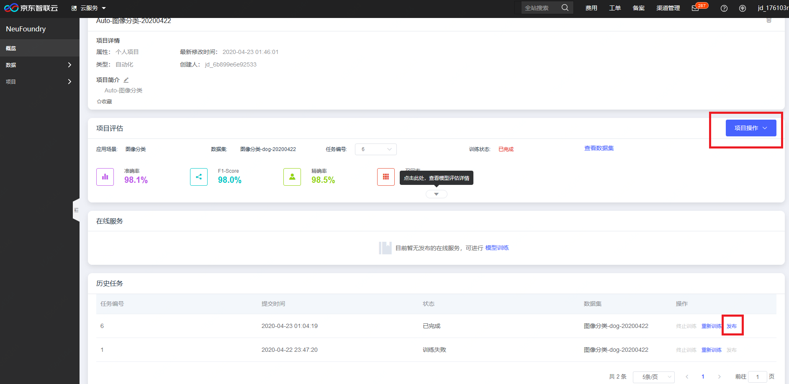

点击发布之后，页面跳转至发布信息填写页

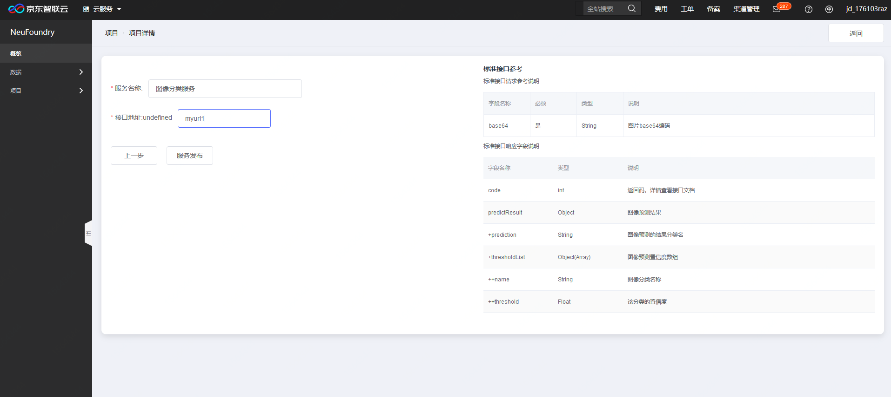

填写服务名称以及自定义的接口地址之后，点击"服务发布"后即可提交服务发布请求，我们的管理员会尽快进行审核。

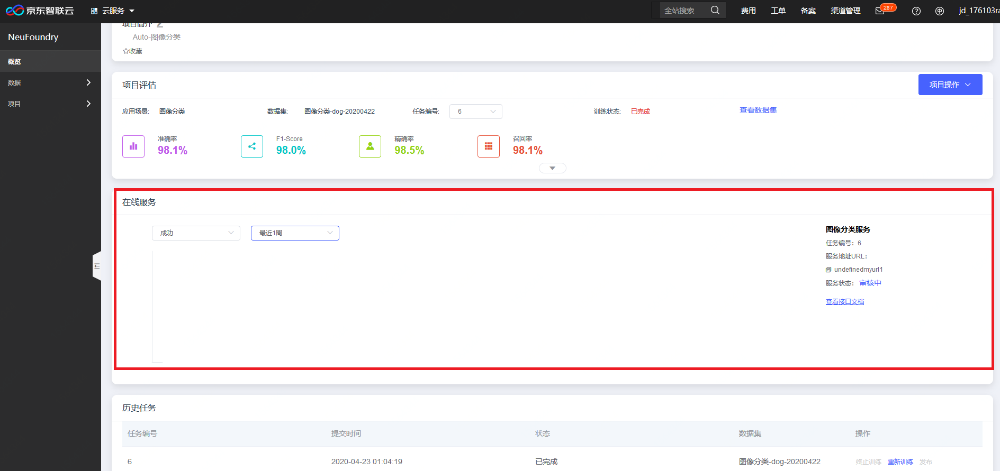

通过审核后，服务状态会变成运行中，此时可通过接口调用来使用刚才训练完成的模型能力。

---

如果您对产品有使用或者其他方面任何问题，欢迎联系我们

---