# 自动化

**第一步，创建项目**

在点击创建项目的页面中，填写必要的信息，如项目名称、项目简介等内容，同时在项目类型中选择“自动化”，如下图：

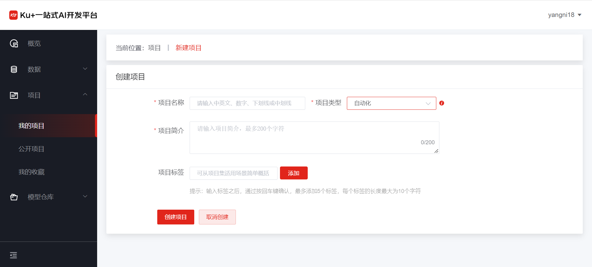
 
在点击创建项目之后，进入实际的创建内容，首先，选择应用场景。

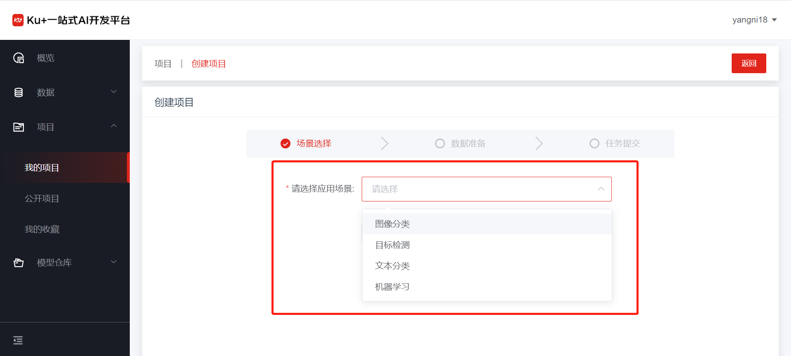
 
选择图像分类，还可以继续选择预置好的子场景，如下图：

 
选好应用场景后，下一步进行数据的准备，从下拉菜单中选择数据集，如果没有数据集，可点击选择框中的“创建数据集”，去新建数据集。

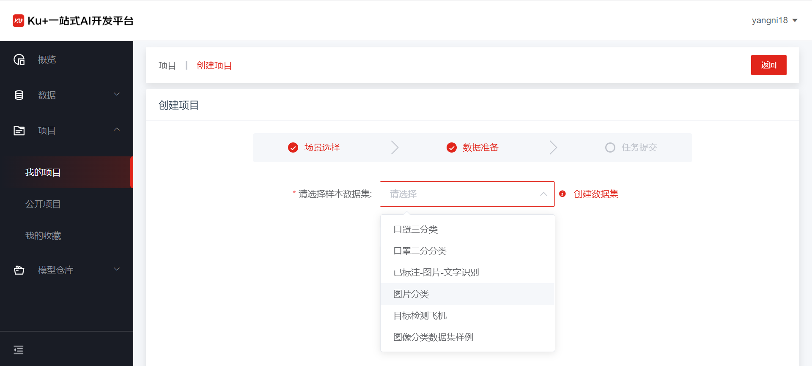 

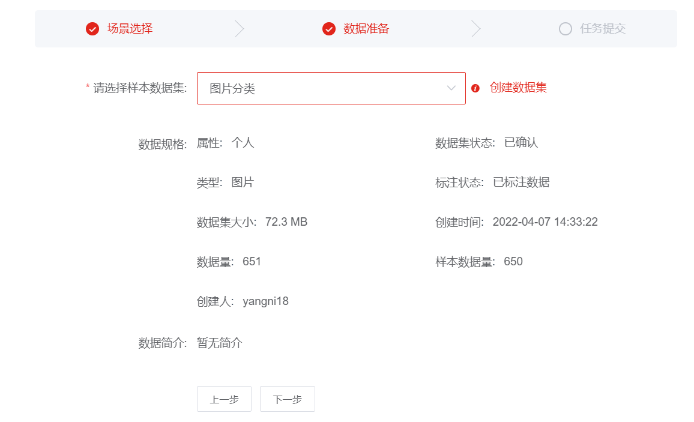
 
点击下一步，对所要提交的信息进行确认，如下图：

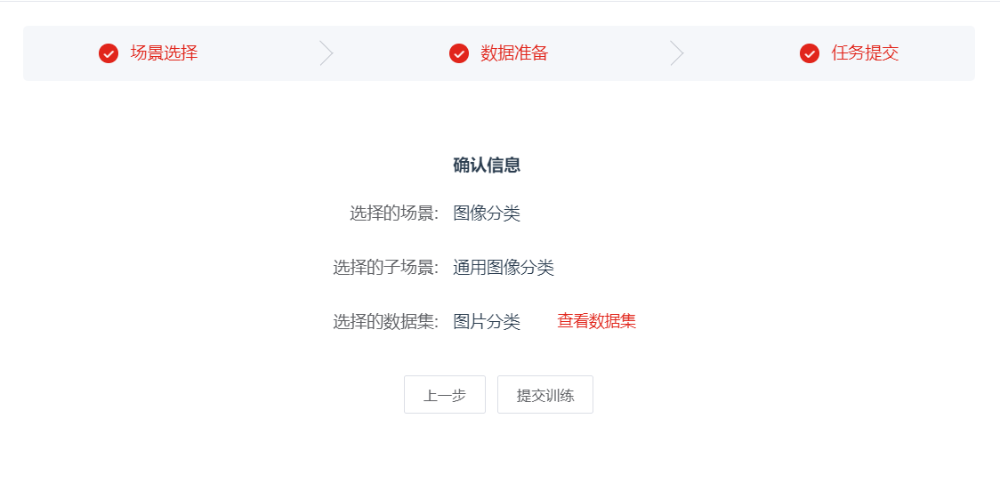
 
确认无误之后，点击提交训练提交自动化训练任务。

**第二步，查看训练任务和评估结果**

训练任务提交之后，在项目的详情页，会显示历史任务，以及任务的状态等信息，如下图：

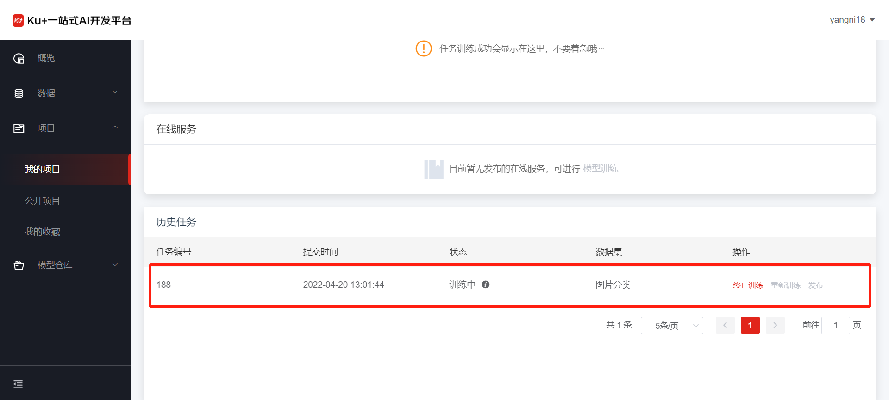
 
在训练过程中，可以对训练的过程进行跟踪，点击任务状态的帮助图标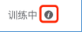 ，即可查看当前任务的全流程。

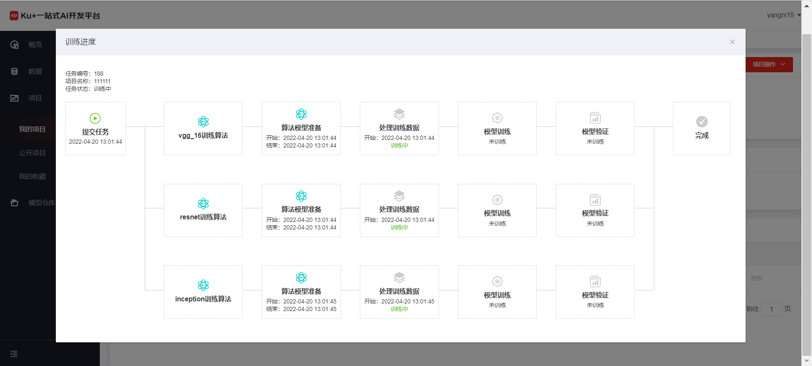
 
有训练任务有成功的结果的话，会在项目评估结果中出现，如下图：

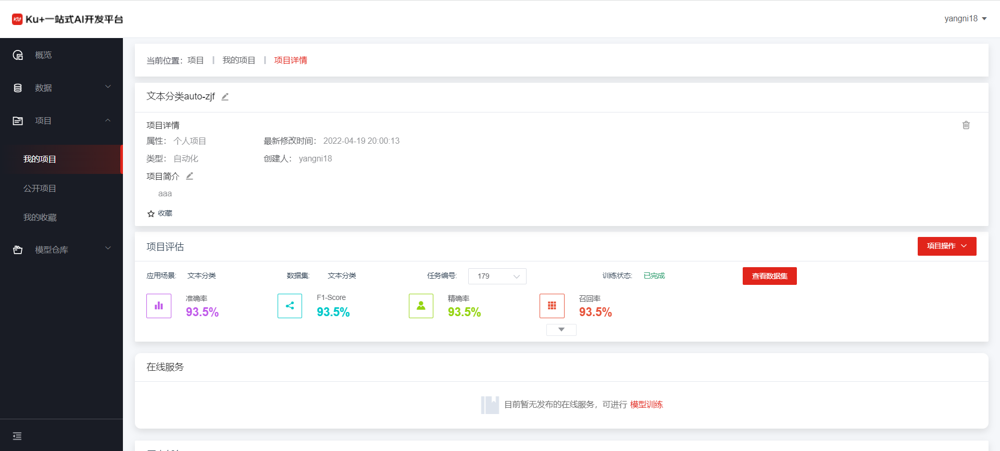
 
点击评估详情区域的下拉箭头，可展示更详细的评估内容，如列表每一个类别的准确率和错误图片等信息：

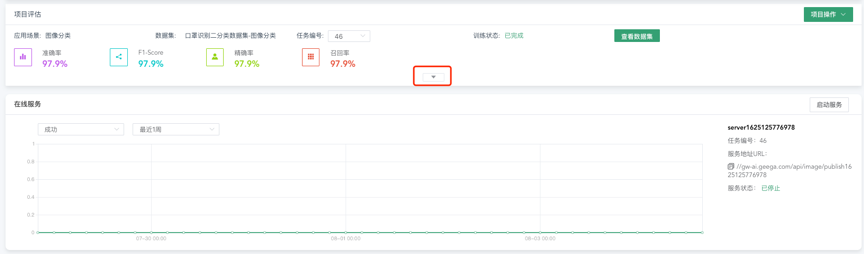
 
展开后下图：

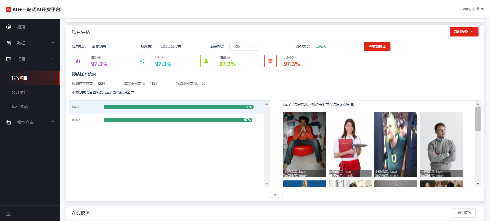
 
点击单张图片后即可查看模型训练后的评估结果。

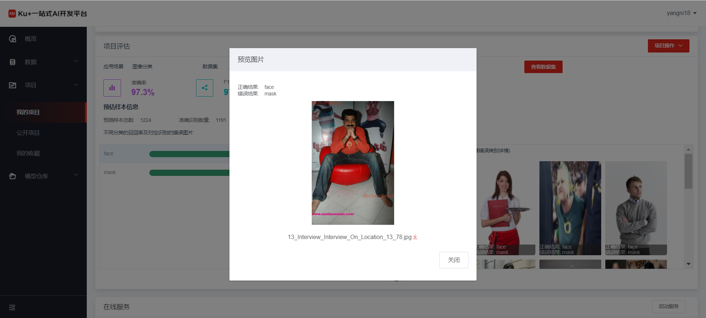
 
**第三步，服务发布**

通过项目详情页，点击项目评估的项目操作—发布，或者在历史任务中已完成任务后面的发布。

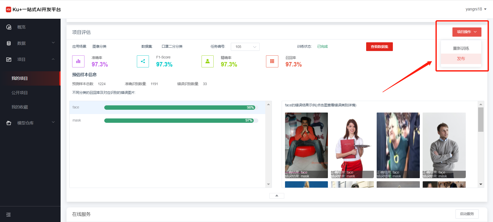
 
点击发布之后，页面跳转至发布信息填写页。

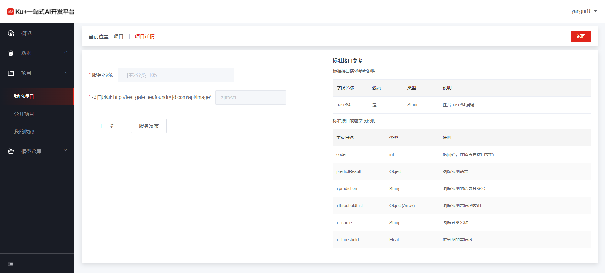
 
填写服务名称以及自定义的接口地址之后，点击服务发布后已提交发布请求，我们的管理员会尽快进行审核。

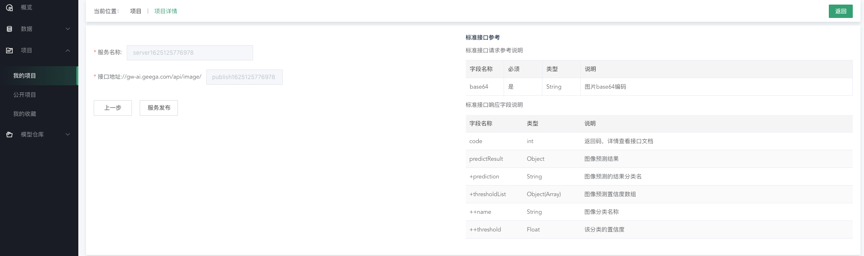

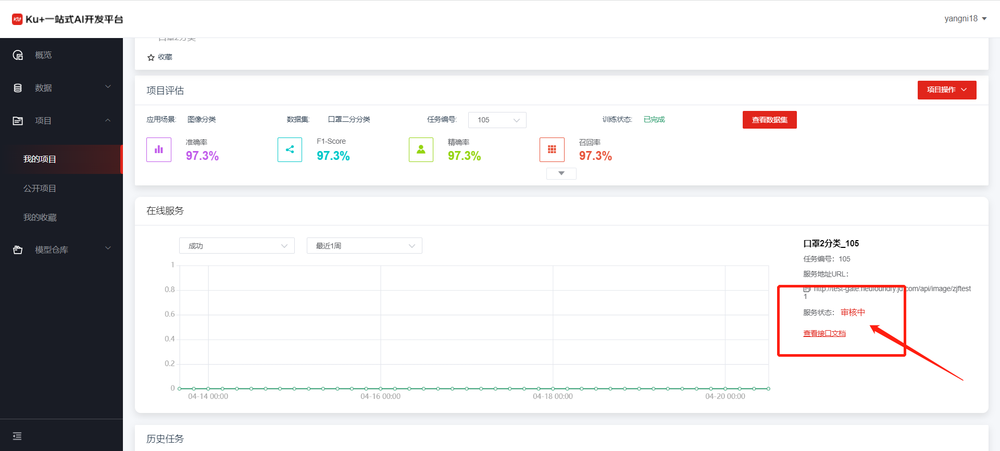
 
 
通过审核后，服务状态会变成运行中，此时可通过接口调用来使用刚才训练完成的模型能力。

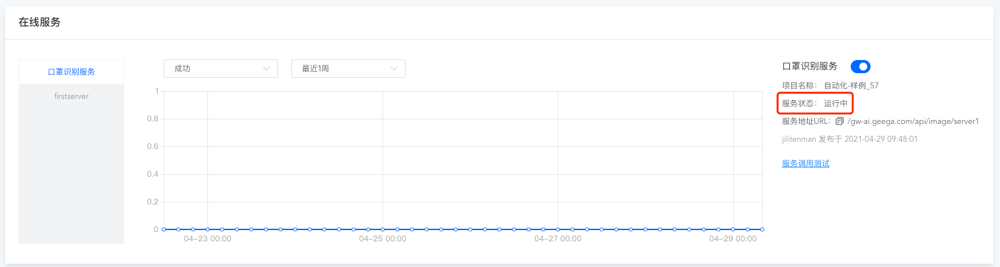
 
点击服务调用测试链接，进入到服务调用Demo展示页面。

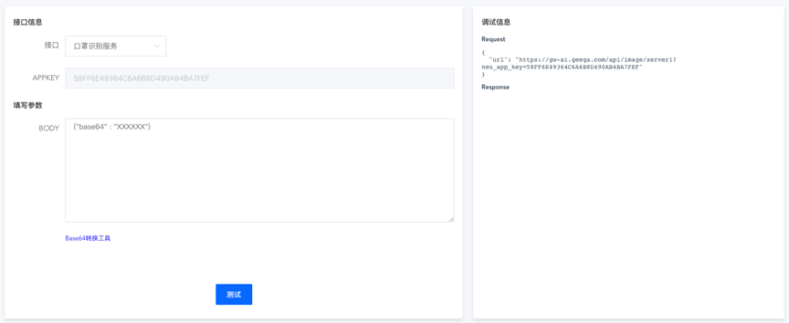
 
在图片分类的服务发布场景中，点击“Base64转换工具”链接，在弹出的窗口中上传所需要的验证图片，会自动生成一个图片的Base64位的字符编码。

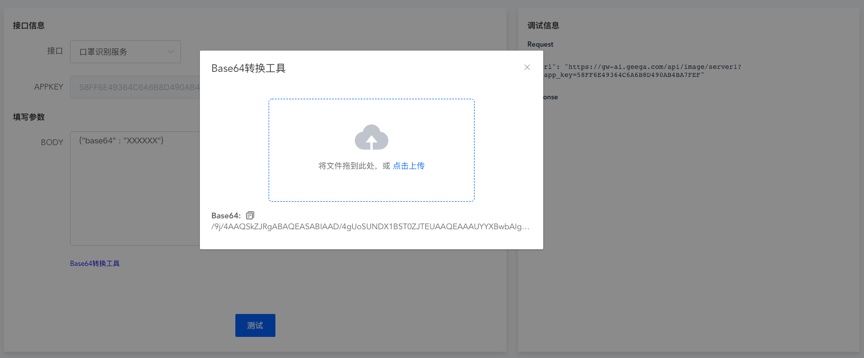
 
复制编码后粘贴到对应的Body请求信息中，点击“测试”按钮，右侧的调试信息栏中会显示调用的返回结果和模型评估信息。
 
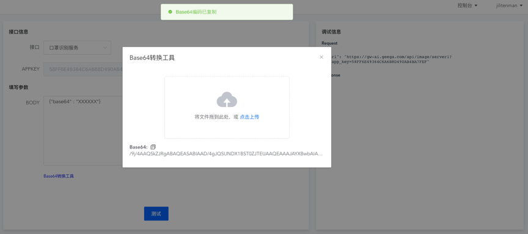

 
测试运行结果：
 
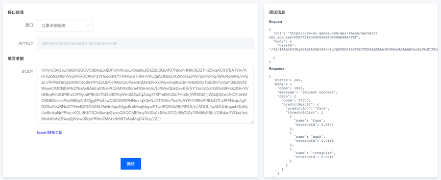

---

如果您对产品有使用或者其他方面任何问题，欢迎联系我们

---
