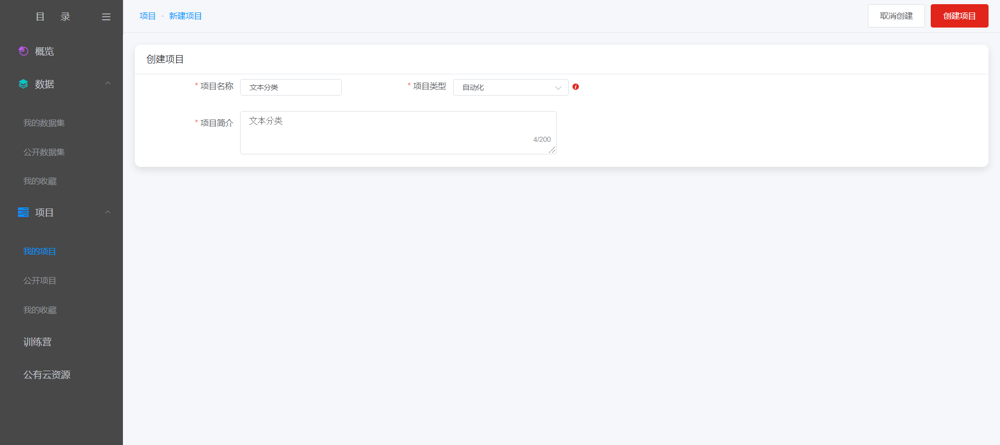
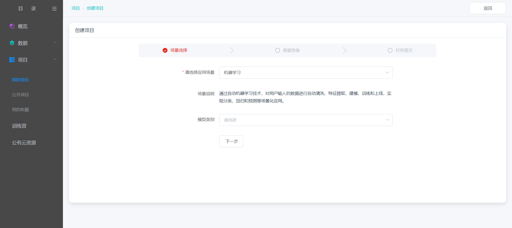
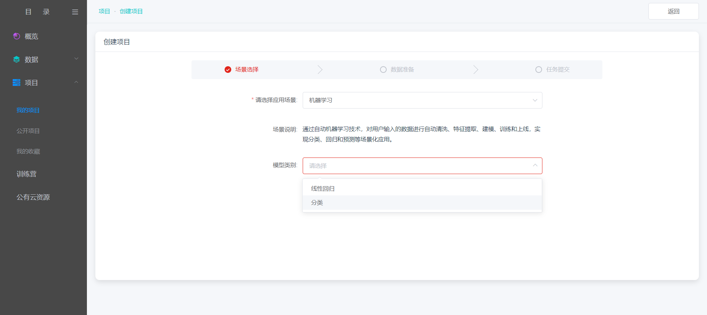
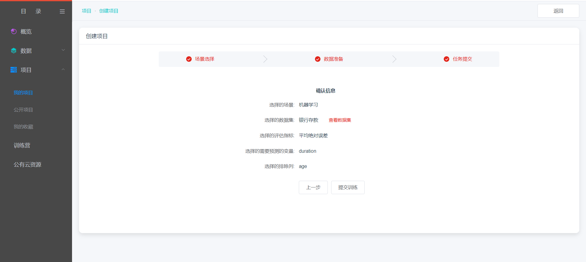
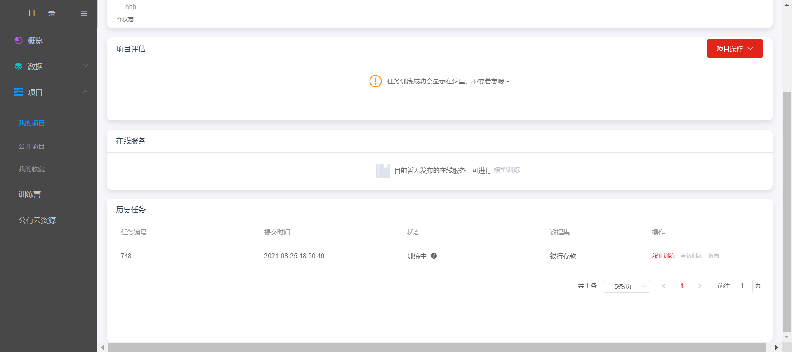
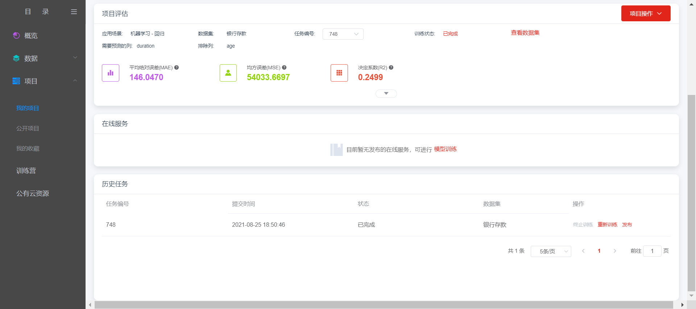
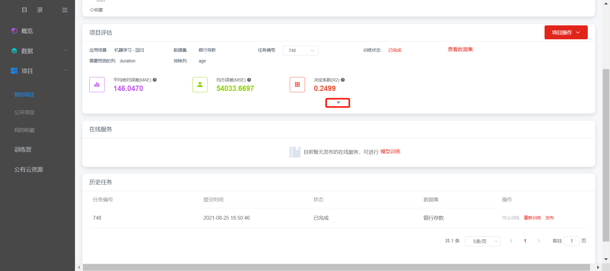
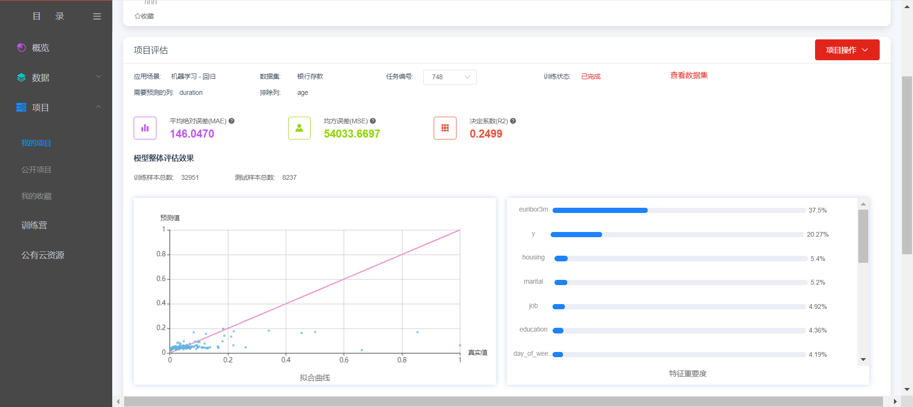

# 机器学习

机器学习主要分为线性回归和分类两种模型类别，下面以线性回归建模过程为例进行介绍。

第一步，创建项目

在点击创建项目的页面中，填写必要的信息，如项目名称、项目简介等内容，同时在项目类型中选择“自动化”，如下图：

****

在点击创建项目之后，进入实际的创建内容，应用场景选择机器学习，如下图：

然后选择模型类别，选择线性回归，点击“下一步”，如下图：

选择样本数据集、评估指标、需要预测的变量和排除列信息，如下图：

鼠标悬浮右侧提示图标，可查看每个指标的具体介绍，如下图：

根据需要选择填写信息，点击“下一步”，如下图：

进入信息确认页面，若确认无误，点击“提交训练”；若需要更改信息，支持点击“上一步”进行信息修改，如下图：

第二步，查看训练任务和评估结果

训练任务提交之后，在项目的详情页，会显示历史任务，以及任务的状态等信息，如下图：

点击训练中旁边的图标查看训练进度

训练任务成功完成后，会在项目评估结果中出现，如下图：

点击评估详情区域的下拉箭头，可展示更详细的评估内容。

展开如下图，列表中展示了训练结果的拟合曲线和特征重要度。

---

如果您对产品有使用或者其他方面任何问题，欢迎联系我们

---
