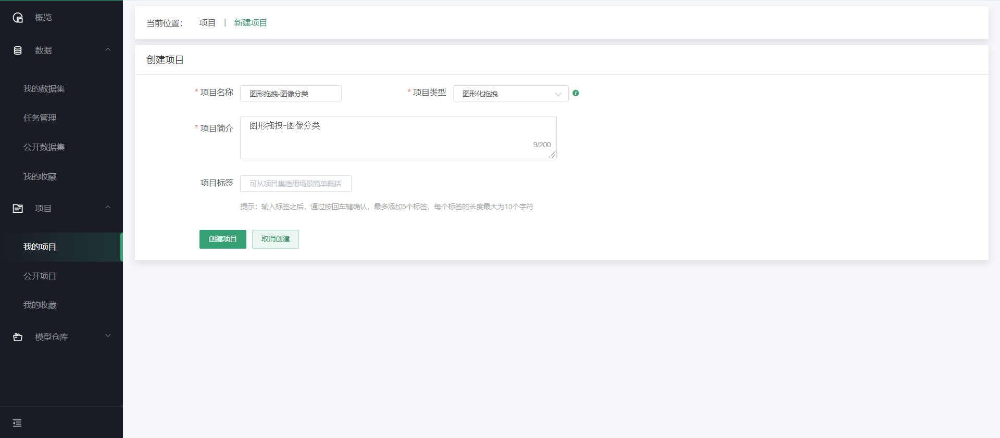
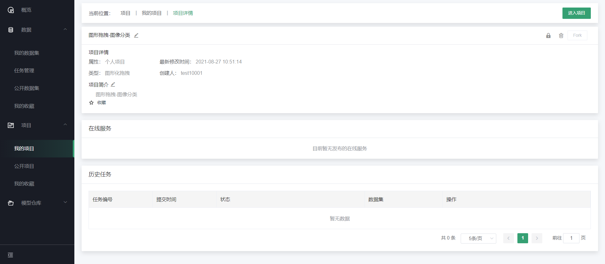
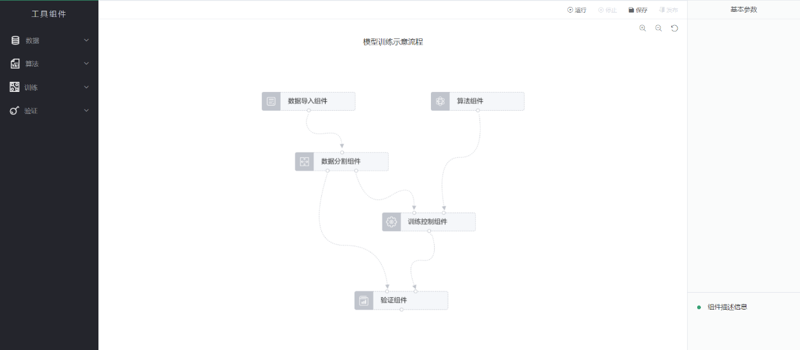
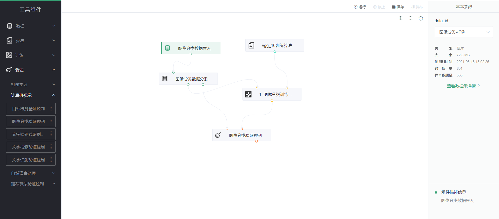
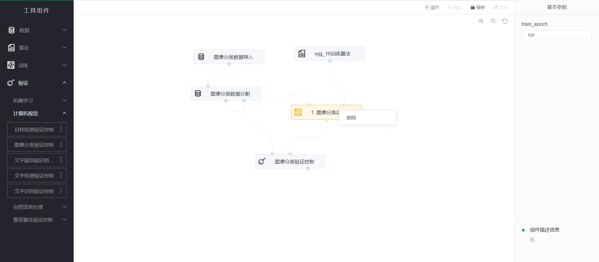
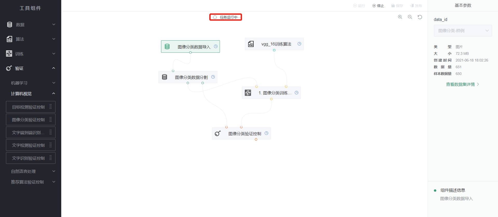
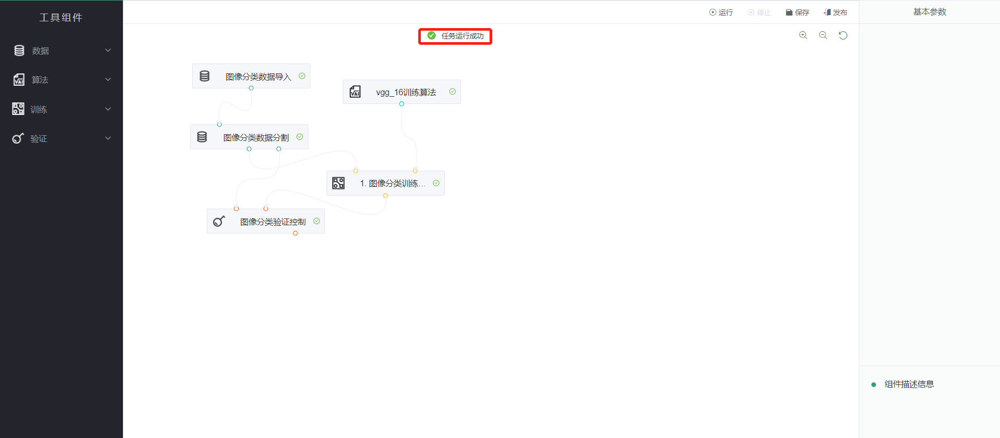

# 拖拽式建模

第一步，创建项目

在点击创建项目的页面中，填写必要的信息，如项目名称、项目简介等内容，同时在项目类型中选择“图形化拖拽”，点击“创建项目”完成创建。如下图：

第二步，查看项目详情

在新建完成项目之后，自动转到项目详情页。因为此时还没有任何训练任务，所以在详情页的历史任务和在线服务均为空，点击“进入项目”，如下图：

第三步，进入项目

项目整个区域分为左、中、右三部分，左侧为组件列表页，中间为操作区域，右侧为信息展示区域。如下图：

工具组件分为了4大类：数据组件、算法组件、训练组件以及验证组件，点开对应类别下拉列表，可以看到详细的组件列表。并且中间操作区域展示了模型训练示意流程，可根据示意流程组合需要的训练场景。如下图：

将训练需要的组件从各类别组件选取后拖拽至操作区域，然后把所有组件按照一定的逻辑链接起来之后，可组成类似如上图中中间部分的流程图。如下图所示，右侧部分为显示选中组件的基本参数信息，以及组件的描述信息，从基本参数信息中，可选择相应的内容，或者填写相应的内容。

如果在拖动拖动过程中，不想使用哪一个组件，则可在该组件处，点击右键，选中弹出框的删除，即可将该组件从该流程图中删除。

第四步，运行

在完成所有流程的设计，以及对应组件的参数配置之后，可点击操作区域的“运行”，对本次所拖拽的流程图内容进行模型训练，所有组件的状态变为“运行中”。

第五步，查看训练状态

训练成功后，操作区域上方显示“任务运行成功”。如下图：

说明：不同的图标分别表示等待运行、运行中、运行完成等内容
