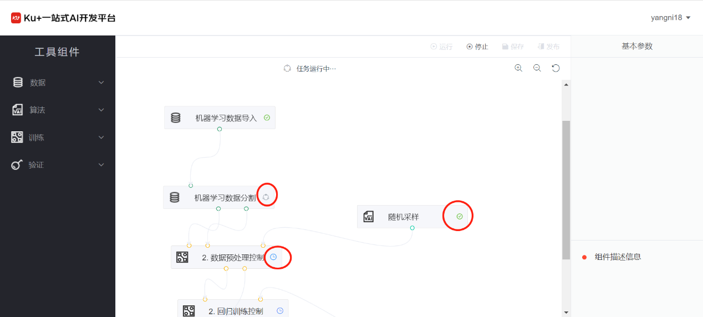

# 图形化拖拽

**第一步，创建项目**

在点击创建项目的页面中，填写必要的信息，如项目名称、项目简介等内容，同时在项目类型中选择“图形化拖拽”，如下图：

 
**第二步，查看项目详情**

在新建完成项目之后，自动转到项目详情页。

 
因为此时还没有任何训练任务，所以在详情页的历史任务和在线服务均为空。

**第三步，进入项目**

 
项目整个区域分为左、中、右三部分，左侧为组件列表页，中间为操作区域，右侧为信息展示区域。

工具组件分为了4大类：数据组件、算法组件、训练组件以及验证组件，在需要使用哪个组件的时候，从对应类别点开之后，可以看到详细的组件列表，如下图：

 
将所有组件按照一定的逻辑链接起来之后，可组成类似如上图中中间部分的流程图。

备注：如果在拖动拖动过程中，不想使用哪一个组件，则可在该组件处，点击右键，选中弹出框的删除，即可将该组件从该流程图中删除。
右侧部分为显示选中组件的基本参数信息，以及组件的描述信息，从基本参数信息中，可选择相应的内容，或者填写相应的内容。

**第四步，运行**

在完成所有流程的设计，以及对应组件的参数配置之后，可点击操作区域的运行，对本次所拖拽的流程图内容进行模型训练。

 
所有组件的状态都会随着改变：

 
说明：不同的图标分别表示等待运行、运行中、运行完成等内容

在运行中的组件可以点击右键查看“实时日志”和下载日志

 
已经运行完成的组件节点点击右键可以查看到删除、查看日志和下载日志等操作。
 

 
下面介绍几种常见的流程：

1)	文本分类

 
2)	图像分类

 
3)	目标检测

 
4)	机器学习（聚类）

 
5)	机器学习（分类和回归）
 

说明：不同的图标分别表示等待运行、运行中、运行完成等内容

---

如果您对产品有使用或者其他方面任何问题，欢迎联系我们

---
