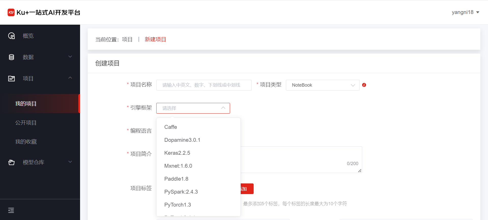
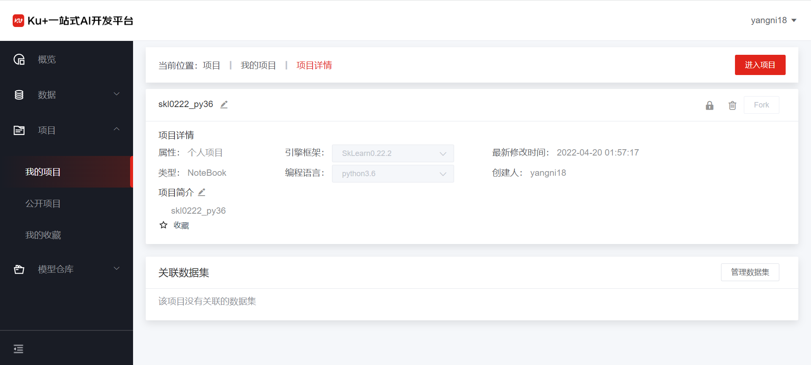
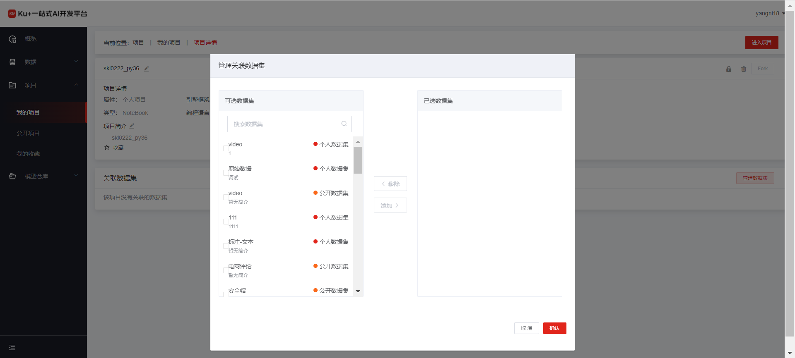
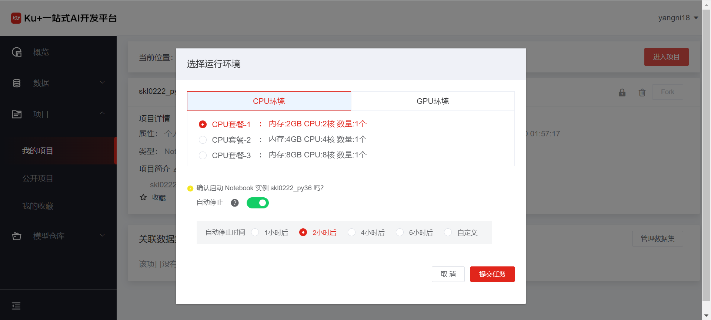
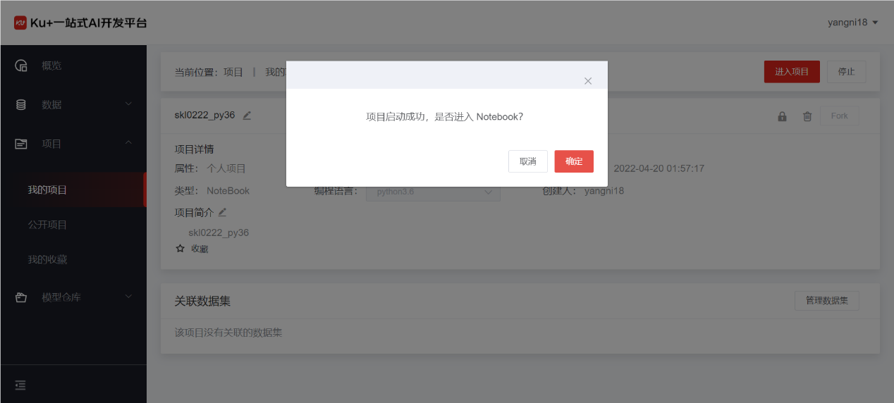
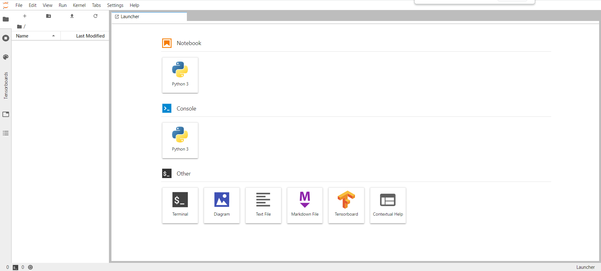
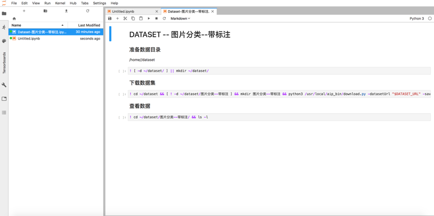

# Jupyter Notebook

**第一步，创建项目**

在点击创建项目的页面中，填写必要的信息，如项目名称、项目简介等内容，同时在项目类型中选择“NoteBook”，选择和实际相对应的引擎框架，选择编程语言版本，如下图

**第二步，查看项目详情**

在新建完成项目之后，自动转到项目详情页

在项目详情页，可设置关联数据集，如下图：

**第三步，启动NoteBook，进入项目**

在项目详情页，点击“进入项目”，选择需要的运行环境，当前支持CPU和GPU的多个套餐的选择，同时也支持是否自动停止的选项，默认是2小时后自动停止，也可以关闭自动停止功能，一直独占对应的套餐资源。
 

 
注：如果您关闭自动停止功能，在您使用 Notebook 实例期间，将始终占用资源并产生相应的费用，直至您主动关闭 Notebook 实例，建议您开启自动停止功能。

**第四步、启动Jupyter NoteBook**

 
等待一段时间，系统后台启动相应NoteBook服务之后，可通过点击进入项目，进到Jupyter NoteBook中。

 
选择数据集的说明文件，可以进入到关联的数据集目录，下载数据集和查看数据详情：

 
在该界面中，就像在使用本地Jupyter NoteBook一样。

 ---

如果您对产品有使用或者其他方面任何问题，欢迎联系我们

---
