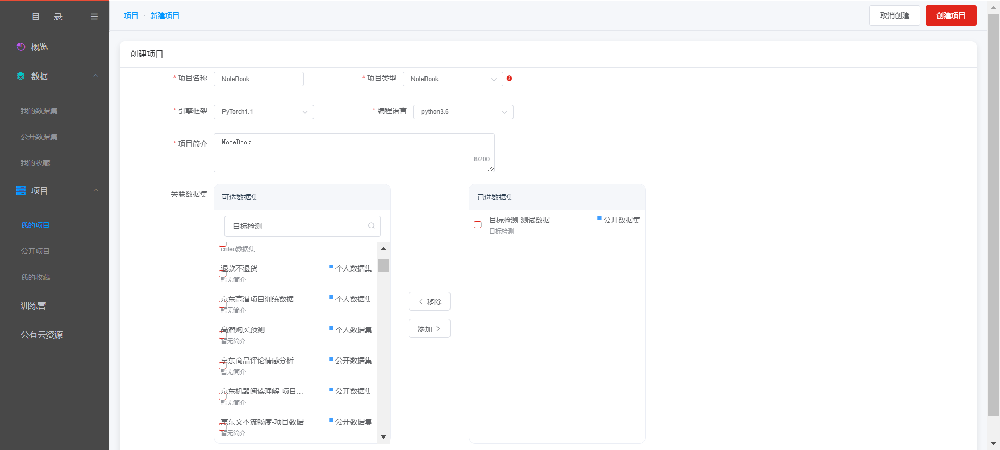
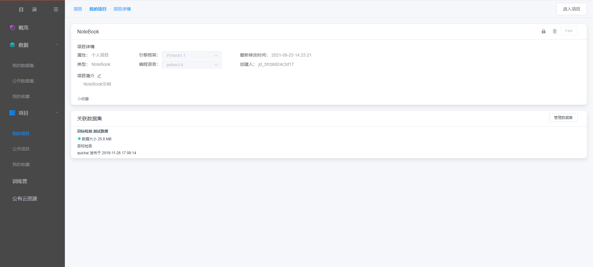
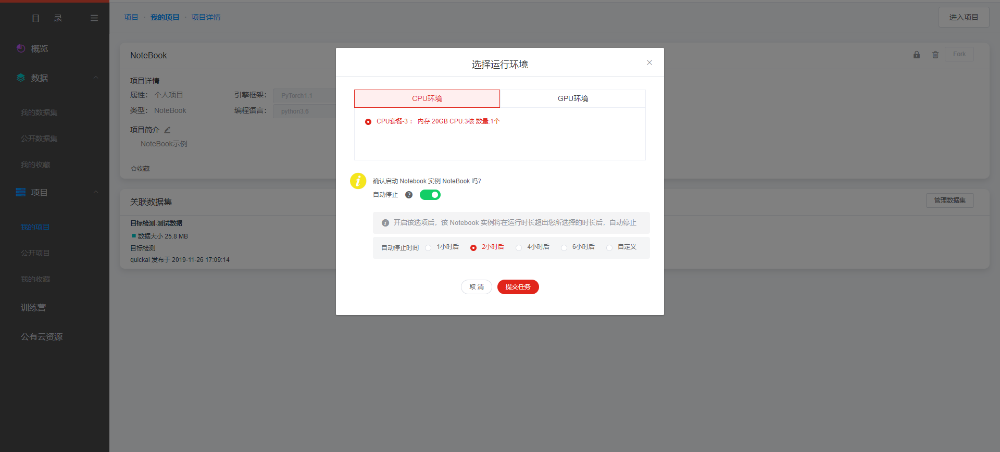
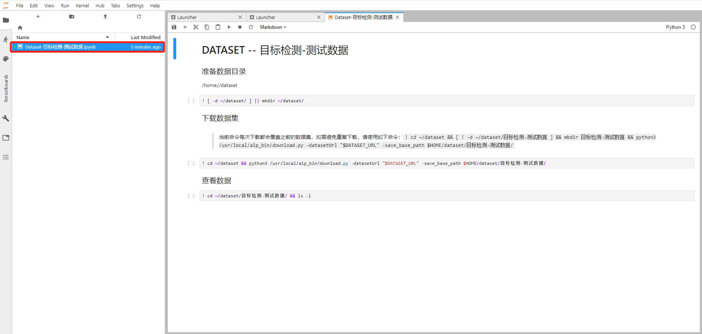

#  Notebook

第一步，创建项目

在点击创建项目的页面中，填写必要的信息，如项目名称、项目简介等内容，同时在项目类型中选择“NoteBook”，以及选择和实际相对应的引擎框架，选择编程语言版本，选择需要训练的数据集，如下图：

第二步，查看项目详情

在新建完成项目之后，自动转到项目详情页

在项目详情页，也可设置关联数据集，如下图：

第三步，启动NoteBook，进入项目

在项目详情页，点击“进入项目”，启动Jupyter NoteBook

等待一段时间，系统后台启动相应NoteBook服务之后，点击“确定”，进到Jupyter
NoteBook中。

鼠标左键双击左侧目录栏文件，弹出交互框，通过此页面信息，用户可知数据集所在位置以及查看数据集的相关命令：

 ---

如果您对产品有使用或者其他方面任何问题，欢迎联系我们

---
