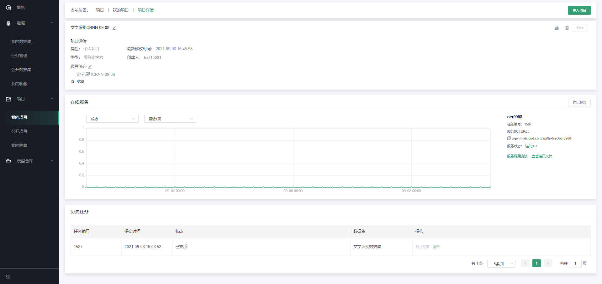
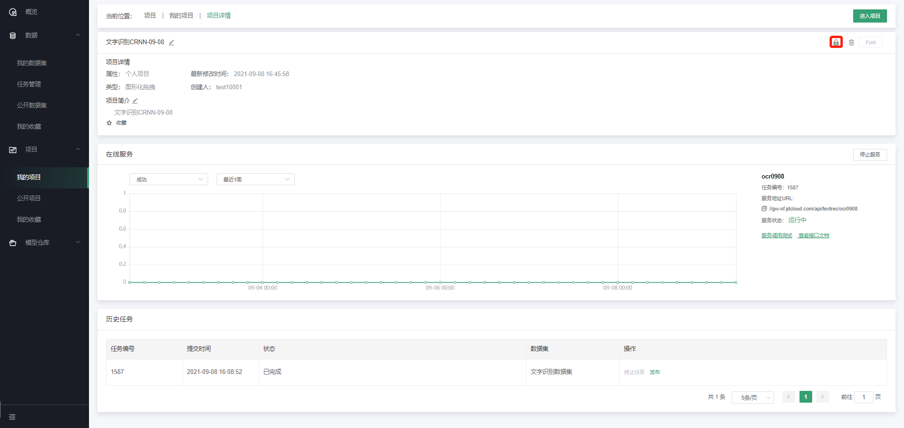
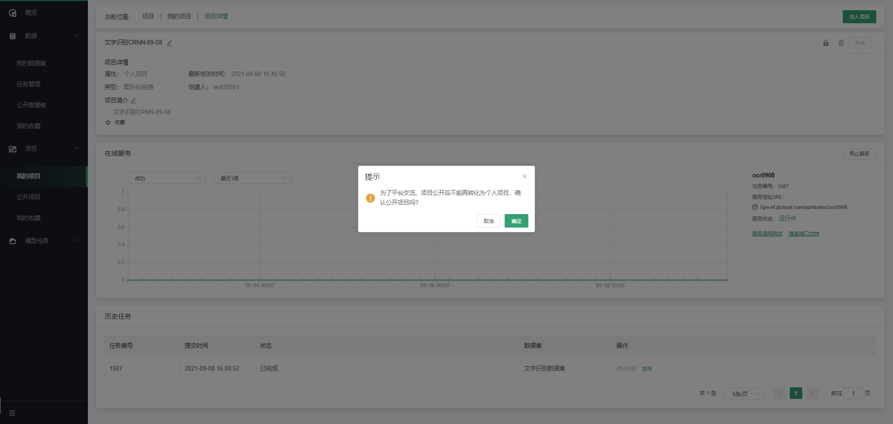
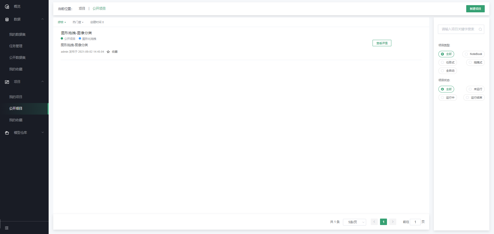
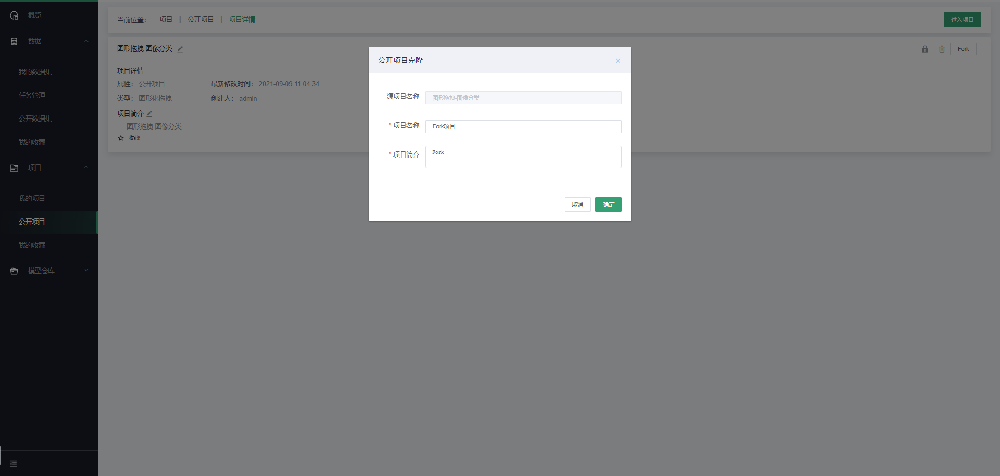
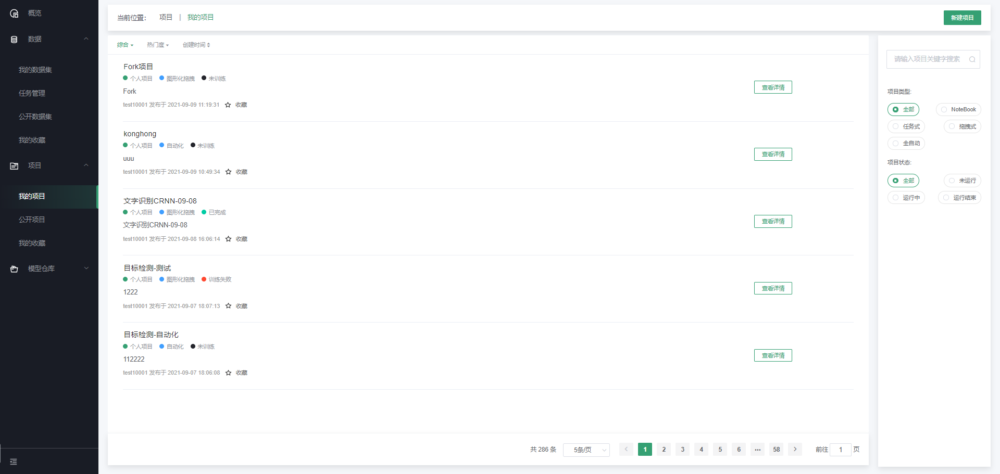

# 公开项目

公开项目的设置旨在为用户提供交流与学习的平台，用户可以将自己训练的优秀项目分享至公开项目中与大家共同学习与进步。具体操作如下：

第一步，进入将要分享的项目详情页面

点击项目概要信息的右上角“设置为公开”，如下图

会弹出公开确认窗口

确认公开之后，会有专门的管理员进行审核，审核通过后，平台上所有人可以看到该项目

#### Fork项目

在公开项目列表中，选择想fork为自己的项目，点击查看详情，进入项目详情

在项目详情中，点击Fork，弹出Fork弹窗

填写弹窗后，项目就Fork为自己的项目，可进行编辑等正常使用

---

如果您对产品有使用或者其他方面任何问题，欢迎联系我们

---
