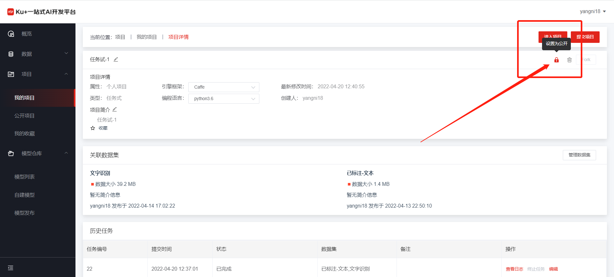
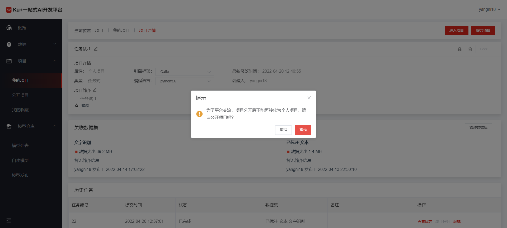
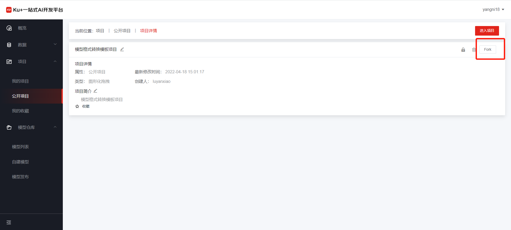
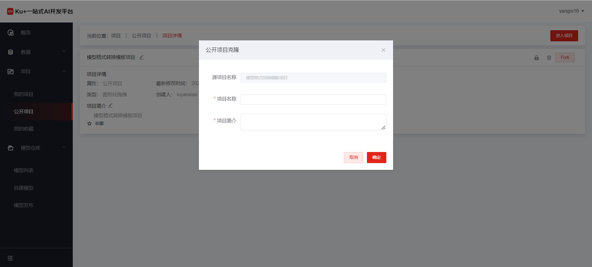
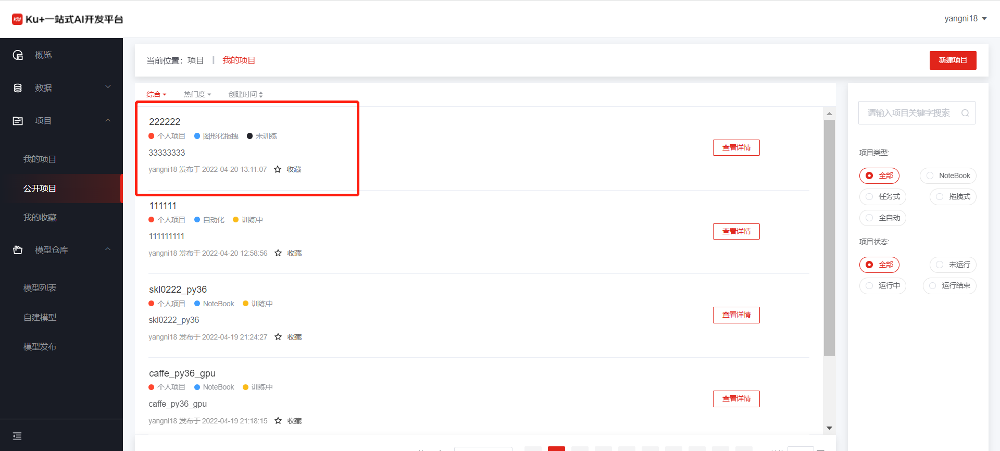

# 公开项目

***说明：目前仅支持可以将任务式项目进行公开，其他类型暂不支持***

**A）将自己项目公开**

点击项目概要信息右上角的“设置为公开”，如下图

会弹出公开确认窗口

确认公开之后，会有专门的管理员进行审核，审核通过后，平台上所有人可以看到该项目

**B）Fork公开项目**

在公开项目列表中，选择想fork的项目，点击"查看详情"，进入项目详情页面
在项目详情中，点击Fork，弹出Fork弹窗

填写弹窗后，项目就fork为自己的项目，可进行编辑等正常使用

---

如果您对产品有使用或者其他方面任何问题，欢迎联系我们

---
