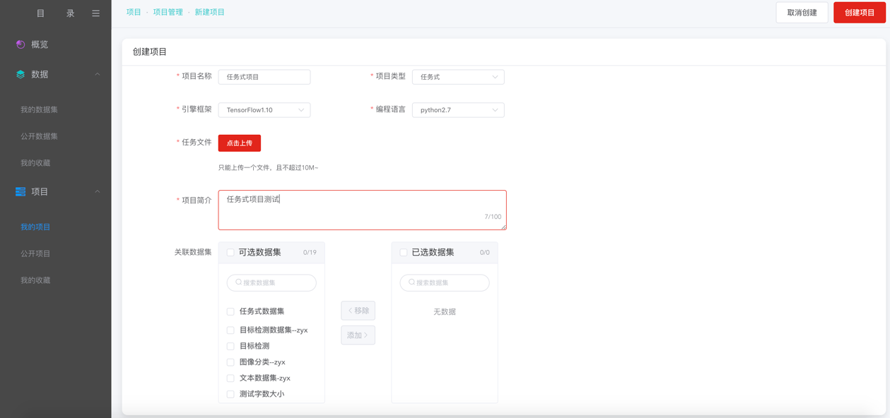
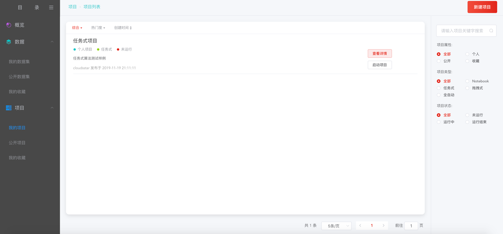
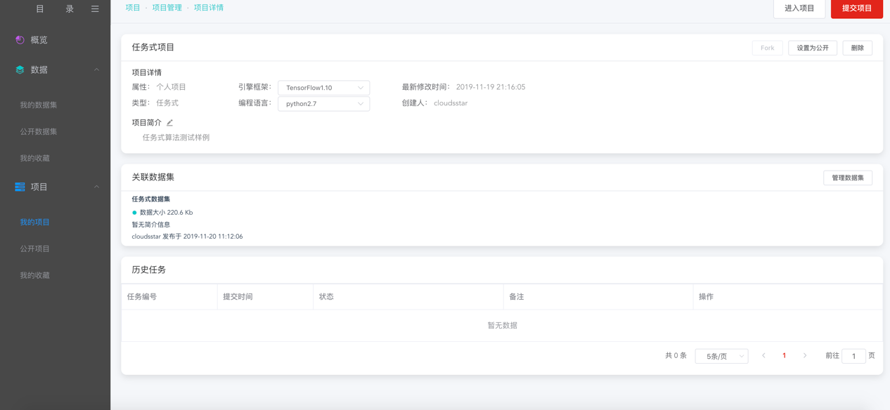
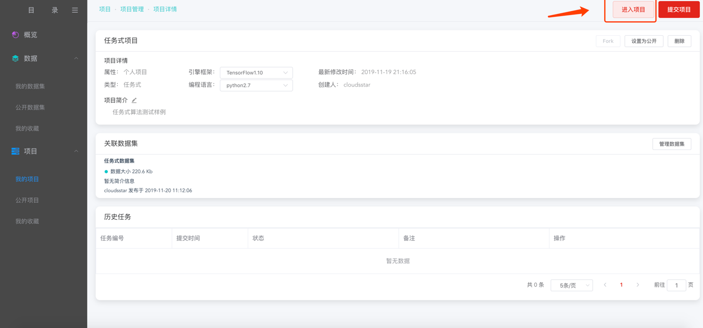
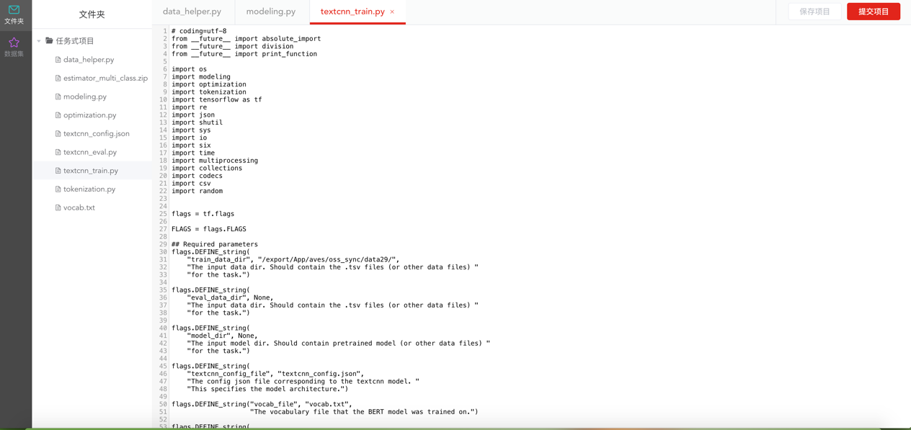
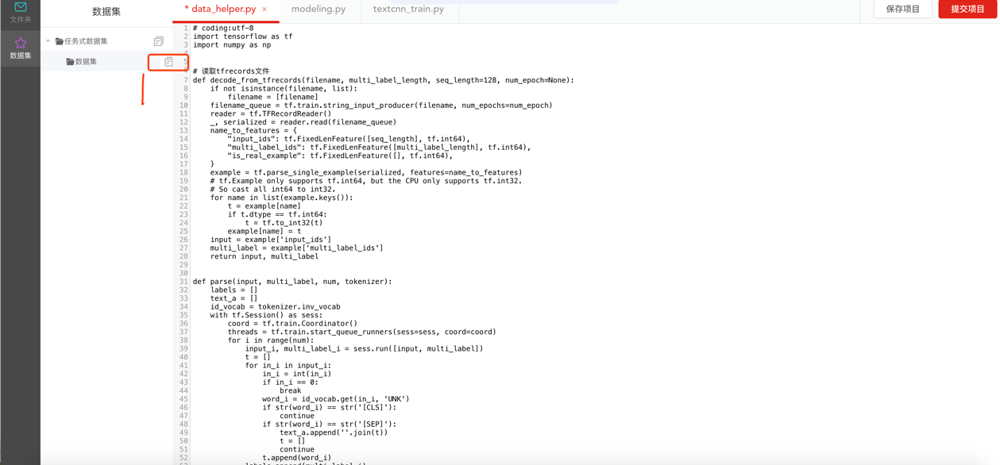
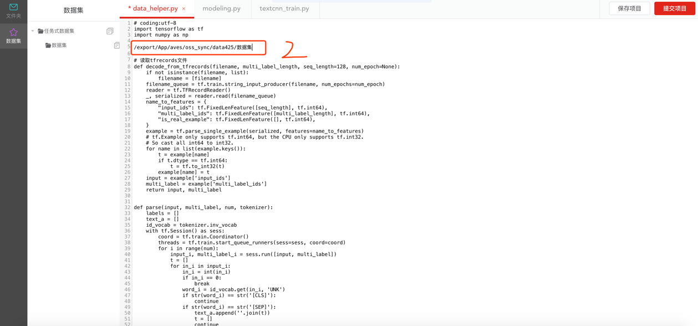
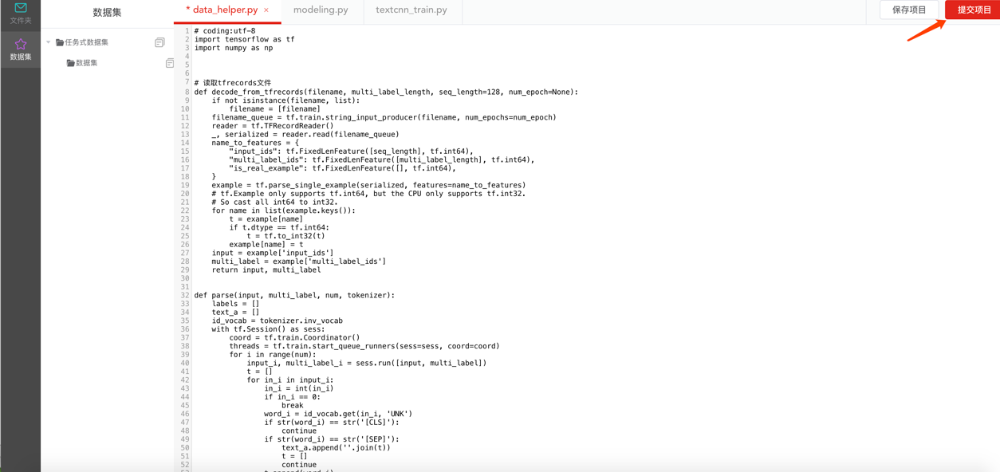
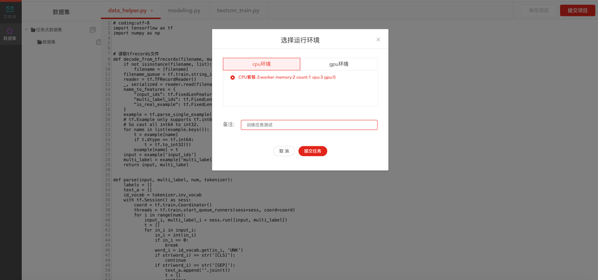
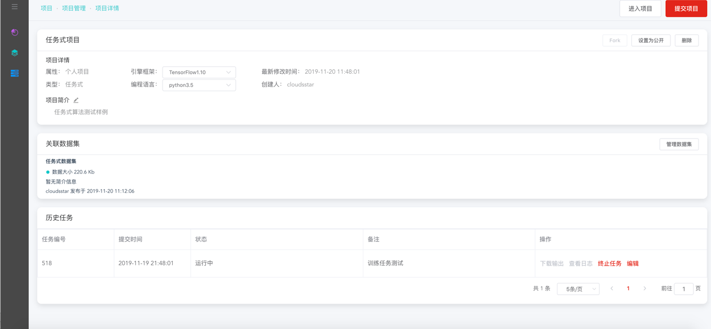

# 任务式建模

第一步，创建项目

在点击创建项目的页面中，填写必要的信息，如项目名称、项目简介等内容，同时在项目类型中选择“任务式”，以及选择和实际相对应的引擎框架，选择编程语言版本，如下图：

点击任务文件后面的“点击上传”按钮，弹出如下对话框：

选择需要上传的算法任务文件，之后，显示如下：

创建完成后，在我的项目列表中会出现相应的内容，如下图：

第二步，查看项目详情

点击项目详情，可进入到项目详情页面，如下：

第三步，进入项目进行编辑

在项目详情页，点击右上角的“进入项目”，即可进入任务式的项目编辑页面，

进入编辑页面后显示如下图：

在该页面中左侧文件夹显示的是代码的列表，在右侧操作区可以对代码进行修改。

**关键步骤：选择主文件**

通过在文件夹区域，通过点击右键，在右键弹出框中，选择“设为主文件”，为我们的代码选择一个主文件，即入口文件内容：

同时，点击左侧的数据集，可看到所关联的数据集内容，通过数据集名称右侧的“复制”图标，快捷拷贝数据集目录，通过数据集目录在代码中直接使用数据集，如下图：

点击保存按钮，对所做的修改内容进行保存。

第四步，提交训练任务

方式1:
通过进入编辑区域，在对代码修改好之后，需要进行模型训练的时候，通过点击右侧的“提交项目”之后，在弹出的运行环境选择对应内容后，将该训练任务提交后台运行。

方式2:
在已经设置好主文件的前提下，可直接在项目详情页通过点击右上角的“提交项目”进行提交。

提交之后，可以在历史任务中看到刚才提交的任务处于运行中，如下图：

训练完成之后，可下载输出以及查看日志等相应操作。
  
  
  
 
  

---

如果您对产品有使用或者其他方面任何问题，欢迎联系我们

---
