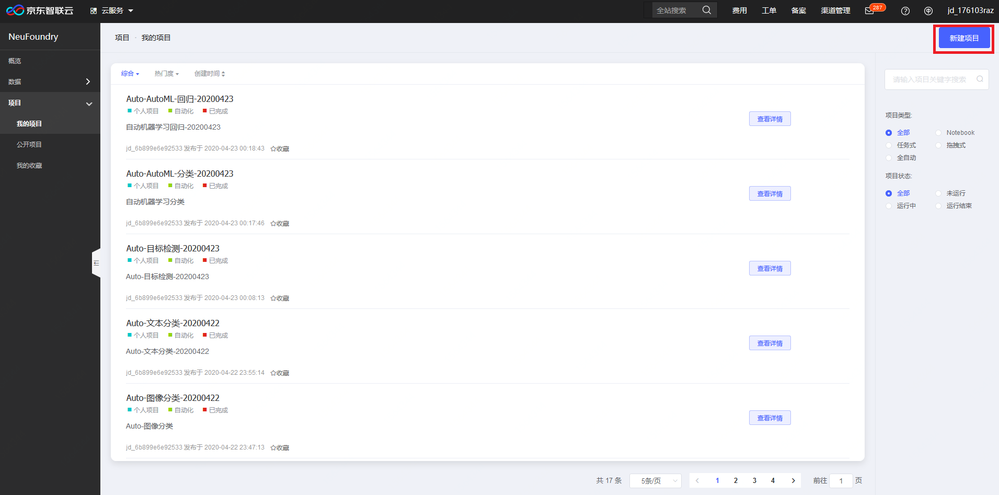
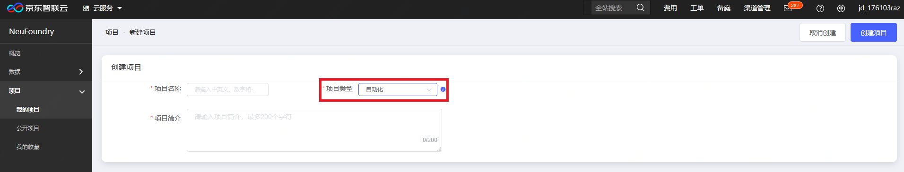
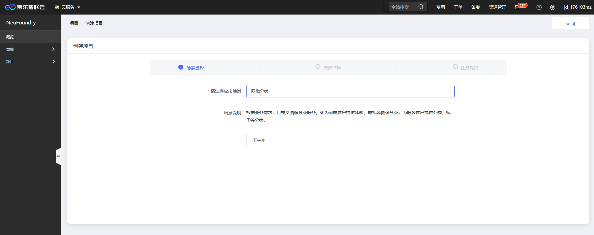
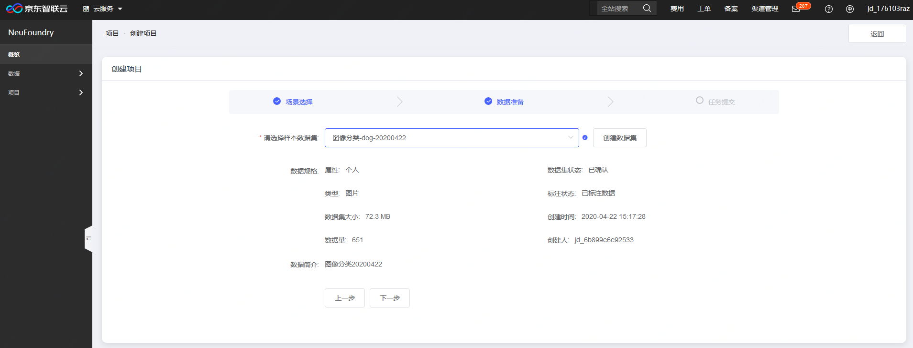
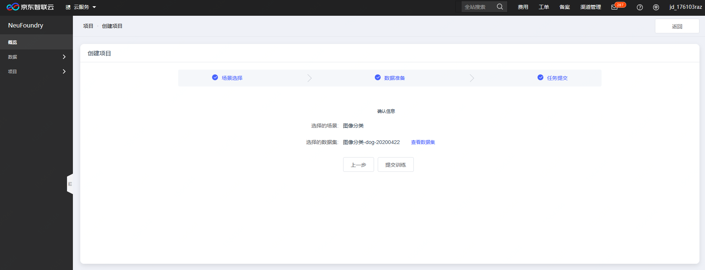
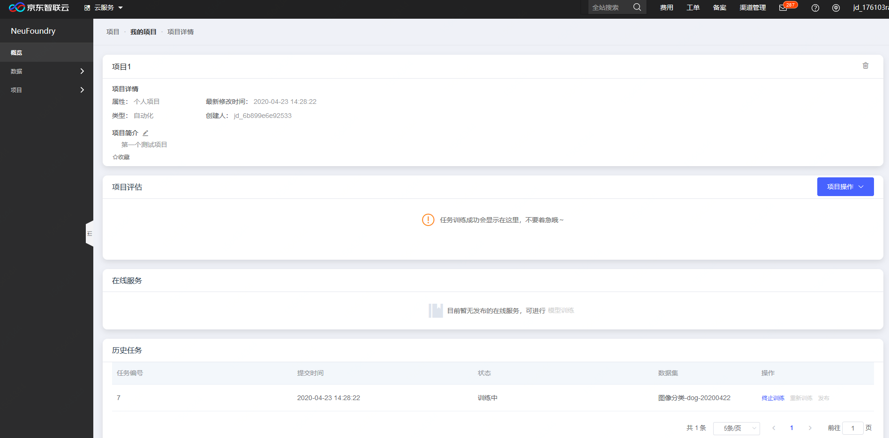

# 二、	体验自动化模型训练流程

1、	进入NeuFoundry控制台首页点击进入项目——我的项目，点击右上角的新建项目

2、	在项目类型中选择“自动化”，并填写项目名称及项目简介

3、	选择应用场景，目前支持：图像分类、目标检测及文本分类，更多场景陆续上线

4、	数据准备：如果你已准备好数据，直接选取相应数据集即可，若还没准备好数据，点击“创建数据集”，进入数据集创建流程，创建符合刚才已选场景的数据集

5、	任务提交：点击“提交训练”进入自动化训练流程

6、	训练进度可在项目——我的项目页面中，选择刚才已经提交的项目，即可进行查看项目详情、对项目进行评估、重新进行训练及发布成在线服务等一系列操作。

---

如果您对产品有使用或者其他方面任何问题，欢迎联系我们

---