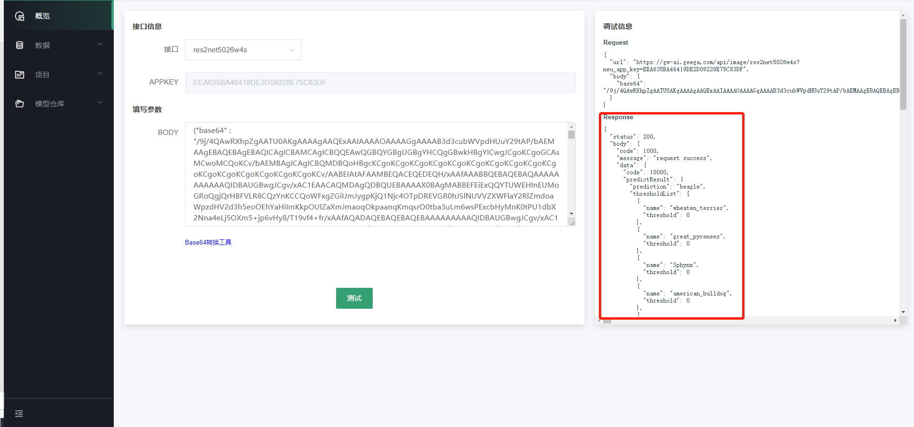

# 使用自动化构建模型

Ku+
MLOps提供了自动化建模方式，无需关注模型选型、参数调整等开发细节，仅需两步即可完成一个AI开发项目。以创建图像分类为例。

步骤1：准备数据

步骤2：创建项目，训练模型

步骤3：将模型部署上线

步骤4：服务调用

**步骤1：准备数据**

Ku+
MLOps在【数据】-【公开数据集】中提供了可直接用于训练的平台预置数据集，本文操作示例使用此数据集进行模型训练。如果您想使用自己的数据集，具体操作参考4.2、4.3。

**步骤2：创建项目，训练模型**

1. 在Ku+ MLOps平台，单击左侧导航栏【项目】-【我的项目】。

2. 单击“新建项目”，填写项目名称、项目类型和项目简介等信息。项目类型选择自动化。

****

1. 单击“创建项目”，跳转至【场景选择】页面，选择“图像分类”应用场景、“通用图像分类”子应用场景。

1. 单击“下一步”，跳转至【数据准备】页面，选择平台的公开数据集“图像分类”

1. 单击“下一步”，跳转至【任务提交】页面，确认信息后，单击“提交训练”，完成图像分类项目创建。

1. 训练时间相对较长，请耐心等待。训练完成后，可以在【项目详情】页面查看“项目评估”，如“准确率”、“F1-score”、“精确率”、“召回率”。

**步骤3：将模型部署上线**

1. 当项目详情的历史任务区域，状态为“已完成”时，单击“发布”。

1. 在【发布】信息填写页面，填写服务名称和接口地址信息，单击“服务发布”，将模型发布上线。

**步骤4：服务调用**

1. 发布通过审核后，即可在【概览】-【在线服务】中进行服务调用操作。

1. 单击“服务调用测试”，填写参数；若为图片类参数，可单击“Base64转换工具”进行格式转换，将转换后的内容填入框内。

1. 单击“测试”，可在【调试信息】区域看到测试结果。

---

如果您对产品有使用或者其他方面任何问题，欢迎联系我们

---
