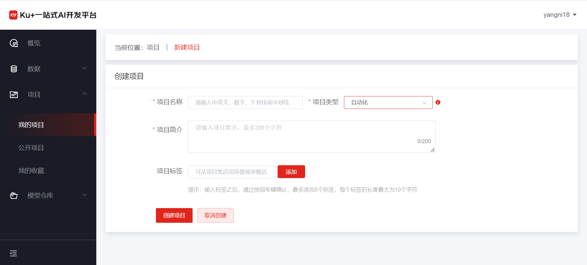
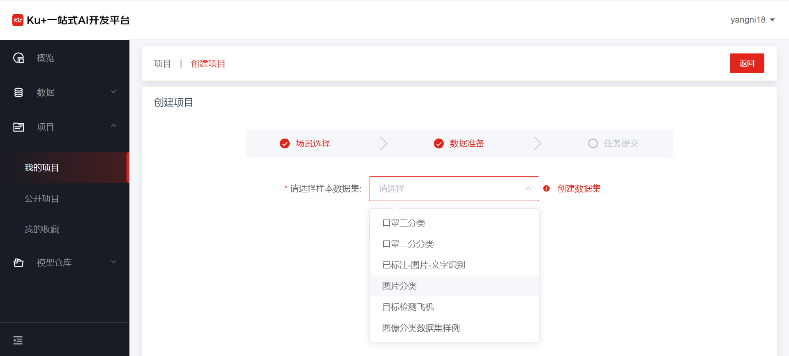
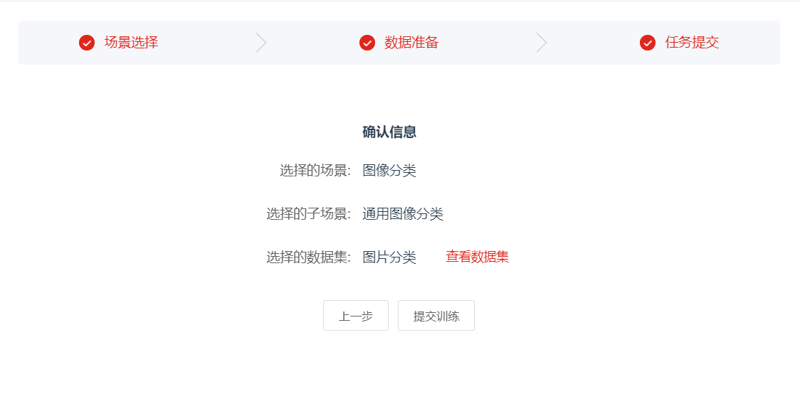
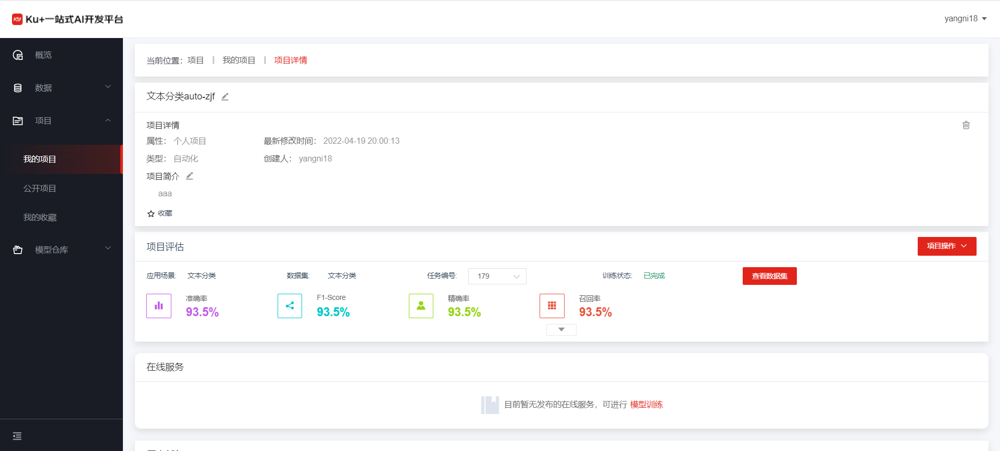
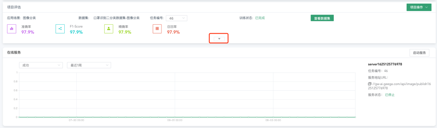

# 自动化模型训练

1、	进入平台首页点击进入项目——我的项目，点击右上角的新建项目

2、	在项目类型中选择“自动化”，并填写项目名称及项目简介

3、	选择应用场景，目前支持：图像分类、目标检测、文本分类及机器学习，更多场景陆续上线

4、	数据准备：如果你已准备好数据，直接选取相应数据集即可，若还没准备好数据，点击“创建数据集”，进入数据集创建流程，创建符合刚才已选场景的数据集

 

5、	任务提交：点击“提交训练”进入自动化训练流程

6、	在训练过程中，可以对训练的过程进行跟踪，点击任务状态的帮助图标 ，即可查看当前任务的全流程。
    

     
7、 有训练任务有成功的结果的话，会在项目评估结果中出现，如下图：
    

     
8、 点击评估详情区域的下拉箭头，可展示更详细的评估内容，如列表每一个类别的准确率和错误图片等信息：
    

     
9、 展开后下图：
    

     
10、 点击单张图片后即可查看模型训练后的评估结果。
    

---

如果您对产品有使用或者其他方面任何问题，欢迎联系我们

---
