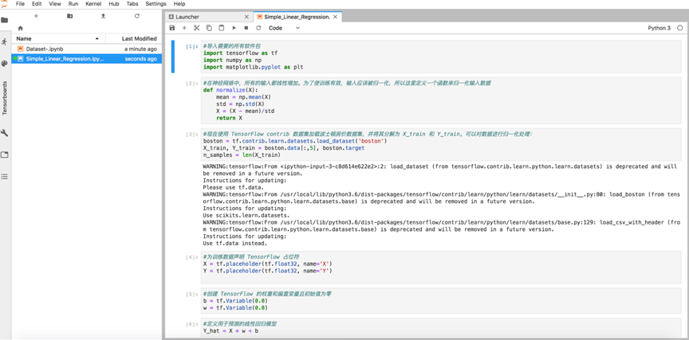
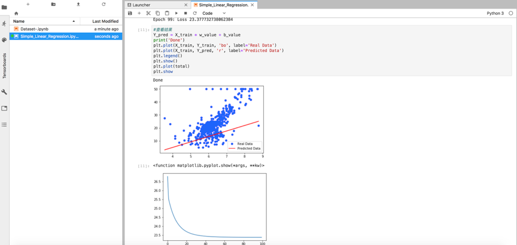
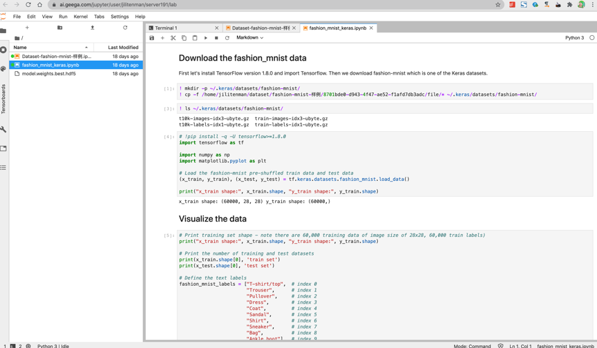
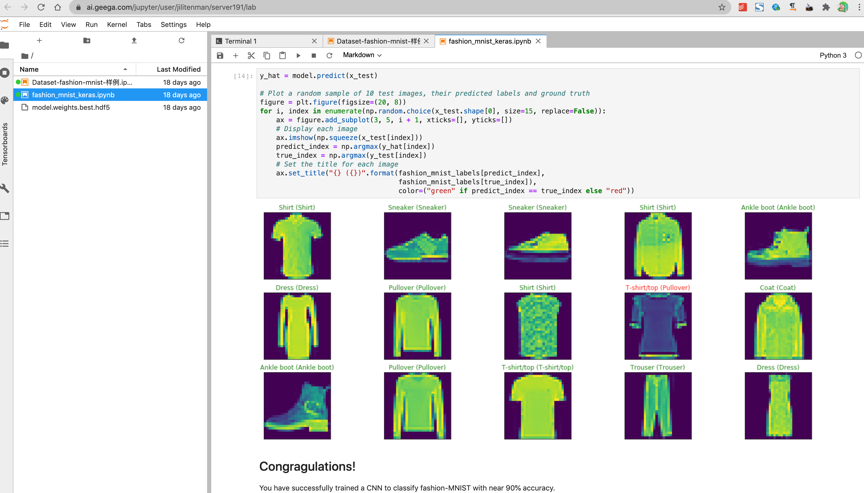

# 示例代码及说明

**示例一：**

项目类型：任务式

项目目标：图像分类

算法截图图下：

 

**示例二：**

项目类型：NoteBook

项目目标：线性回归

算法截图（部分算法代码）

 
 
打印运行结果

 
 
**示例三：**

项目类型：NoteBook

项目目标：Fashion Mnist

算法截图（部分算法代码）

 
 
算法运行结果：

 

---

如果您对产品有使用或者其他方面任何问题，欢迎联系我们

---
